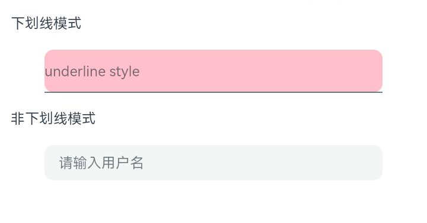
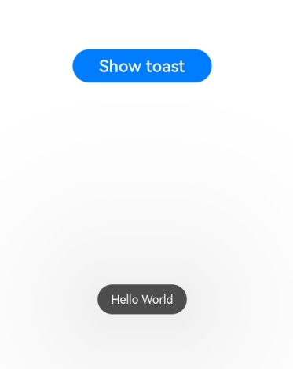

# ArkUI子系统变更说明

## cl.arkui.1 TextInput组件默认样式变更

**访问级别**

公开接口

**变更原因**

默认样式变更。

**变更影响**

该变更为非兼容性变更。

变更前：下划线模式输入框设置borderRadius未生效，还是默认样式radius为0。下划线模式输入框左右padding为12vp。非下划线模式输入框默认高度为48vp。


变更后：下划线模式输入框设置borderRadius正常生效，不设置则显示默认样式radius为0。下划线模式输入框左右padding为0vp。非下划线模式输入框默认高度为40vp。



示例：

```ts
@Entry
@Component
struct TextInputExample {
  @State Text: string = ''
  build() {
    Column({ space: 20 }) {
      Text(`下划线模式`)
        .width('95%')
      // 下划线模式
      TextInput({ placeholder: 'underline style' })
        .showUnderline(true)
        .backgroundColor(Color.Pink)
        .width(380)
        .borderRadius(10)
      Text(`非下划线模式`)
        .width('95%')
      TextInput({ placeholder: '请输入用户名', text: this.Text })
        .showUnderline(false)
        .width(380)
        .borderRadius(10)

    }.width('100%')
  }
}
```

**起始API Level**

10

**变更发生版本**

从OpenHarmony SDK 5.0.0.22开始。

**变更的接口/组件**

TextInput组件默认样式变更。

**适配指导**

默认效果变更，无需适配，但应注意变更后的默认效果是否符合开发者预期，如不符合则应自定义修改效果控制变量以达到预期。

## cl.arkui.2  Toast弹窗接口更改消息框背景色、字色，以及Toast的最大宽度及高度，界面语超长逐级缩小字号至12fp，超出截断。

**访问级别**

公开接口

**变更原因**

API version 12及之后更改Toast UX的显示样式。

**变更影响**

该变更为非兼容性变更。

- API version 11及之前，Toast弹窗背景色为深黑色、字色为白色，最大高度没有限制，界面语超长没有截断。<br/>

- API version 12及之后，Toast弹窗在常规亮色显示风格下toast透明模糊背景、字色黑色，暗色显示风格下透明模糊背景、字色白色，Toast的最大高度 =（屏幕高度-信号栏-导航条）*0.65，最大宽度：基于屏幕宽度-2侧margin，根据容器自适应，最大到400vp不再变化。界面语超长逐级缩小字号至12fp，超出截断。<br/>

- API version 11及之前对比API version 12及之后属性变更如下

 | 属性名 | 变更前 | 变更后 |
|---------|---------|---------|
| 背景色 | bg_color | COMPONENT_ULTRA_THICK |
| 圆角 | toast_border_radius | corner_radius_level9 |
| padding-left | toast_padding_horizontal | padding_level8 |
| padding-top | toast_padding_vertical | padding_level4 |
| padding-right | toast_padding_horizontal | padding_level8 |
| padding-bottom | toast_padding_vertical | padding_level4 |
| 字体大小 | text_font_size | Body_M |
| 字体颜色 | text_color | font_primary |
| 字重 | toast_text_font_weight | font_weight_regular |

**示例：**
如下图所示为变更前后效果对比：

 | 变更前 | 变更后 |
|---------|---------|
|   |    |

**API Level**

12

**变更发生版本**

从OpenHarmony SDK 5.0.0.22 版本开始。

**变更的接口/组件**

Toast弹窗接口

**适配指导**

UX默认行为变更，无需适配。

## cl.arkui.3 Text组件clip通用属性默认值变更

**访问级别**

公开接口

**变更原因**

默认值false符合更多应用场景。

**变更影响**

该变更为非兼容性变更。

API version 12 变更前：Text组件clip通用属性默认值为true, 超出组件区域内容会被截断不显示。


API version 12 变更后：Text组件clip通用属性默认值为false, 超出组件区域内容不会被截断全部显示。


示例：

```ts
@Entry
@Component
struct TextClipExample {
  build() {
    Column({ space: 20 }) {
      Text('This is set wordBreak to WordBreak text Taumatawhakatangihangakoauauotamateaturipukakapikimaungahoronukupokaiwhenuakitanatahu.')
        .fontSize(12)
        .border({ width: 1 })
        .wordBreak(WordBreak.NORMAL)
        .lineHeight(20)
        .maxLines(2)
    }.height(300).width(335).padding({ left: 35, right: 35, top: 35 })
  }
}
```

**起始API Level**

7

**变更发生版本**

从OpenHarmony SDK 5.0.0.22开始。

**变更的接口/组件**

Text组件clip通用属性默认值变更。

**适配指导**

默认效果变更，无需适配，但应注意变更后的默认效果是否符合开发者预期，如不符合则应自定义修改效果控制变量以达到预期。

## cl.arkui.4 TextInput,TextArea,Search组件caretPosition接口异常值处理变更

**访问级别**

公开接口

**变更原因**

优化Search、TextInput、TextArea组件设置光标时异常值处理逻辑。

**变更影响**

该变更为非兼容性变更。

API Version 11 以及之前的版本：TextInput.caretPosition()的入参是负数、undefined时，接口不生效。
TextInputController.caretPosition()、TextAreaController.caretPosition()、SearchController.caretPosition()的入参是负数时，
接口生效，移动光标到0的位置并记录光标位置是负数。

API Version 12 变更后：TextInput.caretPosition()的入参是负数、undefined时，当作0处理，接口生效。
TextInputController.caretPosition()、TextAreaController.caretPosition()、SearchController.caretPosition()的入参是负数时，
当作0处理，接口生效，移动光标到0的位置并记录光标位置是0。

**起始 API Level**

8

**变更发生版本**

从OpenHarmony SDK 5.0.0.22开始。

**适配指导**

光标位置的视觉效果不会发生变化。
如果此前设置光标位置的参数是负数、undefined，并且需要光标位置不发生变化，需要修改业务代码，输入合法数值。