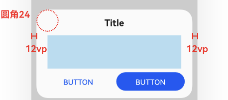
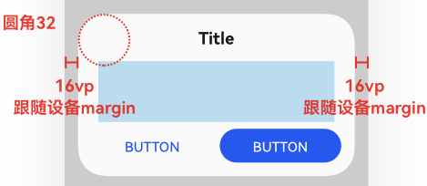
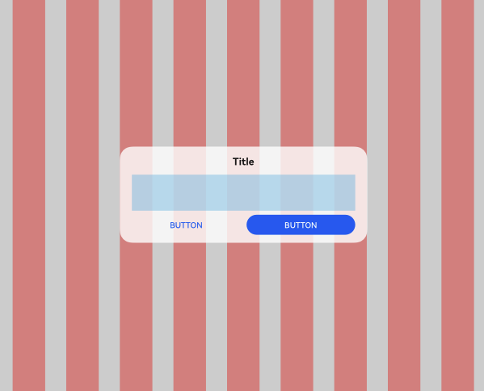
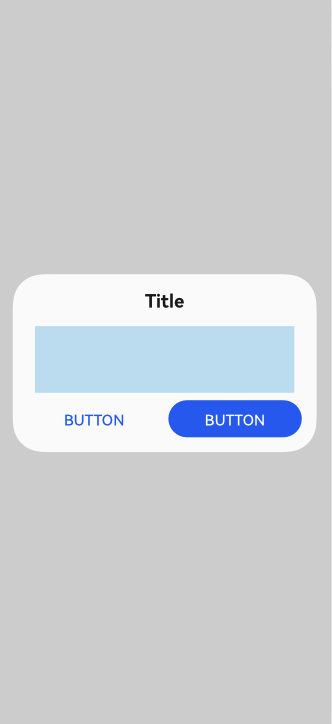
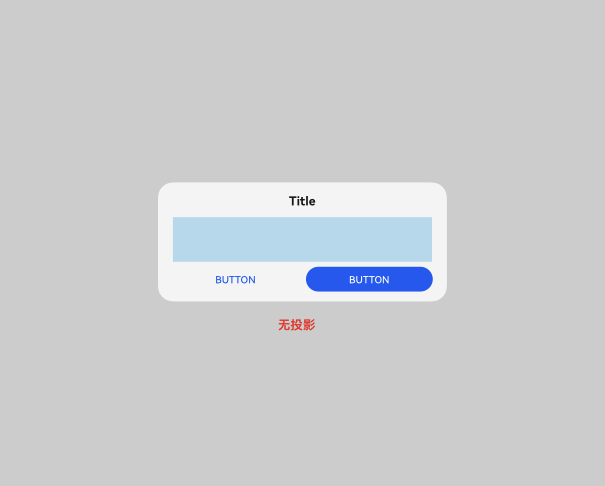
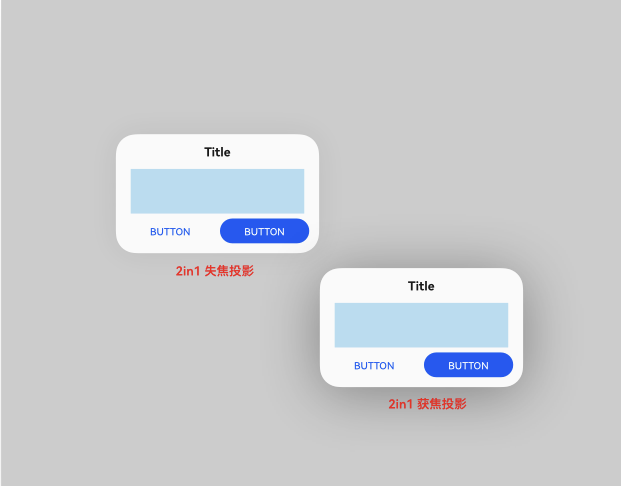
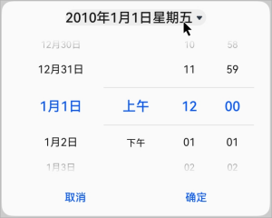
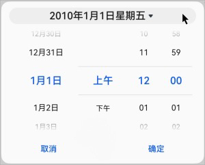

# ArkUI子系统Changelog

## cl.arkui.1 bindMenu新增指向性菜单样式

**访问级别**

公开接口

**变更原因**

UX规格增强

**变更影响**

该变更为非兼容性变更。

变更前：在bindMenu的MenuOptions中将enableArrow属性设为true时，不展示指向性菜单样式。

变更后：在bindMenu的MenuOptions中将enableArrow属性设为true且菜单的大小和位置足以放置箭头时，会展示指向性菜单样式。

**API Level**

enableArrow、arrowOffset属性的起始支持版本为API version 10。

**变更发生版本**

从OpenHarmony SDK 5.0.0.23开始。

**适配指导**

如果不需要bindMenu展示指向性菜单样式，在bindMenu的MenuOptions中不设置enableArrow属性或将enableArrow属性设置为false；
如果需要bindMenu展示指向性菜单样式，在bindMenu的MenuOptions中将enableArrow属性设置为true，并根据需要决定是否设置arrowOffset属性值。

## cl.arkui.2 应用可获焦的默认行为变更

**访问级别**

公开接口

**变更原因**

优化默认走焦行为。

**变更影响**

该变更为非兼容性变更。

变更前：有获焦能力但默认不可获焦的组件，需要通过配置属性`.focusable(true)`使得自身可获焦，且走焦时没有默认焦点框，需要配置焦点态样式。

变更后：注册了onClick或者单指单击手势的组件默认可获焦，走焦时无需配置焦点态样式也能显示默认焦点框。

**API Level**

该特性变更起始支持版本为 API 12。

**变更发生版本**

从OpenHarmony SDK 5.0.0.23开始。

**适配指导**

可点击组件不希望参与走焦，需要显示配置`.focusable(false)`；

## cl.arkui.3 Dialog组件弹窗圆角、背景色、背景模糊、宽高限制、响应式/自适应、阴影样式等默认样式变更

**访问级别**

公开接口

**变更原因**

UX样式变更

**变更影响**

该变更为非兼容性变更，只影响弹窗的默认样式，自定义样式后以设置为准，自定义设置非法值时，效果等同默认场景。

- 变更前
  1. 弹窗圆角默认四个角均为24vp
  2. 弹窗浅色模式默认背景色为0xd9fffff
  3. 大部分弹窗默认均为背景色为透明（Color.Transparent）和 背景模糊（COMPONENT_ULTRA_THICK）叠加，customDialog和PromptAction中showDialog和openCustomDialog还是使用的默认背景色。
  4. 弹窗默认宽度为栅格系统控制，最大宽度400vp，当设备为2in1时，弹窗固定大小为400vp不可改变，无法自定义设置宽度。
  5. 弹窗默认最大高度为（屏幕高度 - 安全区域）* 0.8， 当设备为2in1时，高度最大为全屏 * 0.67 * 0.9。
  6. 弹窗响应式/自适应场景下，居中样式为避让导航条后的居中；默认场景下弹窗对齐方式是DialogAlignment.Bottom样式，其余设备均为居中样式。
  7. 所有设备都没有默认的阴影样式。

  <br/>
- 变更后
  1. 弹窗圆角默认四个角均为32vp
  2. 弹窗浅色模式默认背景色为0xfffff
  3. 所有弹窗默认均为背景色为透明（Color.Transparent）和 背景模糊（COMPONENT_ULTRA_THICK）叠加
  4. 弹窗默认宽度为所在窗口宽度 - 左右margin，设备上margin为16；当设备为2in1时，左右margin为40。默认最大宽度为400vp，可以随所在窗口大小变化。当自定义设置width接口值时，以自定义设置为准， 弹窗参考宽度为所在窗口的宽度，在此基础上调小或调大；自定义设置非法值时，效果等同默认场景。
  5. 弹窗默认最小高度为70vp，默认最大高度均为（窗口高度 - 安全区域）* 0.9，无设备差异。当自定义设置Height接口值时，以自定义设置为准，弹窗参考高度为（窗口高度 - 安全区域），在此基础上调小或调大；自定义设置非法值时，效果等同默认场景。
  6. 弹窗响应式/自适应场景下，居中样式为全屏居中，所有设备都默认弹窗居中。
  7. 当设备为2in1时，默认场景下获焦阴影值为ShadowStyle.OUTER_FLOATING_MD，失焦为ShadowStyle.OUTER_FLOATING_SM；其余设备没有默认阴影样式。

  如下图所示为变更前后效果对比：

 | 变更前 | 变更后 |
|---------|---------|
|   |    |
|  |   |
|   |  |
|   |   |

**API Level**

在API 12进行版本隔离

**变更发生版本**

从OpenHarmony SDK 5.0.0.23 版本开始。

**变更的接口/组件**

Dialog组件。

**适配指导**

默认效果变更：默认效果变更，无需适配，但应注意变更后的默认效果是否符合开发者预期，如不符合则应自定义修改效果控制变量以达到预期。

## cl.arkui.4 拖拽预览图支持透明度效果及应用自定义

**访问级别**

公开接口

**变更原因**

依照UX规范

**变更影响**

该变更为非兼容性变更。

API version 11及以前：可拖拽组件长按浮起预览图后没有透明度。

API version 12及以后：可拖拽组件长按浮起预览图默认为95%透明度，应用可自定义透明度数值。

**API Level**

12

**变更发生版本**

从OpenHarmony SDK 5.0.0.23开始。

**适配指导**

默认样式变更调整，无需适配。

## cl.arkui.5 @Observed/@Track/@ObservedV2新增校验变更
**访问级别**

公开接口

**变更原因**

深度观察的装饰器存在新旧两个接口，增加编译校验，防止开发者混用，导致运行时功能异常。

**变更影响**

变更前：不校验报错。

变更后：
如果开发者存在以下场景，不按规范使用，编译会报错。
1. @Track使用在@ObservedV2修饰的class内；
2. 一个class同时被@Observed和@ObservedV2装饰；
3. 装饰子类和父类的@Observed和@ObservedV2不一致。

错误示例如下：

```ts
// @Track不能使用在@ObservedV2修饰的class内
@ObservedV2
class TestObserved {
  @Track value: string = "hello"
}
// 一个class不能同时被@Observed和@ObservedV2装饰
@Observed
@ObservedV2
class TestObserved1 {
  value: string = "hello"
}
// 装饰子类和父类的@Observed和@ObservedV2需要保持一致
@Observed
class TestObserved3 {
  @Track value: string = "hello"
}
@ObservedV2
class TestObserved4 extends TestObserved3 {
  @Trace value: string = "hello"
}

@ObservedV2
class TestObserved5 {
  @Trace value: string = "hello"
}
@Observed
class TestObserved6 extends TestObserved5 {
  @Track value: string = "hello"
}
```

**起始API Level**

起始支持版本为 API 12。

**变更发生版本**

从OpenHarmony SDK 5.0.0.23开始。

**适配指导**

开发者需要根据错误提示信息，进行适配整改。

## cl.arkui.6 TextInput、TextArea、Search、RichEditor空间文本菜单样式变更

**访问级别**

公开接口

**变更原因**

规格变更

**变更影响**

该变更为兼容性变更。
API Version 11 以及之前的版本：文本选择菜单，包含分享、搜索、翻译按钮，三个按钮都是灰色，并且有拓展菜单。

API Version 12 变更后：文本选择菜单，不包含分享、搜索、翻译按钮，不出现拓展菜单。

**起始 API Level**

文本菜单是系统能力，无对外接口。

**变更发生版本**

从OpenHarmony SDK 5.0.0.23 版本开始。

**变更的接口/组件**

TextInput、TextArea、Search、RichEditor。

**适配指导**

默认行为变更，无需适配，但应注意变更后的行为是否对整体应用逻辑产生影响。

## cl.arkui.7 ImageSpan、ContainerSpan单独使用在DevEco Studio中报错变更

**访问级别**

公开接口

**变更原因**

规格变更

**变更影响**

该变更为非兼容性变更。
变更前：Text子组件ImageSpan、ContainerSpan放在其他组件下使用，编译无报错。
变更后：DevEco Studio中单独使用ImageSpan、ContainerSpan组件，而不是作为Text的子组件被使用，编译报错。

**起始 API Level**

12

**变更发生版本**

从OpenHarmony SDK 5.0.0.23 版本开始。

**变更的接口/组件**

ImageSpan、ContainerSpan。

**适配指导**

默认行为变更，开发者按照报错提示修改。

## cl.arkui.8 Popup组件宽度设置100%场景下避让位置变更

**访问级别**

公开接口

**变更原因**

UX样式变更

**变更影响**

该变更为非兼容性变更。

变更前，Popup宽度大于等于100% - 6vp时，Popup会进行默认避让，且距离窗口有6vp左右边距。

变更后，Popup宽度大于等于100% - 6vp时，Popup不会进行默认避让，且距离窗口没有6vp左右边距。

**起始API Level**

12

**变更发生版本**

从OpenHarmony SDK 5.0.0.23 版本开始。

**变更的接口/组件**

Popup组件。

**适配指导**

默认效果变更，应注意变更后的默认效果是否符合开发者预期，如不符合可以使用offset属性自行调整Popup位置，请查阅[Popup控制](../../../application-dev/reference/apis-arkui/arkui-ts/ts-universal-attributes-popup.md)文档。

## cl.arkui.9 拖拽预览图支持统一圆角及应用自定义

**访问级别**

公开接口

**变更原因**

依照UX规范

**变更影响**

该变更为非兼容性变更。

API version 11及以前：非文本类组件长按浮起预览图显示应用自定义的圆角效果。

API version 12及以后：非文本类组件长按浮起预览图通过检查DragPreviewOptions.mode来判断是否启用非文本类组件统一圆角效果，默认值12vp。当应用自身设置的圆角值大于默认值时，则显示应用自定义圆角效果。

**API Level**

12

**变更发生版本**

从OpenHarmony SDK 5.0.0.23开始。

**适配指导**

默认样式变更调整，无需适配。

## cl.arkui.10 拖拽支持预览图背景模糊效果

**访问级别**

公开接口

**变更原因**

依照UX规范

**变更影响**

该变更为非兼容性变更。

API version 11及以前：非文本类组件长按浮起预览图，预览图无背景模糊效果。

API version 12及以后：非文本类组件长按浮起预览图，预览图有背景模糊效果。

**API Level**

12

**变更发生版本**

从OpenHarmony SDK 5.0.0.23开始。

**适配指导**

默认样式变更调整，无需适配。

## cl.arkui.11 DatePickerDialog标题按钮大小及布局变更

**访问级别**

公开接口

**变更原因**

UX规格增强

**变更影响**

该变更为非兼容性变更。

变更前：DatePickerDialog标题按钮大小与文本大小一致，底部操作区距离弹窗边缘24vp。

变更后：DatePickerDialog标题按钮高度为32vp，距离弹窗左右边界为16vp，底部操作区与离弹窗边缘无间距。

如下图所示为变更前后效果对比：

| 变更前 | 变更后 |
|---------|---------|
|  |  |

**起始API Level**

12

**变更发生版本**

从OpenHarmony SDK 5.0.0.23开始。

**适配指导**

默认行为变更，无需适配，但应注意变更后的行为是否对整体应用逻辑产生影响。

## cl.arkui.12  bindSheet组件修改标题与关闭按钮之间的间距

**访问级别**

公开接口

**变更原因**

为满足应用述求和新的UX规格，标题与关闭按钮的间距调整为8vp。

**变更影响**

该变更为非兼容性变更。

API version 12之前，标题与关闭按钮之间的距离为32vp。

API version 12及以后，标题与关闭按钮之间的距离为8vp。

变更示例图：


**起始API Level**

11

**变更发生版本**

从OpenHarmony SDK 5.0.0.23开始。

**变更的接口/组件**

bindSheet组件

**适配指导**

默认行为变更，无需适配，但应注意变更后的默认效果是否符合开发者预期，如不符合则自定义修改效果控制变量以达到预期。

## c1.arkui.13 bindSheet半模态面板的backgroundColor属性异常值处理逻辑变更

**访问级别**

公开接口

**变更原因**

bindSheet半模态面板的backgroundColor属性设置从正常值更新为异常值时，使用默认值。

**变更影响**

该变更为非兼容性变更。

变更前，当开发者对bindSheet半模态面板的backgroundColor属性设置从正常值更新为异常值时，采用不操作处理。

变更后，当开发者对bindSheet半模态面板的backgroundColor属性设置从正常值更新为异常值时，采用默认颜色处理。

**起始API Level**

11

**变更发生版本**

从OpenHarmony SDK 5.0.0.23 版本开始。

**变更的接口/组件**

bindSheet半模态面板。

**适配指导**

异常值处理逻辑变更，不涉及适配。
