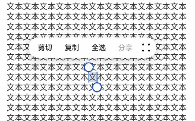
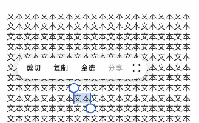

## cl.arkui.1 RichEditor菜单弹出时滚动组件后菜单显隐规格变更

**访问级别**

公开接口

**变更原因**

RichEditor菜单弹出后，滚动停止时菜单是否显示的UX默认行为改变

**变更影响**

变更前：RichEditor菜单弹出后，滚动组件时菜单隐藏，停止滚动时菜单不自动重新显示。

变更后：RichEditor菜单弹出后，滚动组件时菜单隐藏，停止滚动时会自动重新显示。
| 变更前 | 变更后 |
|---------|---------|
| | |
**起始API Level**

该特性变更起始支持版本为 API 12。

**变更发生版本**

从OpenHarmony SDK 5.0.0.24开始。

**适配指导**

UX默认行为变更，无需适配。不影响功能逻辑，请关注当前富文本菜单在停止滚动时的UX表现。

## cl.arkui.2 bindMenu、bindContextMenu菜单允许自定义圆角

**访问级别**

公开接口

**变更原因**

功能增强

**变更影响**

该变更为兼容性变更。

**API Level**

12

**变更发生版本**

从OpenHarmony SDK 5.0.0.24 版本开始。

**变更的接口/组件**

bindMenu、bindContextMenu

**适配指导**

该变更为兼容性变更，无需适配。如需使用该功能，请查阅[菜单控制](../../../application-dev/reference/apis-arkui/arkui-ts/ts-universal-attributes-menu.md)文档。

## cl.arkui.3 在UI上下文不明确的地方，promptAction.showToast使用方式规格变更

**访问级别**

公开接口

**变更原因**

本模块功能依赖UI的执行上下文，不可在UI上下文不明确的地方使用，若在非UI页面中或者一些异步回调中调用此接口，可能无法跟踪到当前UI的上下文，导致toast位置计算错误。

**变更影响**

变更前：在UI上下文不明确的地方，可以直接弹出toast，但是位置可能错误。

变更后：在UI上下文不明确的地方，需要用户指定相应的UIContext来获取promptAction对象，来弹出toast。

**起始API Level**

该特性变更起始支持版本为 API 9。

**变更发生版本**

从OpenHarmony SDK 5.0.0.24开始。

**适配指导**

在http、延时或者子窗口中弹toast，可能不会显示toast，并且日志中能看到窗口返回11的错误码，此时就需要用户自行指定上下文，代码如下
```ts
import promptAction from '@ohos.promptAction';
import http from '@ohos.net.http';

@Entry
@Component
struct Index {
  @State message: string = '点这里会弹个toast';

  build() {
    Row() {
      Button() {
        Text(this.message)
          .fontSize(20)
          .fontWeight(FontWeight.Bold)
      }
      .width('100%')
      .onClick(()=>{
        let httpRequest = http.createHttp()
        let uiContext = this.getUIContext()
        httpRequest.request('https://xxx.com', { method: http.RequestMethod.GET }).then((res: http.HttpResponse) => {
          let promptAction1 = uiContext.getPromptAction()
          promptAction1.showToast({
            message:"ok，我是toast",
            duration:1000,
            showMode: promptAction.ToastShowMode.TOP_MOST
          })
        }).catch((err: Error)=>{
          let promptAction1 = uiContext.getPromptAction()
          promptAction1.showToast({
            message:"error，我是toast",
            duration:1000,
            showMode: promptAction.ToastShowMode.TOP_MOST
          })
          httpRequest.destroy()
        })
      })
    }
    .height('100%')
  }
}
```

## cl.arkui.4 backgroundImagePosition传入参数默认单位规格变更

**访问级别**

公开接口

**变更原因**

接口默认单位值与文档描述不符。

**变更影响**

变更前：position类型传入的数字值，默认单位当作px。

变更后：position类型传入的数字值，默认单位当作vp。

**起始API Level**

该特性版本为API 7,变更版本为API 12。

**变更发生版本**

从OpenHarmony SDK 5.0.0.24开始。

**适配指导**

默认行为变更，无需适配，但应注意变更后的默认效果是否符合开发者预期，如需设置px单位的值，可拼接成数字加px的字符串，或者px2vp后设置。

## cl.arkui.5 RicEditor组件RichEditorTextStyle通用属性默认值变更

**访问级别**

公开接口

**变更原因**

UX规格增强

**变更影响**

该变更为非兼容性变更。

1. 修改RichEditorTextStyle通用属性中设置字体大小为0时的字体显示大小

变更前，设置字体大小为0时內容不显示；

变更后，设置字体大小为0时，显示为默认字体大小16fp。

2. 修改RichEditorTextStyle通用属性中默认字体颜色

变更前，默认字体颜色是Color.Black；

变更后，默认字体颜色是是系统资源中的`font_primary`。

3. 修改RichEditorTextStyle通用属性中默认字体颜色

变更前，默认装饰线颜色是Color.Black；

变更后，默认装饰线颜色为跟随字体颜色。

**起始API Level**

10

**变更发生版本**

从OpenHarmony SDK 5.0.0.24开始。

**适配指导**

默认行为变更，无需适配，但应注意变更后的默认效果是否符合开发者预期，如不符合则自定义修改效果控制变量以达到预期。