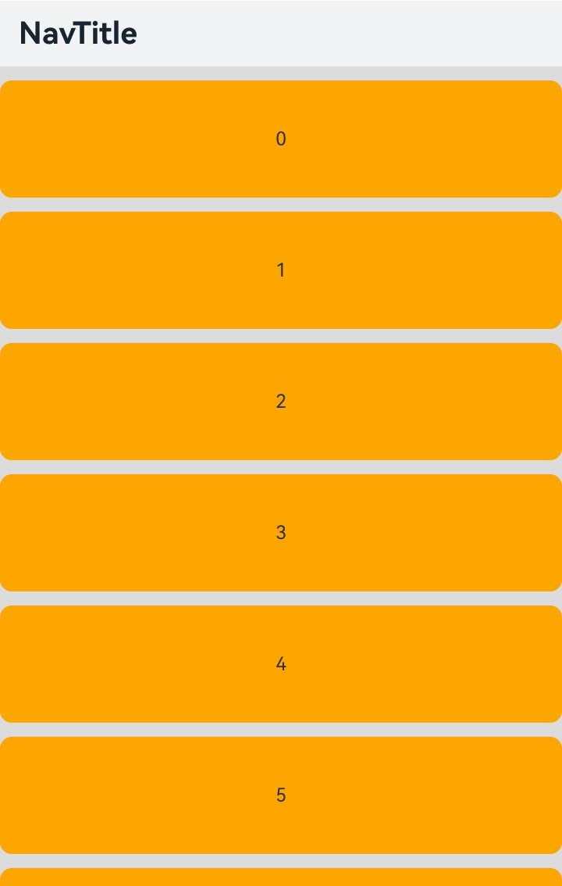
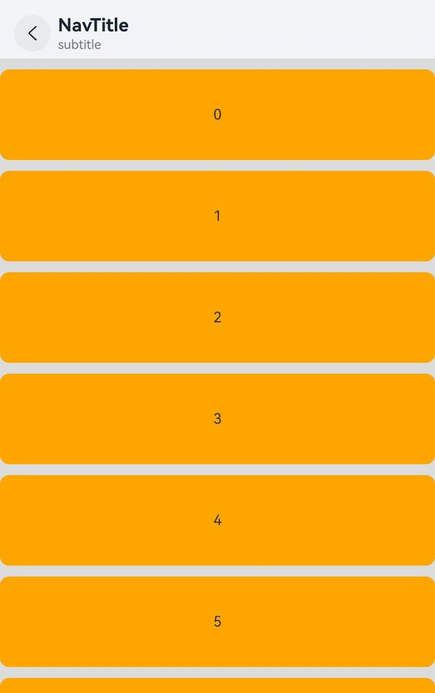
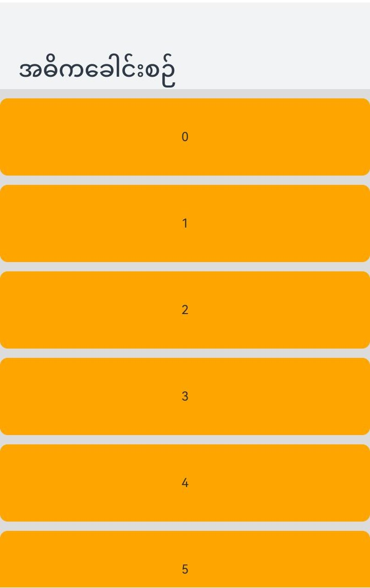
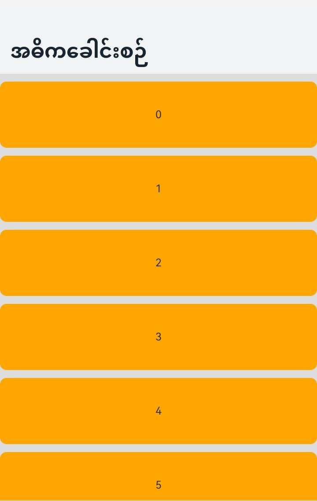
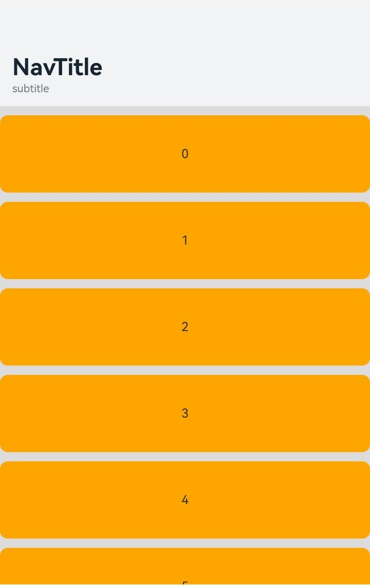
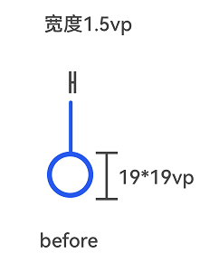
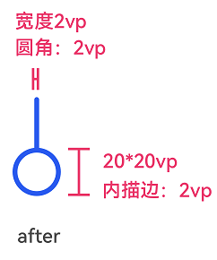

# ArkUI子系统Changelog

## cl.arkui.1 Navigation、NavDestination默认样式变化

**访问级别**

公开接口

**变更原因**

UX样式增强

**变更影响**

1. Navigation Mini模式，主标题字重默认值由MEDIUM变更为BOLD；隐藏返回键时，非自定义主标题默认字号由24fp变更为26fp;

变更前后对比效果，如下图所示：

| 变更前 | 变更后 |
|---------|---------|
|  |  |
|  |  |

2. Navigation Mini模式及NavDestination组件的标题栏含副标题时默认高度由82vp变更为56vp，标题居中布局；back图标变更；

变更前后对比效果，如下图所示：

| 变更前 | 变更后 |
|---------|---------|
|  |  |
|  |  |

3. Navigation Full、Free模式，大标题模式，布局变更：<br/>
变更前：标题居中布局；<br/>
变更后：<br/>
含副标题：<br/>
   (1)当主标题高度+副标题高度+主副标题之间间距2vp+标题下间距8vp =< 82vp时，固定主副标题之间间距2vp，标题居中布局；<br/>
   (2)当主标题高度+副标题高度+主副标题之间间距2vp+标题下间距8vp > 82vp时，固定标题下间距8vp，主副标题之间间距2vp，主标题向上自适应布局。<br/>
   不含副标题：<br/>
   (1)当标题高度 > 56vp时，固定标题下间距8vp，标题向上自适应布局；<br/>
   (2)当标题高度 =< 56vp时，标题居中布局。<br/>

变更前后对比效果，如下图所示：
| 变更前 | 变更后 |
|---------|---------|
|  |  |
|  |  |
|  |  |


**起始API Level**

9

**变更发生版本**

从OpenHarmony SDK 5.0.0.25 版本开始。

**变更的接口/组件**

Navigation、NavDestination

**适配指导**

默认效果变更，无需适配。但应注意变更后的默认效果是否符合预期。

## cl.arkui.2 一级菜单弹出/退出动效增强，二级菜单新增STACK_EXPAND和EMBEDDED_EXPAND模式动效

**访问级别**

公开接口

**变更原因**

一级/二级菜单弹窗默认风格刷新

**变更影响**

一级菜单弹出/退出动效：
变更前：
菜单弹出/退出是透明度在变换

变更后：
菜单相对target组件弹出/退出，在透明度的基础上增加了位移缩放模糊动效

二级菜单弹出/退出动效：
变更前:
二级菜单在一级菜单侧边展开，退出时直接消失
变更后：
1. 开发者设置为STACK_EXPAND模式，二级菜单展开形成前后两个层级，一级菜单向后位移缩放，透明度同时切换，二级菜单中的标题和箭头以点击的menuItem为中心，向下位移至正确位置，同时箭头方向顺时针旋转90度。
2. STACK_EXPAND模式退出时，二级菜单向上位移至正确位置，且箭头逆时针旋转90度，透明度变为0，一级菜单向前位移至原位且大小恢复原样，透明度变为100%；
3. 开发者设置为EMBEDDED_EXPAND模式，二级菜单展开到合适高度，且向下的箭头顺时针旋转180度，退出时，二级菜单慢慢消失高度变为0，且箭头逆时针旋转180度。

**起始 API Level**

12

**变更发生版本**

从OpenHarmony SDK 5.0.0.25 版本开始。

**变更的接口/组件**

菜单

**适配指导**

一级菜单弹出/退出动效行为变更，无需适配，二级菜单弹出/退出动效，可以调用subMenuExpandingMode接口设置动效模式

## cl.arkui.3 Canvas绘制的阴影参与混合模式

**访问级别**

公开接口

**变更原因**

变更前效果未达预期

**变更影响**

该变更为非兼容性变更。

变更前：两个图形做混合模式时，未绘制的图形的阴影先与已绘制的图形做默认的source-over混合，未绘制的图形再与已绘制的图形与未绘制的图形的阴影混合后的图形按设定的globalCompositeOperation做混合。

变更后：两个图形做混合模式时，未绘制的图形的阴影先与已绘制的图形做设定的混合，未绘制的图形再与已绘制的图形与未绘制的图形的阴影混合后的图形按照设定的globalCompositeOperation做混合。

**起始 API Level**

8

**变更发生版本**

从OpenHarmony SDK 5.0.0.25 版本开始。

**变更的接口/组件**

globalCompositeOperation接口与shadowBlur, shadowOffsetX或shadowOffsetY接口同时作用时存在非兼容性变更。

**适配指导**

默认效果变更，无需适配。但应注意变更后的效果是否符合预期。

下图以globalCompositeOperation为"xor"时举例，globalCompositeOperation设定为其他值时类似：

```ts
@Entry
@Component
struct Demo {
  private settings: RenderingContextSettings = new RenderingContextSettings(true)
  private context: CanvasRenderingContext2D = new CanvasRenderingContext2D(this.settings)

  build() {
    Flex({ direction: FlexDirection.Column, alignItems: ItemAlign.Center, justifyContent: FlexAlign.Center }) {
      Canvas(this.context)
        .width('100%')
        .height('50%')
        .onReady(() => {
          this.context.fillStyle = "#f00"
          this.context.fillRect(0, 0, 100, 50)
          this.context.globalCompositeOperation = 'xor'
          this.context.shadowColor = "#00f"
          this.context.shadowOffsetX = 100
          this.context.fillStyle = "#0f0"
          this.context.fillRect(100, 0, 100, 50)
        })
    }
    .width('100%')
    .height('100%')
  }
}
```


## cl.arkui.4 光标默认样式变更

**访问级别**

公开接口

**变更原因**

默认样式变更。

**变更影响**

该变更为非兼容性变更。

变更前：光标默认宽度1.50vp，光标无圆角，圆圈直径为19vp。

变更后：光标默认宽度2.00vp，光标有圆角2vp，圆圈直径为20vp。

变更前后对比效果，如下图所示：
| 变更前 | 变更后 |
|---------|---------|
|||

**起始API Level**

10

**变更发生版本**

从OpenHarmony SDK 5.0.0.25开始。

**变更的接口/组件**

涉及光标的组件：TextInput、TextArea、Search、RichEditor。

**适配指导**

默认效果变更，无需适配，但应注意变更后的默认效果是否符合开发者预期，如不符合则应自定义修改效果控制变量以达到预期。

## cl.arkui.5 TextInput组件错误提示文本样式变更和showCounter接口临界条件变更

**访问级别**

公开接口

**变更原因**

showError接口默认样式变更和showCounter接口不同参数时行为不一致。

**变更影响**

该变更为非兼容性变更。

变更前：showError接口配置的错误提示文本单行超长时超出部分截断。showCounter接口只设置第一个参数value时，计数器变红的条件是达到最大字符数，设置第二个参数options时，计数器变红条件是达到最大字符数后继续输入才会变红。

变更后：showError接口配置的错误提示文本单行超长时末尾显示省略号。showCounter接口达到最大字符计数器不变红，超过最大字符数计数器才会变红，使不同参数配置时触发计数器变红的临界条件相同，接口行为表现一致。

变更前后对比效果，如下图所示：
| 变更前 | 变更后 |
|---------|---------|
|||

示例：

```ts
@Entry
@Component
struct demo {
  @State errorText: string = '这是错误提示文本，这是错误提示文本，这是错误提示文本。'
  build() {
    Column() {
      TextInput({ text: '请输入用户名...'})
        .margin({ top: 10 })
        .width('60%')
        .showError(this.errorText)
    }
    .width('100%')
  }
}
```

**起始API Level**

showError：10，showCounter：11。

**变更发生版本**

从OpenHarmony SDK 5.0.0.25开始。

**变更的接口/组件**

TextInput组件showError接口和showCounter接口。

**适配指导**

默认效果变更，无需适配，但应注意变更后的默认效果是否符合开发者预期，如不符合则应自定义修改效果控制变量以达到预期。