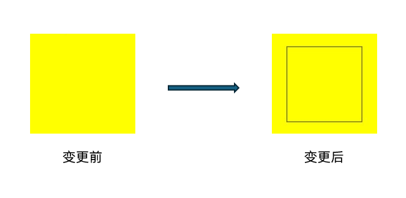
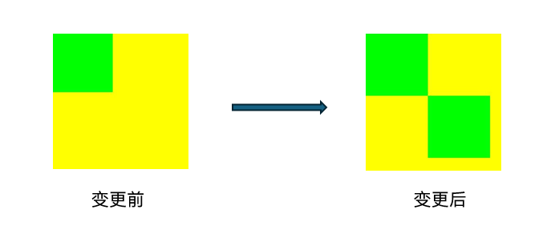

# ArkUI子系统Changelog

## cl.arkui.1 线性DataPanel组件默认圆角尺寸变更并可以自定义圆角尺寸

**访问级别**

公开接口

**变更原因**

线性DataPanel组件的圆角尺寸不能改变，导致开发者无法自定义线性DataPanel组件的圆角尺寸。新增支持自定义线性DataPanel组件的圆角尺寸，增强开发者自定义能力。

**变更影响**

该变更为非兼容性变更。

变更前：
线性DataPanel组件默认是胶囊形状。不能自定义线性DataPanel组件的圆角。

变更后：
线性DataPanel组件默认圆角的是小圆角。可以自定义线性DataPanel组件的圆角尺寸，调用borderRadius设置圆角尺寸。

**API Level**

12

**变更发生版本**

从OpenHarmony SDK 5.0.0.26开始。

**适配指导**

默认圆角效果变更，无需适配，如不接受变更后的默认圆角效果，可以调用borderRadius自定义修改圆角尺寸以达到预期。

## cl.arkui.2 ScrollBar组件没有子节点时，支持显示默认样式的滚动条

**访问级别**

公开接口

**变更原因**
从API version 12开始，ScrollBar组件没有子节点时，支持显示默认样式的滚动条。

**变更影响**

该变更为非兼容性变更。

API version 11及以前，ScrollBar组件没有子节点时，不显示滚动条。

API version 12及以后，ScrollBar组件没有子节点时，支持显示默认样式的滚动条。

**API Level**

12

**变更发生版本**

从OpenHarmony SDK 5.0.0.26 版本开始。

**变更的接口/组件**

ScrollBar组件

**适配指导**

请查阅[ScrollBar组件](../../../application-dev/reference/apis-arkui/arkui-ts/ts-basic-components-scrollbar.md)文档进行适配。

## cl.arkui.3 UIExtensionComponent异常处理废弃onRelease和onResult，使用onTerminated和onError替代

**访问级别**

公开接口

**变更原因**
UIExtensionComponent异常处理回调分散

**变更影响**

该变更为非兼容性变更。

API version 11及以前，被拉起的UIExtensionAbility意外Crash或被kill时，触发onRelease回调（错误码为1）；被拉起的UIExtensionAbility调用terminateSelf时会触发onRelease回调（错误码为0）；被拉起的UIExtensionAbility调用terminateSelfWithResult时会触发onRelease回调（错误码为0）和onResult回调。

API version 12及以后，被拉起的UIExtensionAbility意外Crash或被kill时，触发onError回调（错误码为100014）；被拉起的UIExtensionAbility调用terminateSelf时会触发onTerminated回调，其入参"code"取默认值"0"，"want"为"undefined"；被拉起的UIExtensionAbility调用terminateSelfWithResult时会触发onTerminated回调，其携带的信息会传给回调函数的入参。

**API Level**

12

**变更发生版本**

从OpenHarmony SDK 5.0.0.26 版本开始。

**变更的接口/组件**

UIExtensionComponent组件

**适配指导**

请查阅[UIExtensionComponent组件](../../../application-dev/reference/apis-arkui/arkui-ts/ts-container-ui-extension-component-sys.md)文档进行适配。

## cl.arkui.4 手势菜单复制，粘贴，全选，剪切按钮扩大选中区域的高度至40vp

**访问级别**

公开接口

**变更原因**
手势菜单复制、粘贴、全选、剪切按钮选中区域高度不符合简单易用标准

**变更影响**

该变更为非兼容性变更。

API version 11及以前，手势菜单复制、粘贴、全选、剪切按钮扩中区域的高度为28vp。

API version 12及以后，手势菜单复制、粘贴、全选、剪切按钮扩中区域的高度为40vp，且保持长按时视觉效果一致。

**起始API Level**

10

**变更发生版本**

从OpenHarmony SDK 5.0.0.26 版本开始。

**变更的接口/组件**

涉及菜单的组件：TextInput、TextArea、Search、RichEditor。

**适配指导**

默认行为变更，无需适配，但应注意变更后的行为是否对整体应用逻辑产生影响。

## cl.arkui.5 pickerDialog操作区按钮大小及间距调整

**访问级别**

公开接口

**变更原因**

修正视觉效果以获得更好的用户体验。

**变更影响**

该变更为非兼容性变更。

| |变更前 | 变更后 |
|---------|---------|---|
| DatePickerDialog      |按钮大小：高36vp，宽150vp。 按钮边距：上18vp，左右20vp，下10vp。|按钮大小：高度40vp，宽度自适应。 按钮边距：上16vp，左右16vp，下16vp，按钮之间16vp。|
| TimePickerDialog      |按钮大小：高36vp，宽150vp。 按钮边距：上24vp，左右20vp，下6vp。  |按钮大小：高度40vp，宽度自适应。 按钮边距：上16vp，左右16vp，下16vp，按钮之间16vp。|
| CalendarPickerDialog  | 按钮大小：高40vp，宽150vp。 按钮边距：上8vp，左右16vp，下16vp。 |按钮大小：高度40vp，宽度自适应。 按钮边距：上16vp，左右16vp，下16vp，按钮之间16vp。|
| TextPickerDialog      | 按钮大小：高36vp，宽150vp。 按钮边距：上32vp，左右20vp，下6vp。  |按钮大小：高度40vp，宽度自适应。 按钮边距：上16vp，左右16vp，下16vp，按钮之间16vp。|

**起始API Level**

12

**变更发生版本**

从OpenHarmony SDK 5.0.0.26 版本开始。

**变更的接口/组件**

涉及菜单的组件：CalendarPickerDialog、TextPickerDialog、DatePickerDialog、TimePickerDialog。

**适配指导**

默认行为变更，无需适配，但应注意变更后的行为是否对整体应用逻辑产生影响。

## cl.arkui.6 使用Path2D复制构造Path2D不生效

**访问级别**

公开接口

**变更原因**

变更前效果未达预期

**变更影响**

该变更为非兼容性变更。

变更前：使用Path2D复制构造Path2D不生效

变更后：使用Path2D复制构造Path2D可以创建出一个与原来的Path2D相同路径的Path2D

**起始 API Level**

8

**变更发生版本**

从OpenHarmony SDK 5.0.0.26 版本开始。

**变更的接口/组件**

Path2D

**适配指导**

默认效果变更，无需适配。但应注意变更后的效果是否符合预期。

```ts
@Entry
@Component
struct Demo {
  private settings: RenderingContextSettings = new RenderingContextSettings(true)
  private context: CanvasRenderingContext2D = new CanvasRenderingContext2D(this.settings)
  private path2Da: Path2D = new Path2D()

  build() {
    Flex({ direction: FlexDirection.Column, alignItems: ItemAlign.Center, justifyContent: FlexAlign.Center }) {
      Canvas(this.context)
        .width('100%')
        .height('50%')
        .onReady(() => {
          this.path2Da.rect(20, 20, 100, 100)
          let path2Db = new Path2D(this.path2Da)
          this.context.stroke(path2Db)
        })
    }
    .width('100%')
    .height('100%')
  }
}
```



## cl.arkui.7 使用PixelMap构造ImageBitmap不生效

**访问级别**

公开接口

**变更原因**

变更前效果未达预期

**变更影响**

该变更为非兼容性变更。

变更前：使用PixelMap构造ImageBitmap不生效

变更后：使用PixelMap构造ImageBitmap可以创建出ImageBitmap

**起始 API Level**

8

**变更发生版本**

从OpenHarmony SDK 5.0.0.26 版本开始。

**变更的接口/组件**

ImageBitmap

**适配指导**

默认效果变更，无需适配。但应注意变更后的效果是否符合预期。

```ts
@Entry
@Component
struct Demo {
  private settings: RenderingContextSettings = new RenderingContextSettings(true)
  private context: CanvasRenderingContext2D = new CanvasRenderingContext2D(this.settings)

  build() {
    Flex({ direction: FlexDirection.Column, alignItems: ItemAlign.Center, justifyContent: FlexAlign.Center }) {
      Canvas(this.context)
        .width('100%')
        .height('50%')
        .backgroundColor('#ffff00')
        .onReady(() => {
          this.context.fillStyle = "#00ff00"
          this.context.fillRect(0, 0, 100, 100)
          let pixel = this.context.getPixelMap(0, 0, 100, 100)
          let image = new ImageBitmap(pixel)
          this.context.drawImage(image, 100, 100)
        })
    }
    .width('100%')
    .height('100%')
  }
}

```

