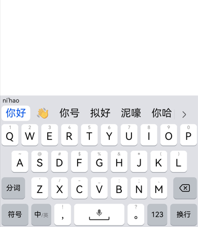
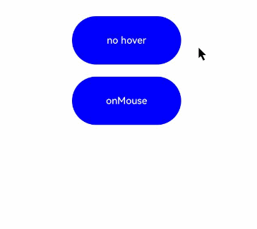

# ArkUI子系统Changelog

## cl.arkui.1 onTextSelectionChange触发回调不需要获焦变更

**访问级别**
 
公开接口

**变更原因**

onTextSelectionChange回调触发与控件获焦解除绑定

**变更影响**

该变更为非兼容性变更。

变更前：控件没有获焦时，不允许触发onTextSelectionChange。

变更后：控件没有获焦时，允许触发onTextSelectionChange。

**起始API Level**

10

**变更发生版本**

从OpenHarmony SDK 5.0.0.27开始。

**变更的接口/组件**

Text、TextInput、TextArea、Search。

**适配指导**

如果onTextSelectionChange绑定了事件，需要适配未获焦时的触发回调的行为。

## cl.arkui.2 富文本增加预上屏功能及开关接口，默认打开，支持关闭。

**访问级别**
 
公开接口

**变更原因**

富文本新增支持输入预上屏功能,默认打开，支持开关关闭。

**变更影响**

该变更为非兼容性变更。

变更前：输入法应用输入时富文本组件无预上屏内容及预上屏下划线样式，在确认候选词后内容插入到组件中。

变更后：输入法应用输入时富文本组件显示预上屏内容及下划线样式，未确认完毕候选词前，预上屏内容已经插入到组件中，在确认完毕候选词后，预上屏内容从组件中移除，再将确认完毕的候选词插入到组件中显示。应用若想保持之前输入时的状态，需要自行设置预上屏开关为false。
输入相关回调返回值中增加预上屏字段:aboutToIMTInput#RichEditorInsertValue.previewText;onIMEInputComplete#RichEditorTextSpanResult.previewText。

| 变更前 | 变更后 |
|---------|---------|
| | |

**起始API Level**

12

**变更发生版本**

从OpenHarmony SDK 5.0.0.27开始。

**变更的接口/组件**

RichEditor

**适配指导**

富文本预上屏功能默认打开，预上屏时会触发相关输入回调。
例：预上屏输入  "n" -> "ni"时，aboutToIMeInput回调 : {RichEditorInsertValue.insertValue = "", RichEditorInsertValue.previewText = "i"}
onIMEInputComplete回调 ：{RichEditorTextSpanResult.value = "", RichEditorTextSpanResult.previewText = "i"}

基于回调的使用方式不同，输入内容的状态可能会出现不符合开发者预期的情况,开发者可以通过设置预上屏开关，将预上屏功能关闭。
RichEditor({ controller: this.controller })
    .enablePreviewText(false)

## cl.arkui.3 按下鼠标按键（任意按键）移动鼠标情况下不再上报鼠标事件的行为变更。

**访问级别**
 
公开接口

**变更原因**

优化鼠标按压态下拖移的执行效率。

**变更影响**

该变更为非兼容性变更。

变更前：按压鼠标按键拖移过程中，中途经过的控件会收到鼠标事件。

变更后：按压鼠标按键拖移过程中，中途经过的控件不再会收到鼠标事件。

| 变更前(按住鼠标进行拖移) | 变更后(按住鼠标进行拖移) |
|---------|---------|
| | |

**起始API Level**

12

**变更发生版本**

从OpenHarmony SDK 5.0.0.27开始。

**变更的接口/组件**

[onHover](../../../application-dev/reference/apis-arkui/arkui-ts/ts-universal-mouse-key.md#onhover)

[onMouse](../../../application-dev/reference/apis-arkui/arkui-ts/ts-universal-mouse-key.md#onmouse)

**适配指导**

如果开发者需要在按住鼠标按键移动情况下，中间经过的控件也要有hover效果，则需要整改为通过点击开始时命中的控件接收鼠标事件，自行处理。如果当前鼠标移动为拖拽场景，则不要使用[onHover](../../../application-dev/reference/apis-arkui/arkui-ts/ts-universal-mouse-key.md#onhover)和[onMouse](../../../application-dev/reference/apis-arkui/arkui-ts/ts-universal-mouse-key.md#onmouse)而是通过[onDragMove](../../../application-dev/reference/apis-arkui/arkui-ts/ts-universal-events-drag-drop.md#ondragmove)去处理鼠标移动事件。

## cl.arkui.4 TextInput、TextArea 设置TextAlign.Center且显示PlaceHolder文字时，光标位置的变更。

**访问级别**

公开接口

**变更原因**

UX规范变更

**变更影响**

该变更为不兼容性变更。

变更前：TextAlign.Center，显示PlaceHolder文字时，光标在文字中间，输入文字后光标在末尾

变更后：TextAlign.Center，显示PlaceHolder文字时，光标在文字前面，输入文字后光标在末尾

| 变更前 | 变更后 |
|---------|---------|
| | |

**起始API Level**

9

**变更发生版本**

从OpenHarmony SDK 5.0.0.27开始。

**适配指导**

光标显示效果变化，无需适配。

## cl.arkui.5 Toggle/Switch按压反馈样式变更

**访问级别**

公开接口

**变更原因**

UX规范变更

**变更影响**

该变更为不兼容性变更。

变更前：Toggle/Switch有按压反馈，点击时会有按压效果。

变更后：去除Toggle/Switch按压反馈，点击时无按压效果。

| 变更前 | 变更后 |
|---------|---------|
| | |

**起始API Level**

8

**变更发生版本**

从OpenHarmony SDK 5.0.0.27开始。

**适配指导**

按压显示效果变化，无需适配。