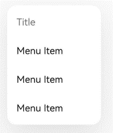
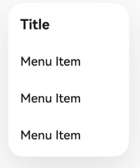

# ArkUI子系统Changelog

## cl.arkui.1 自定义组件struct装饰器校验信息优化

**访问级别**

公开接口

**变更原因**

之前的报错信息存在冗余，不易理解。

**变更影响**

该变更为兼容性变更。

变更前：
输出一个警告(WARN)和一个错误(ERROR)日志信息。
```
WARN: ArkTS:WARN File: xx
A struct should use decorator '@Component' or '@ComponentV2'.
ERROR: ArkTS:ERROR File:xx
'TestComponent()' does not meet UI component syntax.
```

变更后：
如果struct没有被(@Entry/@Preview/@ComponentV2/@Component/@CustomDialog/@Reusable)其中一个装饰器装饰，编译报错，只有一个错误(ERROR)日志信息。
```
ERROR: ArkTS:ERROR File:xx
Decorator '@Component', '@ComponentV2', or '@CustomDialog' is missing for struct 'TestComponent'.
```
错误示例如下：
```ts
struct Child {
  build() {
    Column() {
      Text("hello Child")
    }
  }
}

@Entry
@Component
struct Child {
  build() {
    Column() {
      Child()
    }
  }
}
```

**起始API Level**

不涉及API变更

**变更发生版本**

从OpenHarmony SDK 5.0.0.28开始。

**适配指导**

如果应用代码未发生变化，则不需要适配。
## cl.arkui.2 增加方法装饰器的校验

**访问级别**

公开接口

**变更原因**

当开发者错误的使用多个方法装饰器装饰在同一个方法上时，会导致运行时异常，需要在编译阶段提前拦截。

**变更影响**

该变更为非兼容性变更。

变更前：
当不同的方法装饰器装饰在同一个方法时，编译无日志提示信息。

变更后：
当不同的方法装饰器装饰在同一个方法时，编译输出报错提示信息。
```
ERROR: ArkTS:ERROR File:xx
A function can only be decorated by one of the 'AnimatableExtend, Builder, Extend, Styles and Concurrent'.
ERROR: ArkTS:ERROR File:xx
The member property or method can not be decorated by multiple built-in decorators.
```

错误示例如下：
```ts
@Builder
@Styles
function testFunc() {
  Text("hello testFunc")
}

@Component
struct TestComponent {

  @Builder
  @Styles
  testMethod() {
    Text("hello testMethod")
  }

  build() {
    Column() {
      Text("hello TestComponent")
    }
  }
}
```

变更前：
当相同的内置方法装饰器(@AnimatableExtend/@Builder/@Extend/@Styles/@Concurrent)装饰在同一个方法时，编译无日志提示信息。

变更后：
当相同的内置方法装饰器(@AnimatableExtend/@Builder/@Extend/@Styles/@Concurrent)装饰在同一个方法时，编译输出警告日志提示信息。
```
WARN: ArkTS:WARN File: xx
Duplicate decorators for function are not allowed.
```

错误示例如下：
```ts
@Builder
@Builder
function testFunc() {
  Text("hello testFunc")
}
```

**起始API Level**

不涉及API变更

**变更发生版本**

从OpenHarmony SDK 5.0.0.28开始。

**适配指导**

如果开发者不按规范使用对应范式，则需按日志提示信息进行修改。

## cl.arkui.3 bindPopup在窗口失焦后不消失

**访问级别**

公开接口

**变更原因**

开发者不希望popup所在的窗口失去焦点后，popup会自动消失

**变更影响**

该变更为非兼容性变更。

变更前：
popup所在窗口失焦时，popup会自动消失。

变更后：
popup所在窗口失焦时，popup不会自动消失。


**起始API Level**

不涉及API变更

**变更发生版本**

从OpenHarmony SDK 5.0.0.28开始。

**适配指导**

气泡的关闭需要用户自行决定。如果出现之前版本某一操作后popup消失，现版本不消失的现象时，用户可以检查现象前后窗口焦点是否发生了变化，如果发生变化，现版本需要用户自行将isShow属性设置为false来关闭popup。

## cl.arkui.4 TextInput/TextArea组件设置宽度为auto时，最小值为16vp

**访问级别**

公开接口

**变更原因**

TextInput/TextArea组件设置宽度为auto并且内容为空时，组件消失。

**变更影响**

该变更为兼容性变更。

变更前：
TextInput/TextArea组件设置宽度为auto并且内容为空时，组件消失。

变更后：
TextInput/TextArea组件设置宽度为auto并且内容为空时，组件最小宽度为16vp。

**起始API Level**

不涉及API变更

**变更发生版本**

从OpenHarmony SDK 5.0.0.28开始。

**适配指导**

默认行为变更，无需适配，但应注意变更后的行为是否对整体应用逻辑产生影响。

## cl.arkui.5 TextInput/TextArea组件设置为内联模式时，最小值为16vp

**访问级别**

公开接口

**变更原因**

TextInput/TextArea组件设置为内联模式并且内容为空时，组件消失。

**变更影响**

该变更为兼容性变更。

变更前：
TextInput/TextArea组件设置为内联模式并且内容为空时，组件消失。

变更后：
TextInput/TextArea组件设置为内联模式并且内容为空时，组件最小宽度为16vp。

**起始API Level**

不涉及API变更

**变更发生版本**

从OpenHarmony SDK 5.0.0.28开始。

**适配指导**

默认行为变更，无需适配，但应注意变更后的行为是否对整体应用逻辑产生影响。

## cl.arkui.6 TextInput/TextArea组件在2in1设备上通过双击弹出菜单时，点击全选，菜单消失

**访问级别**

公开接口

**变更原因**

TextInput/TextArea组件在2in1上通过双击弹出菜单时，点击全选，此时无需菜单弹出。

**变更影响**

该变更为兼容性变更。

变更前：
TextInput/TextArea组件在2in1上通过双击弹出菜单时，点击全选，此时菜单弹出。

变更后：
TextInput/TextArea组件在2in1上通过双击弹出菜单时，点击全选，此时菜单消失。

**起始API Level**

不涉及API变更

**变更发生版本**

从OpenHarmony SDK 5.0.0.28开始。

**适配指导**

默认行为变更，无需适配，但应注意变更后的行为是否对整体应用逻辑产生影响。

## cl.arkui.7 Menu组件默认样式变更

**访问级别**

公开接口

**变更原因**

优化menu组件的视觉体验。

**变更影响**

该变更为非兼容性变更。

**变更前：**



菜单列表的左右padding默认为0

菜单项文本字重默认为regular

菜单组件圆角大小默认为16vp

对于带标题的菜单列表，标题文本大小默认为16fp

对于带标题的菜单列表，标题文本颜色默认为#89000000

对于带标题的菜单列表，标题文本字重默认为normal

**变更后：**



菜单列表的左右padding默认为16vp

菜单项文本字重默认为medium

菜单组件圆角大小默认为20vp

对于带标题的菜单列表，标题文本大小默认为18fp

对于带标题的菜单列表，标题文本颜色默认为#FF000000

对于带标题的菜单列表，标题文本字重默认为bold


**起始API Level**

9

**变更发生版本**

从OpenHarmony SDK 5.0.0.28开始。

**适配指导**

默认效果变更，无需适配，但应注意变更后的默认效果是否符合开发者预期，如不符合则应自定义修改效果控制变量以达到预期。

## cl.arkui.8 chipGroup不设置items属性的异常处理

**访问级别**

公开接口

**变更原因**

chipGroup组件在使用过程中，对于必填属性items，不设置时DevEco Studio是否抛出异常。

**变更影响**

该变更为非兼容性变更。

变更前：必填属性items，不设置时DevEco Studio不报错。

变更后：必填属性items，不设置时DevEco Studio抛出异常告警。

**起始API Level**

12

**变更发生版本**

从OpenHarmony SDK 5.0.0.28开始。

**适配指导**

使用chipGroup组件时，如果不设置必填属性items，则需按日志提示信息进行修改。

## cl.arkui.9 ListItem横滑跟手比变更

**访问级别**

公开接口

**变更原因**

ListItem横滑动态跟手比计算公式，需要与其他场景（例如：List拖动过界）的公式一致。

**变更影响**

该变更为不兼容变更。

ListItem横滑动态跟手比按新实现后，手指滑动相同距离，组件滑动距离会变大。

**起始API Level**

9

**变更发生版本**

从OpenHarmony SDK 5.0.0.28开始。

**适配指导**

默认效果变更，无需适配。

## cl.arkui.10 DrawableDescriptor显示效果

**访问级别**

公开接口

**变更原因**

对原来非标准288x288图标的裁切行为做统一变更，提高用户体验。

**变更影响**

该变更为不兼容性变更。

对于非288x288尺寸前景图片，当前生成的分层图标按照缩放后裁剪显示，288x288尺寸前景图片保持原规格。

**起始API Level**

10

**变更发生版本**

从OpenHarmony SDK 5.0.0.28开始。

**适配指导**

默认效果变更：默认效果变更，无需适配，但应注意变更后的默认效果是否符合开发者预期，如不符合则应自定义修改效果控制变量以达到预期。

## cl.arkui.11 TipsDialog中 imageRes、imageSize、title 变更

**访问级别**

公开接口

**变更原因**

扩展 TipsDialog imageRes 支持 pixelMap 和 string 类型的图片，修改参数  imageSize，title 由必填改为非必填，提升用户使用体验。

**变更影响**

该变更为不兼容变更。

变更前：
1. TipsDialog不支持pixelMap和string类型的图片
2. TipsDialog的图片大小为必填
3. TipsDialog中间标题必须有

变更后：
1. TipsDialog支持pixelMap和string类型的图片
2. TipsDialog图片大小非必填，默认大小64v*64vp
3. TipsDialog中间标题可为非必填，未填不展示标题

**起始API Level**

API 12

**变更发生版本**

从OpenHarmony SDK 5.0.0.28开始。

**适配指导**

默认效果变更：默认效果变更，无需适配，但应注意变更后的默认效果是否符合开发者预期，如不符合则应自定义修改效果控制变量以达到预期。