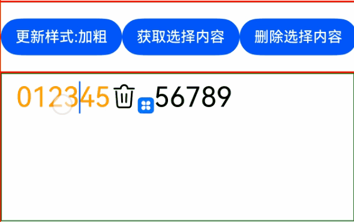
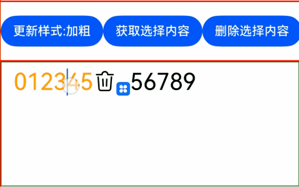
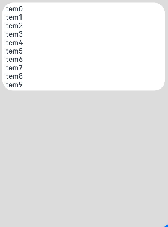
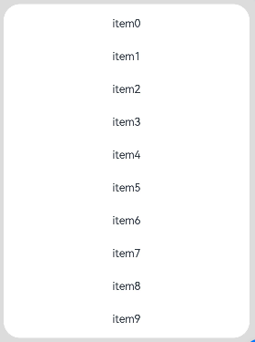

# ArkUI子系统Changelog

## cl.arkui.1 @Component和@ComponentV2修饰的自定义组件使用@Observed或者@ObservedV2修饰的类增加相关校验

**访问级别**

公开接口

**变更原因**

该变更为非兼容性变更。

1.在@Component修饰的自定义组件中通过@State、@Prop、@Link、@Provide、@Consume、@StorageLink、@StorageProp、LocalStorageLink、@LocalStorageProp修饰并使用@ObservedV2修饰的变量类型时，进行校验并输出错误信息。

简化示例如下：

```ts
@ObservedV2
class TmpA{}

@Entry
@Component
struct testTmp {
  @State value_string: TmpA = new TmpA()
  build() {
    Column(){

    }
  }
}
```

2.在@ComponentV2修饰的自定义组件中通过@Param、@Local、@Event、@Provider()、@Consumer()修饰并使用@Observed修饰的类时，进行校验并输出错误信息。

简化示例如下：

```ts
@Observed
class TmpA{}

@Entry
@ComponentV2
struct testTmp {
  @Param value_string: TmpA = new TmpA()
  build() {
    Column(){

    }
  }
}
```

3.以上的变量类型联合使用时，也会进行校验并输出错误信息。

示例如下：

```ts
@ObservedV2
class TmpA{}

@Observed
class TmpB{}

@Entry
@Component
struct testTmp {
  @State value_string: TmpA | TmpB = new TmpA()
  build() {
    Column(){

    }
  }
}
```

**变更影响**

变更前无报错。

变更后报错：

1.The type of the @State property can not be a class decorated with @ObservedV2.

2.The type of the @Param property can not be a class decorated with @Observed.

3.The type of the @State property can not be a class decorated with @ObservedV2.

**起始API Level**

不涉及API变更

**变更发生版本**

从OpenHarmony SDK 5.0.0.31开始。

**适配指导**

如果开发者不按规范使用对应范式，则需按日志提示信息进行修改。

## cl.arkui.2 bindContentCover动效参数变更

**访问级别**

公开接口

**变更原因**

为满足应用述求和UX规格，全模态动效参数改为与半模态一致。

**变更影响**

该变更为不兼容性变更。

变更前，全模态动效参数为interpolatingSpring(velocity:n, mass:1, stiffness:100, damping:20)，动效时长约为1200ms。

变更后，全模态动效参数为interpolatingSpring(velocity:n, mass:1, stiffness:328, damping:36)，动效时长约为800ms。

**起始API Level**

11

**变更发生版本**

从OpenHarmony SDK 5.0.0.31开始。

**变更的接口/组件**

bindContentCover组件

**适配指导**

默认行为变更，无需适配，但应注意变更后的默认效果是否符合开发者预期，如不符合则自定义修改效果控制变量以达到预期，可通过transition接口自定义动效。

## cl.arkui.3 @ohos.arkui.advanced.SubHeader删除SymbolRenderingStrategy和SymbolEffectStrategy。

**访问级别**

公开接口

**变更原因**

SymbolGlyph中已定义SymbolRenderingStrategy和SymbolEffectStrategy，避免重复枚举定义。减少开发者引用工作量。

**变更影响**

该变更为非兼容性变更。

变更前引用@ohos.arkui.advanced.SubHeader中SymbolRenderingStrategy和SymbolEffectStrategy无报错。

变更后报错：

1.Eerror message:the requested module '@ohos.arkui.advanced.SubHeader' does not provide an export name 'SymbolRenderingStrategy' and 'SymbolEffectStrategy'.

**起始API Level**

12

**变更发生版本**

从OpenHarmony SDK 5.0.0.31开始。

**适配指导**

如果开发者不按规范使用对应范式，则需按编译提示信息进行修改。参考API文档，删除引用SubHeader中SymbolRenderingStrategy和SymbolEffectStrategy，自动引用SymbolGlyph中SymbolRenderingStrategy和SymbolEffectStrategy。
适配示例：

```ts
import { promptAction, OperationType, SubHeader } from '@kit.ArkUI'

@Entry
@Component
struct SubHeaderExample {
  build() {
    Column() {
      SubHeader({
        icon: $r('sys.symbol.ohos_wifi'),
        iconSymbolOptions: {
          effectStrategy: SymbolEffectStrategy.HIERARCHICAL,
          renderingStrategy: SymbolRenderingStrategy.MULTIPLE_COLOR,
          fontColor: [Color.Blue, Color.Grey, Color.Green],
        },
        secondaryTitle: '标题',
        operationType: OperationType.BUTTON,
        operationItem: [{ value: '操作',
          action: () => {
            promptAction.showToast({ message: 'demo' })
          }
        }]
      })
    }
  }
}
```

## cl.arkui.4 bindSheet支持嵌套滚动

**访问级别**

公开接口

**变更原因**

为满足应用诉求，半模态面板嵌套滚动组件，且在滚动组件上设置嵌套模式时，需要实现联动效果。

**变更影响**

该变更为非兼容性变更。

变更前，半模态面板嵌套滚动组件，且在滚动组件上设置嵌套模式时，无法实现联动。具体现象为内容位于顶部时，多档位场景，上下滑动无法切换挡位；单挡位场景，下滑无法关闭半模态。

变更后，半模态面板嵌套滚动组件，且在滚动组件上设置嵌套模式时，可以实现联动。具体现象为内容位于顶部时，多档位场景，上下滑动可以切换挡位，在最低一档下滑可以关闭半模态；单挡位场景，下滑可以关闭半模态。

**起始API Level**

11

**变更发生版本**

从OpenHarmony SDK 5.0.0.31开始。

**变更的接口/组件**

bindSheet组件

**适配指导**

需要开发者主动适配。例如，在半模态面板中嵌套list组件场景，Builder内容可以参考如下示例。
适配示例：

```ts
@Builder
myBuilder() {
  Column() {
    List({ space: 20, initialIndex: 0 }) {
        ForEach(this.arr, (item: number) => {
          ListItem() {
            Text('' + item)
              .width('100%')
              .height(100)
              .fontSize(16)
              .textAlign(TextAlign.Center)
              .borderRadius(10)
              .backgroundColor(0xFFFFFF)
          }
        }, (item: string) => item)
      }
      .listDirection(Axis.Vertical) // 排列方向
      .edgeEffect(EdgeEffect.None)
      .nestedScroll({
        scrollForward: NestedScrollMode.PARENT_FIRST,
        scrollBackward: NestedScrollMode.SELF_FIRST
      }) // 嵌套模式
      .backgroundColor(Color.Gray)
      .width('90%')
      .height('100%')
  }
}
```

## cl.arkui.5 RichEditor长按交互调整

**访问级别**

公开接口

**变更原因**

为满足应用述求和UX规格，RichEditor组件长按交互效果需要进行调整。

**变更影响**

该变更为非兼容性变更。

变更前，长按文本内容，直接触发选词，展示选中背板、手柄以及文本选择菜单。

变更后，长按文本内容不松手，触发选词并展示选中背板，继续拖动变更选中区域，松手后展示手柄及文本选择菜单。如果不继续拖动，则松手时直接展示手柄和文本选择菜单。
| 变更前                                 | 变更后                               |
| -------------------------------------- | ------------------------------------ |
|  |  |

**起始API Level**

不涉及API变更

**变更发生版本**

从OpenHarmony SDK 5.0.0.31开始。

**变更的接口/组件**

RichEditor组件

**适配指导**

默认行为变更，无需适配，但应注意变更后的默认效果是否符合开发者预期，如不符合则自定义修改事件效果以达到预期。

## cl.arkui.6 textTimer的onTimer回调频率与参数调整

**访问级别**

公开接口

**变更原因**

调整onTimer回调频率与参数调整使其符合文档描述。

**变更影响**

该变更为非兼容性变更。

变更前，当textTimer的format包含S（毫秒）时，时间的变化就会触发onTimer（几毫秒一次），且回调参数的单位为ms（毫秒）。

变更后，textTimer的文本发生变化时回调onTimer，且回调参数的单位随format变化。format为mm:ss.S时，100ms回调一次，回调参数的单位为0.1秒；为mm:ss.SS时10ms回调一次，回调参数的单位为0.01秒。

**起始API Level**

11

**变更发生版本**

从OpenHarmony SDK 5.0.0.31开始。

**变更的接口/组件**

textTimer组件

**适配指导**

需要开发者主动适配，调整回调参数的数量级。

## cl.arkui.7 滚动类组件（List、Grid、WaterFlow、Scroll）Friction接口默认值变更

**访问级别**

公开接口

**变更原因**

该变更为非兼容性变更。

将滚动类组件（List、Grid、WaterFlow、Scroll）Friction接口默认值改为0.75。

**变更影响**

List、Grid、WaterFlow、Scroll等组件的默认抛滑效果改变。相较变更之前，用同样力度抛滑，抛滑时间更短、抛滑距离更近。

**起始API Level**

10

**变更发生版本**

从OpenHarmony SDK 5.0.0.31开始。

**变更的接口/组件**

List、Grid、WaterFlow、Scroll等组件的Friction接口

**适配指导**
如开发者需改回变更之前的抛滑效果，可以用friction设置成变更前的默认参数0.7。
```ts
@Entry
@Component
struct FrictionExample {
  build() {
    List() {
      ForEach([1, 2, 3, 4, 5], (item: number) => {
        ListItem() {
          Text('' + item)
            .width('100%').height(200).fontSize(16)
            .textAlign(TextAlign.Center).borderRadius(10).backgroundColor(0xFFFFFF)
        }
      }, (item: string) => item)
    }
    .height(500)
    .friction(0.7)
  }
}
```
## cl.arkui.8 ListItem卡片样式行为变更

**访问级别**

公开接口

**变更原因**

原本ListItem在LazyForEach下使用时，ListItem设置卡片样式不生效，需要整该为能够生效。

**变更影响**

该变更为不兼容变更。

变更前：ListItem在LazyForEach下使用时，卡片样式设置不生效。<br>变更后：ListItem在LazyForEach下使用时，卡片样式设置可以生效。

```ts
build() {
  List() {
    ListItemGroup({ style: ListItemGroupStyle.CARD }) {
      LazyForEach(this.arr, (item: number) => {
        ListItem({ style: ListItemStyle.CARD }) {
          Text("item" + item.toString())
        }
      })
    }
  }.backgroundColor("#DCDCDC")
  .height("100%")
}
```
| 变更前效果 | 变更后效果 |
| ---- | ---- |
|  |  |

**起始API Level**

10

**变更发生版本**

从OpenHarmony SDK 5.0.0.31 版本开始。

**变更的接口/组件**

涉及的组件：ListItem组件ListItemStyle接口。

**适配指导**

如果ListItem在LazyForEach下使用，设置了卡片样式没有生效，变更后生效卡片样式导致显示界面变化，可以删除卡片样式的设置。

如下代码变更前设置卡片样式不生效，变更后生效卡片样式导致显示界面变化。
```ts
build() {
  List() {
    ListItemGroup({ style: ListItemGroupStyle.CARD }) {
      LazyForEach(this.arr, (item: number) => {
        ListItem({ style: ListItemStyle.CARD }) {
          Text("item" + item.toString())
            .height(64)
        }
      })
    }
  }.backgroundColor("#DCDCDC")
  .height("100%")
}
```
删除ListItem卡片样式可以恢复变更前效果。
```ts
build() {
  List() {
    ListItemGroup({ style: ListItemGroupStyle.CARD }) {
      LazyForEach(this.arr, (item: number) => {
        ListItem() {
          Text("item" + item.toString())
            .height(64)
        }
      })
    }
  }.backgroundColor("#DCDCDC")
  .height("100%")
}
```