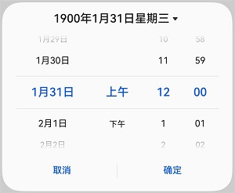
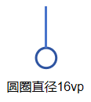

## cl.arkui.1 UIExtensionComponent以及CreateModalUIExtension增加使用约束

**访问级别**

系统接口

**变更原因**

UIExtensionComponent以及CreateModalUIExtension增加使用约束。

**变更影响**

该变更为非兼容性变更。

UIExtensionComponent增加系统应用访问校验。

CreateModalUIExtension增加禁止其他组件遮挡的校验逻辑。

CreateModalUIExtension更改默认行为为防不安全窗口遮挡，且不允许取消防遮挡。

**变更发生版本**

从OpenHarmony SDK 5.0.0.32开始。

**变更的接口/组件**

UIExtensionComponent以及CreateModalUIExtension。

**适配指导**

使用UIExtensionComponent的必须为系统应用。

CreateModalUIExtension禁止其他组件和非安全窗口遮挡。

## cl.arkui.2 DatePickerDialog显示时间时分割线延长

**访问级别**

公开接口

**变更原因**

修正视觉效果以获得更好的用户体验。

**变更影响**

该变更为不兼容变更。

| 变更前 | 变更后 |
|---------|---------|
|  |  |

**起始API Level**

12

**变更发生版本**

从OpenHarmony SDK 5.0.0.32 版本开始。

**变更的接口/组件**

涉及的组件：DatePickerDialog。

**适配指导**

默认行为变更，无需适配。

## cl.arkui.3 Menu组件箭头离宿主节点默认安全边距变更

**访问级别**

公开接口

**变更原因**

带箭头菜单离宿主节点过远，变更后效果更佳。

**变更影响**

| 变更前箭头离宿主节点16vp | 变更后箭头离宿主节点8vp |
|---------|---------|
|         |         |

**起始API Level**

不涉及API变更

**变更发生版本**

从OpenHarmony SDK 5.0.0.32 版本开始。

**变更的接口/组件**

Menu组件。

**适配指导**

带箭头菜单离宿主节点的默认安全距离变小，若需要更大的间距，可设置菜单的offset进行调整。

## cl.arkui.4 Grid和List组件onItemDrag接口拖拽出窗口外行为变更
**访问级别**

公开接口

**变更原因**

onItemDrag接口无法与其他应用产生交互，但生成的拖拽窗口能拖拽出当前应用。

现在限制其能拖出当前应用的行为，与使用范围保持一致。

**变更影响**

该变更为兼容性变更。

API version 12之前，onItemDrag拖起的拖拽窗口可以拖出当前应用窗口外。


API version 12及以后，onItemDrag拖起的拖拽窗口不可以拖出当前应用窗口外。


**起始API Level**

8

**变更发生版本**

从OpenHarmony SDK 5.0.0.32开始。

**变更的接口/组件**

Grid组件的onItemDragStart、onItemDragMove、onItemDragEnter、onItemDragLeave和onItemDrop方法

List组件的onItemDragStart、onItemDragMove、onItemDragEnter、onItemDragLeave和onItemDrop方法

**适配指导**

默认行为变更，无需适配，但应注意变更后的行为是否对整体应用逻辑产生影响。

## cl.arkui.5 List的constraintSize设置生效

**访问级别**

公开接口

**变更原因**

List的布局行为和当前通用的布局约束优先的规格不一致。

**变更影响**

该变更为不兼容变更。

变更前，List不设置Height时，constraintSize的minHeight设置不生效。

变更后，List不设置Height时，constraintSize的minHeight设置会生效。

```ts
@Entry
@Component
struct ListExample {
  build() {
    List({ space: 5 }) {
      ForEach([1, 2, 3, 4, 5], (item: number) => {
        ListItem() {
          Text('' + item)
            .width('100%').height(50)
            .textAlign(TextAlign.Center).backgroundColor(0xFFFFFF)
        }
      }, (item: string) => item)
    }
    .padding(5)
    .constraintSize({ minHeight: 500 })
    .backgroundColor(0xDCDCDC)
  }
}
```

如下是以上示例代码变更前后效果对比：

 | 变更前 | 变更后 |
|---------|---------|
|   |    |

**起始API Level**

7

**变更发生版本**

从OpenHarmony SDK 5.0.0.32开始。

**变更的接口/组件**

List组件的constraintSize接口。

**适配指导**

如果List没有设置height属性，且设置了constraintSize的minHeight属性。变更后minHeight属性生效，导致布局界面变化，如果需要保持之前的布局界面，可以删除constraintSize的minHeight属性。

如下代码，变更前constraintSize的minHeight属性不生效，变更后constraintSize的minHeight属性生效导致显示界面变化。
```ts
@Entry
@Component
struct ListExample {
  build() {
    List({ space: 5 }) {
      ForEach([1, 2, 3, 4, 5], (item: number) => {
        ListItem() {
          Text('' + item)
            .width('100%').height(50)
            .textAlign(TextAlign.Center).backgroundColor(0xFFFFFF)
        }
      }, (item: string) => item)
    }
    .padding(5)
    .constraintSize({ minHeight: 500, maxHeight: 1000 })
    .backgroundColor(0xDCDCDC)
  }
}
```
删除constraintSize接口minHeight设置可以恢复之前的效果。
```ts
@Entry
@Component
struct ListExample {
  build() {
    List({ space: 5 }) {
      ForEach([1, 2, 3, 4, 5], (item: number) => {
        ListItem() {
          Text('' + item)
            .width('100%').height(50)
            .textAlign(TextAlign.Center).backgroundColor(0xFFFFFF)
        }
      }, (item: string) => item)
    }
    .padding(5)
    .constraintSize({ maxHeight: 1000 })
    .backgroundColor(0xDCDCDC)
  }
}
```

## cl.arkui.6 hideNonSecureWindows接口行为变更

**访问级别**

系统接口

**变更原因**

不安全窗口类型扩展以及CreateModalUIExtension防不安全窗口遮挡行为变更。

**变更影响**

该变更为非兼容性变更。

不安全窗口的定义新增宿主创建的Dialog窗口，变更前后不安全窗口包含的窗口类型如下表所示。

| 变更前 | 变更后 |
| --- | --- |
| <br>非系统全局悬浮窗 <br>宿主创建的非系统子窗 | <br>非系统全局悬浮窗 <br>宿主创建的非系统子窗 <br>宿主创建的非系统Dialog窗口 |


CreateModalUIExtension防不安全遮挡行为变更，变更前后行为如下表所示
| 变更前 | 变更后 |
| --- | --- |
| CreateModalUIExtension默认行为为不防不安全窗口遮挡，允许系统应用设置防不安全窗口遮挡 | CreateModalUIExtension默认行为为防不安全窗口遮挡，且不允许取消防遮挡 |

**起始API Level**

11

**变更发生版本**

从OpenHarmony SDK 5.0.0.32开始。

**变更的接口/组件**

hideNonSecureWindows接口。

**适配指导**

接口行为变更，无需适配，但应注意变更后的行为是否对整体应用逻辑产生影响。

## cl.arkui.7 AlphabetIndexer组件autoCollapse属性默认值由false改为true

**访问级别**

公开接口

**变更原因**

自适应折叠模式使用场景更广，显示效果更加灵活，默认开启自适应折叠模式更符合开发者期望。

**变更影响**

该变更为不兼容变更。

API version 12之前：autoCollapse属性默认值为false，当AlphabetIndexer组件高度不足时，不会折叠显示。


API version 12及之后：autoCollapse属性默认值为true，当AlphabetIndexer组件高度不足时，会折叠显示。


**起始API Level**

11

**变更发生版本**

从OpenHarmony SDK 5.0.0.32开始。

**变更的接口/组件**

AlphabetIndexer组件

**适配指导**

默认行为变更，默认开启自适应折叠模式，若要关闭自适应折叠模式，可通过设置[autoCollapse](../../../application-dev/reference/apis-arkui/arkui-ts/ts-container-alphabet-indexer.md#autocollapse11)属性进行适配。

## cl.arkui.9 RichEditor组件builderSpan支持绑定自定义菜单

**访问级别**

公开接口

**变更原因**

富文本支持builderSpan绑定自定义菜单。

**变更影响**

该变更为不兼容变更。

变更前：右击或长按builderSpan会弹出对RichEditorSpanType.IMAGE类型绑定的自定义菜单。

变更后：新增自定义菜单绑定类型RichEditorSpanType.BUILDER，builderSpan和imageSpan分开绑定和弹出自定义菜单。右击或长按builderSpan不再弹出对RichEditorSpanType.IMAGE类型绑定的自定义菜单，而是弹出对RichEditorSpanType.BUILDER类型绑定的自定义菜单。

**起始API Level**

10

**变更发生版本**

从OpenHarmony SDK 5.0.0.32开始。

**变更的接口/组件**

RichEditor组件的RichEditorSpanType接口。

**适配指导**

若开发者需要右击或长按builderSpan时弹出RichEditorSpanType.IMAGE类型的自定义菜单，需要对该自定义菜单绑定RichEditorSpanType.BUILDER类型。
```ts
@Entry
@Component
struct Example {
    @Builder
    menu() {
        Column() {
            Text("自定义菜单");
        }
    }
    build() {
        Column() {
            RichEditor({controller： new RichEditorController()})
                // 变更前
                .bindSelectionMenu(RichEditorSpanType.IMAGE, this.menu(), ResponseType.LongPress)

                // 变更后
                .bindSelectionMenu(RichEditorSpanType.IMAGE, this.menu(), ResponseType.LongPress)
                // 绑定RichEditorSpanType.BUILDER类型
                .bindSelectionMenu(RichEditorSpanType.BUILDER, this.menu(), ResponseType.LongPress)
        }
    }
}
```

## cl.arkui.10 文本测算接口MeasureOptions入参对象fontSize参数默认单位实现修正

**访问级别**

公开接口

**变更原因**

fontSize参数在文档描述中number类型默认单位是fp,实际实现是vp。

**变更影响**

该变更为不兼容变更。

系统设置显示和亮度下字体大小使用默认的标准档，变更前后文本测算接口返回结果相同。

调整系统设置显示和亮度下字体大小标准档为特大档，文本测算接口变更前后行为如下表所示
| 变更前 | 变更后 |
| --- | --- |
| measureText接口fontSize传入number类型值获取到的文本测算宽度结果小于实际fp单位fontSize文本测算宽度。 measureTextSize接口fontSize传入number类型值获取到的文本测算宽度高度结果均小于实际fp单位fontSize文本测算宽度高度。| measureText接口fontSize传入number类型值获取到的文本测算宽度结果等于实际fp单位fontSize文本测算宽度。 measureTextSize接口fontSize传入number类型值获取到的文本测算宽度高度结果等于实际fp单位fontSize文本测算宽度高度。 |

**起始API Level**

measureText:9，measureTextSize:10

**变更发生版本**

从OpenHarmony SDK 5.0.0.32开始。

**变更的接口/组件**

measureText和measureTextSize接口。

**适配指导**

变更前测算接口fontSize参数number类型默认单位实现为vp,调整系统设置显示和亮度下字体大小后测算接口的返回值无变化。

若Text组件上fontSize设置的是vp类型字号，则在测算接口把number类型fontSize参数改为string类型显式传入vp类型字号参数即可。

若Text组件上fontSize设置的是number类型值，则无需适配，此次变更后fontSize参数number类型默认单位实现修正为文档说明的fp，得到的测算结果就是字体大小调整后文本显示实际所需宽高。

## cl.arkui.11 光标默认样式变更

**访问级别**

系统接口

**变更原因**

默认样式变更。

**变更影响**

该变更为不兼容变更。

变更前：光标小圆圈默认直径为20vp。

变更后：光标小圆圈默认直径为16vp。

变更前后对比效果，如下表所示
| 变更前 | 变更后 |
| --- | --- |
| |  |

**起始API Level**

不涉及公开接口。

**变更发生版本**

从OpenHarmony SDK 5.0.0.32开始。

**变更的接口/组件**

涉及光标的组件：TextInput、TextArea、Search、RichEditor。

**适配指导**

默认效果变更，无需适配。

## cl.arkui.12 高级组件SelectionMenu默认样式变更

**访问级别**

系统接口

**变更原因**

默认样式变更。

**变更影响**

该变更为不兼容变更。

变更前：自定义文本选择菜单点击“更多”后展开菜单会显示内置的置灰项分享翻译搜索。

变更后：自定义文本选择菜单点击“更多”后展开菜单去除内置的置灰项分享翻译搜索。

使用[示例](../../../application-dev/reference/apis-arkui/arkui-ts/ohos-arkui-advanced-SelectionMenu.md#示例)，变更前后对比效果，如下表所示：

| 变更前 | 变更后 |
| --- | --- |
| |  |

**起始API Level**

不涉及公开接口。

**变更发生版本**

从OpenHarmony SDK 5.0.0.32开始。

**变更的接口/组件**

高级组件SelectionMenu。

**适配指导**

默认效果变更，无需适配。