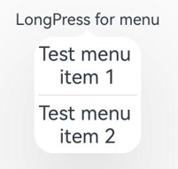
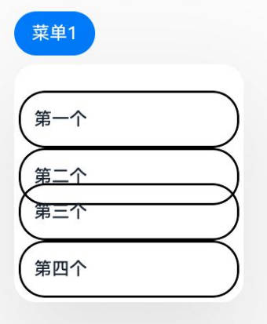
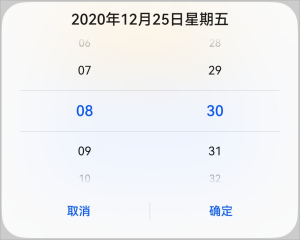
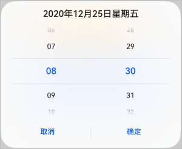
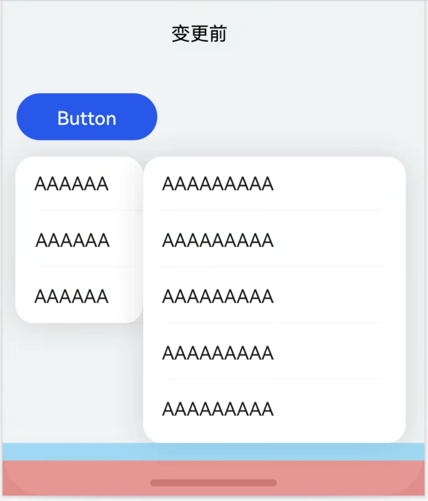
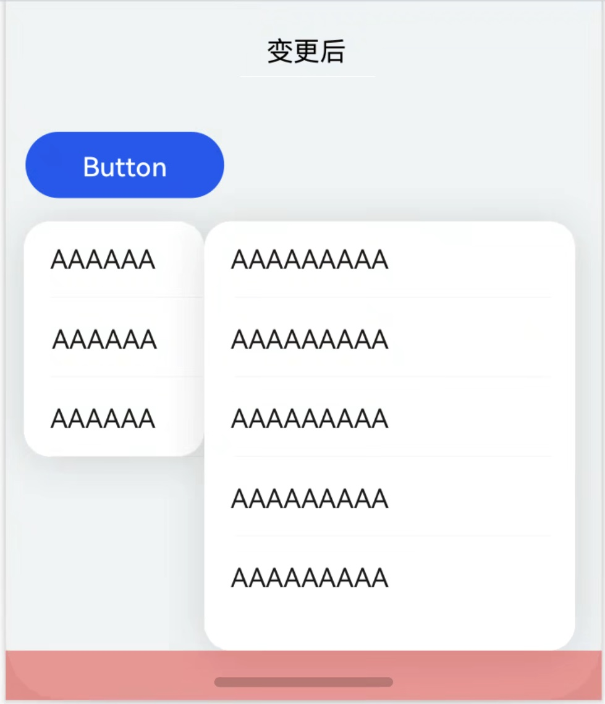

## cl.arkui.1 Menu组件箭头离宿主节点默认安全边距变更

**访问级别**

公开接口

**变更原因**

带箭头菜单离宿主节点过远，变更后效果更佳。

**变更影响**

| 变更前箭头离宿主节点16vp | 变更后箭头离宿主节点8vp |
|---------|---------|
|         |         |

**起始API Level**

不涉及API变更

**变更发生版本**

从OpenHarmony SDK 5.0.0.35 版本开始。

**变更的接口/组件**

Menu组件。

**适配指导**

带箭头菜单离宿主节点的默认安全距离变小，若需要更大的间距，可设置菜单的offset进行调整。

## cl.arkui.2 MenuItemGroup嵌套MenuItem且MenuItem设置margin top或者bottom时，布局效果变更

**访问级别**

公开接口

**变更原因**

MenuItemGroup高度没有加上MenuItem的margin高度，布局错乱，变更后布局正常。

**变更影响**

| 变更前布局错乱 | 变更后布局正常 |
|---------|---------|
|         |         |

**起始API Level**

不涉及API变更

**变更发生版本**

从OpenHarmony SDK 5.0.0.35 版本开始。

**变更的接口/组件**

Menu组件。

**适配指导**

菜单布局效果变更，应用无需适配。

## cl.arkui.3 Menu中MenuItem全部设置margin后，左右边距布局效果变更

**访问级别**

公开接口

**变更原因**

Menu中MenuItem全部设置margin后，左右边距不对称，变更后左右对称。

**变更影响**

| 变更前边距不对称 | 变更后左右对称 |
|---------|---------|
|         |         |

**起始API Level**

不涉及API变更

**变更发生版本**

从OpenHarmony SDK 5.0.0.35 版本开始。

**变更的接口/组件**

Menu组件。

**适配指导**

菜单布局效果变更，应用无需适配。

## cl.arkui.4 点击Menu菜单区域外的空白区域，关闭菜单交互行为变更

**访问级别**

公开接口

**变更原因**

点击Menu菜单区域外的空白区域，当前为点击按下时菜单就关闭，变更为点击按下-抬手才关闭菜单。

**变更影响**

变更前：点击菜单以外的空白区域，按下时关闭菜单

变更后：点击菜单以外的空白区域，抬手时关闭菜单

**起始API Level**

不涉及API变更

**变更发生版本**

从OpenHarmony SDK 5.0.0.35 版本开始。

**变更的接口/组件**

Menu组件。

**适配指导**

菜单关闭交互行为变更，应用无需适配。

## cl.arkui.5 菜单避让手机挖孔变更

**访问级别**

公开接口

**变更原因**

开发者在应用侧的module.json5中配置开启避让手机挖孔时，菜单未避让挖孔。

``` json
{
    "module": {
        "metadata": [
            {
                "name" : "avoid_cutout",
                "value": "true",
            }
        ]
    }
}
```

**变更影响**

该变更为不兼容性变更。

变更前：竖屏时菜单默认避让挖孔；横屏时，应用配置开启避让手机挖孔，菜单不会避让挖孔。

变更后：竖屏时菜单默认避让挖孔；横屏时，应用配置开启避让手机挖孔，菜单会避让挖孔。

**起始API Level**

Menu组件的BindMenu接口 API 7

Menu组件的BindContextMenu接口 API 8

**变更发生版本**

从OpenHarmony SDK 5.0.0.35开始。

**变更的接口/组件**

Menu组件的BindMenu接口

Menu组件的BindContextMenu接口

**适配指导**

默认行为变更，无需适配。

## cl.arkui.6 Repeat设置totalCount属性行为变更

**访问级别**

公开接口

**变更原因**

totoalCount表示UI显示的数据个数。Repeat设置totalCount属性时，如果totalCount小于数据长度，显示的数据个数为数据的长度，与totalCount定义不符。

**变更影响**

该变更为不兼容性变更。

变更前：Repeat设置totalCount属性时，如果totalCount小于数据长度，显示的数据个数为数据的长度

变更后：Repeat设置totalCount属性时，如果totalCount小于数据长度，显示的数据个数为totalCount值

**起始API Level**

12

**变更发生版本**

从OpenHarmony SDK 5.0.0.35开始。

**变更的接口/组件**

Repeat组件。

**适配指导**

如果开发者想要显示的数据个数为数据长度时，需要将totalCount值设置为数组长度。示例代码如下：

```ts
@Entry
@ComponentV2
struct TestPage {
  @Local simpleList: Array<string> = [];
  private totalCount: number = 50;

  aboutToAppear(): void {
    for (let i = 0; i < 50; i++) {
      this.simpleList.push('Hello ' + i);
    }
  }

  build() {
    Column({ space: 10 }) {
      List() {
        Repeat<string>(this.simpleList)
          .each((obj: RepeatItem<string>) => {
            ListItem() {
              Text('[each] ' + obj.item)
                .fontSize(30)
                .margin({ top: 10 })
            }
          })
          .key((item: string, index: number) => item)
          .virtualScroll({ totalCount: this.totalCount })
          .templateId((item: string, index: number) => "default")
          .template('default', (ri) => {
            Text('[template] ' + ri.item)
              .fontSize(30)
              .margin({ top: 10 })
          }, { cachedCount: 3 })
      }
      .cachedCount(1)
      .border({ width: 1 })
      .height('50%')
    }
    .height('100%')
    .justifyContent(FlexAlign.Center)
  }
}
```

## cl.arkui.7 TimePickerDialog标题高度变更

**访问级别**

公开接口

**变更原因**

修正视觉效果以获得更好的用户体验。

**变更影响**

该变更为不兼容变更。

变更前：标题高度为46vp。

变更后：标题高度为56vp。

| 变更前 | 变更后 |
|---------|---------|
|  |  |

**起始API Level**

8

**变更发生版本**

从OpenHarmony SDK 5.0.0.35开始。

**变更的接口/组件**

TimePickerDialog组件。

**适配指导**

默认行为变更，无需适配。

## cl.arkui.8 AlertDialog、promptAction.showDialog中Button间距变更

**访问级别**

公开接口

**变更原因**

修正视觉效果以获得更好的用户体验。

**变更影响**

该变更为不兼容变更。

变更前：Button间距为8vp。

变更后：Button间距为16vp。

| 变更前 | 变更后 |
|---------|---------|
|  |  |

**起始API Level**

7

**变更发生版本**

从OpenHarmony SDK 5.0.0.35开始。

**变更的接口/组件**

AlertDialog、promptAction.showDialog。

**适配指导**

默认行为变更，无需适配。

## cl.arkui.9 SubMenu避让底部导航条距离变更

**访问级别**

公开接口

**变更原因**

Menu避让能贴近底部导航条，而SubMenu避让位置无法贴近底部导航条，视觉效果不好

**变更影响**

该变更为不兼容性变更。

| 变更前：SubMenu避让底部导航条之后避让了一个固定高度的padding | 变更后：SubMenu仅避让底部导航条，不额外添加固定高度的padding |
|---------|---------|
|         |      

**起始API Level**

不涉及API变更

**变更发生版本**

从OpenHarmony SDK 5.0.0.35开始。

**变更的接口/组件**

Menu组件。

**适配指导**

默认行为变更，无需适配。

## cl.arkui.7 menu、toast修改阴影参数
**访问级别**

公开接口

**变更原因**

当前阴影不明显，区分度不高。

**变更影响**

该变更为不兼容性变更。

| 变更前阴影 | 变更后阴影|
|---------|---------|
|         |         |
|         |         |

**起始API Level**

Menu组件的BindMenu接口 API 7

Menu组件的BindContextMenu接口 API 8

Toast组件的ShowToast接口 API 9

**变更发生版本**

从OpenHarmony SDK 5.0.0.35开始。

**变更的接口/组件**

Menu组件的BindMenu接口

Menu组件的BindContextMenu接口

Toast组件ShowToast接口

**适配指导**

默认行为变更，无需适配。

## cl.arkui.11 RichEditor设置预设样式的接口当传入异常值时，文本样式效果变更

**访问级别**

公开接口

**变更原因**

RichEditor设置用户预设样式的接口setTypingStyle当传入异常值undefined/null后，开发者自定义预置样式依然存在，未恢复成不设置时效果。

不设置时，当用户输入文本，输入后的文本样式跟随前一个文本的文本样式。

**变更影响**

该变更为不兼容变更

变更前：当setTypingStyle设置为undefined/null时，调用接口setTypingStyle不生效。

变更后：当setTypingStyle设置为undefined/null时，会恢复为不设置时效果。

**起始API Level**

11

**变更发生版本**

从OpenHarmony SDK 5.0.0.35 版本开始。

**变更的接口/组件**

setTypingStyle

**适配指导**
开发者需要清除TypingStyle时，请参照如下代码。
```ts
@Entry
@Component
struct Index {
  controller: RichEditorController = new RichEditorController()
  options: RichEditorOptions = { controller: this.controller }
  build() {
      Column() {
        RichEditor(this.options)
          .borderWidth(1)
          .borderColor(Color.Green)
          .width("100%")
          .height("50%")
        Button('ResetTypingStyle')
          .fontSize(10)
          .onClick(() => {
            // 清除TypingStyle
            this.controller.setTypingStyle(undefined)
            // this.controller.setTypingStyle(null)
          })
        Button('SetTypingStyle')
          .fontSize(10)
          .onClick(() => {
            // 设置TypingStyle
            this.controller.setTypingStyle({fontColor:"#ff0000"})
          })
    }
  }
}
```

## cl.arkui.12 RichEditor占位文本接口中文本样式属性传入异常值时，占位文本样式的效果变更

**访问级别**

公开接口

**变更原因**

1.RichEditor中设置占位文本接口placeholder，其占位文本样式属性PlaceHolderStyle为异常值{}时，组件未将占位文本样式属性设置为默认效果。

2.当占位文本样式属性中各个属性为异常值undefined/null时，对应默认效果未生效。

占位文本样式属性：

- 文本尺寸（默认值 16vp）

- 文本粗细（默认值 400）

- 文本字体（默认值 当前系统字体/注册自定义字体）

- 文本样式（默认值 FontStyle.Normal）

- 文本颜色（默认值 跟随系统主题（一般为黑色））

**变更影响**

该变更为不兼容变更

变更前：占位文本样式属性或其内部其他属性设为异常值时，调用接口placeholder未生效。

变更后：占位文本样式属性或其内部其他属性设为异常值时，按组件默认占位文本样式/对应属性默认样式生效。

**起始API Level**

12

**变更发生版本**

从OpenHarmony SDK 5.0.0.35 版本开始。

**变更的接口/组件**

PlaceHolderStyle

**适配指导**

开发者需要排查调用设置占位文本placeholder中PlaceHolderStyle为异常值或其各个属性为异常值时，是否按照默认效果生效。

以style为{}和fontcolor为异常值为例，见如下代码。
```ts
@Entry
@Component
struct Index {
  controller: RichEditorController = new RichEditorController()
  options: RichEditorOptions = { controller: this.controller }
  @State style: PlaceholderStyle = { fontColor: "#ff0000" };

  build() {
    Column() {
      RichEditor(this.options)
        .borderWidth(1)
        .borderColor(Color.Green)
        .width("100%")
        .height("50%")
        .placeholder("hello world", this.style)
      Button('change style to {}')
        .fontSize(10)
        .onClick(() => {
          this.style = {};
        })
      Button('change style.fontColor to undefined')
        .fontSize(10)
        .onClick(() => {
          this.style = { fontColor: undefined };
        })
      Button('change style.fontColor to null')
        .fontSize(10)
        .onClick(() => {
          this.style = { fontColor: null };
        })
      Button('change style.fontColor to normal value')
        .fontSize(10)
        .onClick(() => {
          this.style = { fontColor: "#ff0000" };
        })
    }
  }
}
```