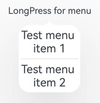

## cl.arkui.1 Menu组件箭头离宿主节点默认安全边距变更

**访问级别**

公开接口

**变更原因**

带箭头菜单离宿主节点过远，变更后效果更佳。

**变更影响**

| 变更前箭头离宿主节点16vp | 变更后箭头离宿主节点8vp |
|---------|---------|
|         |         |

**起始API Level**

不涉及API变更

**变更发生版本**

从OpenHarmony SDK 5.0.0.35 版本开始。

**变更的接口/组件**

Menu组件。

**适配指导**

带箭头菜单离宿主节点的默认安全距离变小，若需要更大的间距，可设置菜单的offset进行调整。

## cl.arkui.2 MenuItemGroup嵌套MenuItem且MenuItem设置margin top或者bottom时，布局效果变更

**访问级别**

公开接口

**变更原因**

MenuItemGroup高度没有加上MenuItem的margin高度，布局错乱，变更后布局正常。

**变更影响**

| 变更前布局错乱 | 变更后布局正常 |
|---------|---------|
|         |         |

**起始API Level**

不涉及API变更

**变更发生版本**

从OpenHarmony SDK 5.0.0.35 版本开始。

**变更的接口/组件**

Menu组件。

**适配指导**

菜单布局效果变更，应用无需适配。

## cl.arkui.3 Menu中MenuItem全部设置margin后，左右边距布局效果变更

**访问级别**

公开接口

**变更原因**

Menu中MenuItem全部设置margin后，左右边距不对称，变更后左右对称。

**变更影响**

| 变更前边距不对称 | 变更后左右对称 |
|---------|---------|
|         |         |

**起始API Level**

不涉及API变更

**变更发生版本**

从OpenHarmony SDK 5.0.0.35 版本开始。

**变更的接口/组件**

Menu组件。

**适配指导**

菜单布局效果变更，应用无需适配。

## cl.arkui.4 点击Menu菜单区域外的空白区域，关闭菜单交互行为变更

**访问级别**

公开接口

**变更原因**

点击Menu菜单区域外的空白区域，当前为点击按下时菜单就关闭，变更为点击按下-抬手才关闭菜单。

**变更影响**

变更前：点击菜单以外的空白区域，按下时关闭菜单

变更后：点击菜单以外的空白区域，抬手时关闭菜单

**起始API Level**

不涉及API变更

**变更发生版本**

从OpenHarmony SDK 5.0.0.35 版本开始。

**变更的接口/组件**

Menu组件。

**适配指导**

菜单关闭交互行为变更，应用无需适配。

## cl.arkui.5 RichEditor就设置用户预设样式的接口当传入异常值时，文本样式效果变更

**访问级别**

公开接口

**变更原因**

RichEditor就设置用户预设样式的接口（setTypingStyle）当传入异常值（undefined/null）后，开发者自定义预置样式依然存在，未恢复成不设置时效果。

不设置时效果为当用户输入文本时，输入后的文本样式跟随前一个文本的文本样式。

**变更影响**

该变更为不兼容变更

变更前：当setTypingStyle(undefined/null)时，调用接口setTypingStyle不生效

变更后：当setTypingStyle(undefined/null)时，会恢复成不设置时效果。

**起始API Level**

11

**变更发生版本**

从OpenHarmony SDK 5.0.0.35 版本开始。

**变更的接口/组件**

setTypingStyle

**适配指导**
开发者需要清除TypingStyle时，请参照如下代码
```ts
@Entry
@Component
struct Index {
  controller: RichEditorController = new RichEditorController()
  options: RichEditorOptions = { controller: this.controller }
  build() {
      Column() {
        RichEditor(this.options)
          .borderWidth(1)
          .borderColor(Color.Green)
          .width("100%")
          .height("50%")
        Button('ResetTypingStyle')
          .fontSize(10)
          .onClick(() => {
            // 清除TypingStyle
            this.controller.setTypingStyle(undefined)
            // this.controller.setTypingStyle(null)
          })
        Button('SetTypingStyle')
          .fontSize(10)
          .onClick(() => {
            // 设置TypingStyle
            this.controller.setTypingStyle({fontColor:"#ff0000"})
          })
    }
  }
}
```

## cl.arkui.6 RichEditor占位文本接口中文本样式属性传入异常值时，占位文本样式的效果变更

**访问级别**

公开接口

**变更原因**

1.RichEditor中设置占位文本接口(placeholder)中占位文本样式属性（PlaceHolderStyle）为异常值（{}）时，组件未将占位文本样式属性设置为默认效果<br/>
2.当占位文本样式属性中各个属性为异常值（undefined/null）时，对应默认效果未生效<br/>

占位文本样式属性：<br/>
文本尺寸（默认值 16vp）<br/>
文本粗细（默认值 400）<br/>
文本字体（默认值 当前系统字体/注册自定义字体）<br/>
文本样式（默认值 FontStyle.Normal）<br/>
文本颜色（默认值 跟随系统主题（一般为黑色））<br/>

**变更影响**

该变更为不兼容变更

变更前：占位文本样式属性或其内部其他属性设为异常值时，调用接口placeholder未生效

变更后：占位文本样式属性或其内部其他属性设为异常值时，按组件默认占位文本样式/对应属性默认样式生效

**起始API Level**

12

**变更发生版本**

从OpenHarmony SDK 5.0.0.35 版本开始。

**变更的接口/组件**

PlaceHolderStyle

**适配指导**

开发者需要排查调用设置占位文本placeholder中PlaceHolderStyle为异常值或其各个属性为异常值时，是否按照默认效果生效

以style为{}和fontcolor为异常值为例，见如下代码
```ts
@Entry
@Component
struct Index {
  controller: RichEditorController = new RichEditorController()
  options: RichEditorOptions = { controller: this.controller }
  @State style: PlaceholderStyle = { fontColor: "#ff0000" };

  build() {
    Column() {
      RichEditor(this.options)
        .borderWidth(1)
        .borderColor(Color.Green)
        .width("100%")
        .height("50%")
        .placeholder("hello world", this.style)
      Button('change style to {}')
        .fontSize(10)
        .onClick(() => {
          this.style = {};
        })
      Button('change style.fontColor to undefined')
        .fontSize(10)
        .onClick(() => {
          this.style = { fontColor: undefined };
        })
      Button('change style.fontColor to null')
        .fontSize(10)
        .onClick(() => {
          this.style = { fontColor: null };
        })
      Button('change style.fontColor to normal value')
        .fontSize(10)
        .onClick(() => {
          this.style = { fontColor: "#ff0000" };
        })
    }
  }
}
```