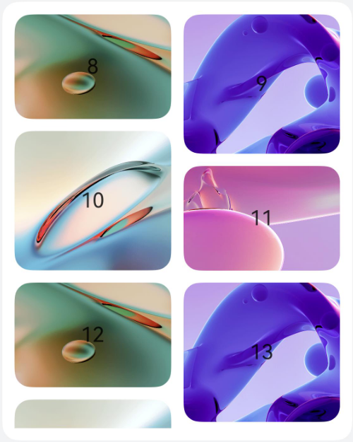

## cl.arkui.1 移动窗口布局模式瀑布流行为变更

**访问级别**

公开接口

**变更原因**

优化[移动窗口布局模式](../../../application-dev/reference/apis-arkui/arkui-ts/ts-container-waterflow.md#waterflowlayoutmode12)瀑布流使用LazyForEach增删节点时布局方式。

**变更影响**

变更前：在显示范围上方增加节点，显示范围节点会下移；在显示范围上方删除节点，显示范围节点会上移

变更后：在显示范围上方增删节点，显示范围不变

下表显示在显示范围上方增加一个节点时变更前后的效果对比：
| 增加节点前|变更前：图7显示到原图8的位置 | 变更后：图8位置不变 |
| --- |--- | --- |
| | |  |


**起始API Level**

不涉及API变更

**变更发生版本**

从OpenHarmony 5.0.0.36 版本开始。

**变更的接口/组件**

WaterFlow组件。

**适配指导**

默认行为变更，无需适配。

## cl.arkui.2 Tabs组件的页签可滚动且为非子页签样式时增加页签默认切换动效

**访问级别**

公开接口

**变更原因**

快速连续切换页签时，页签产生跳变现象，视觉效果不佳。

**变更影响**

该变更为不兼容性变更。

变更前：Tabs组件的barMode为BarMode.Scrollable，TabContent组件的tabBar为子页签样式时有默认切换动效，即切换页签后，选中页签执行动画平移至tabBar中间位置。但非子页签样式时无默认切换动效，即切换页签后，选中页签立即跳变至tabBar中间位置。

变更后：Tabs组件的barMode为BarMode.Scrollable，TabContent组件的tabBar为任意页签样式时均有默认切换动效，切换动效的时长为Tabs组件的animationDuration属性值。

| 变更前 | 变更后 |
|---------|---------|
|  |  |

**起始API Level**

不涉及API变更

**变更发生版本**

从OpenHarmony SDK 5.0.0.36开始。

**变更的接口/组件**

Tabs组件

**适配指导**

若希望关闭页签的默认切换动效，可设置Tabs组件的animationDuration属性值为0，但同时TabContent页面的默认切换动效也会被关闭。示例代码如下：
```ts
@Entry
@Component
struct TabsSample {
  @State currentIndex: number = 0;

  @Builder TabBuilder(index: number, name: string) {
    Text(name)
      .fontColor(this.currentIndex === index ? Color.White : Color.Black)
      .fontSize(this.currentIndex === index ? 18 : 16)
      .fontWeight(this.currentIndex === index ? 500 : 400)
      .textAlign(TextAlign.Center)
      .width(100)
      .height(48)
      .margin({ left: 4, right: 4 })
      .backgroundColor(this.currentIndex === index ? '#007DFF' : '#F1F3F5')
      .borderRadius(24)
  }

  build() {
    Column() {
      Tabs({ index: this.currentIndex }) {
        TabContent() {
          Column().width('100%').height('100%').backgroundColor('#00CB87')
        }.tabBar(this.TabBuilder(0, 'green'))

        TabContent() {
          Column().width('100%').height('100%').backgroundColor('#007DFF')
        }.tabBar(this.TabBuilder(1, 'blue'))

        TabContent() {
          Column().width('100%').height('100%').backgroundColor('#FFBF00')
        }.tabBar(this.TabBuilder(2, 'yellow'))

        TabContent() {
          Column().width('100%').height('100%').backgroundColor('#E67C92')
        }.tabBar(this.TabBuilder(3, 'pink'))
      }
      .height(300)
      .barMode(BarMode.Scrollable, { margin: 16 })
      .fadingEdge(false)
      .animationDuration(0)
      .onChange((index: number) => {
        this.currentIndex = index
      })
    }.width('100%')
  }
}
```