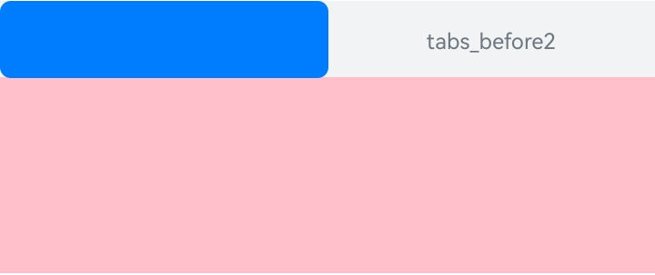
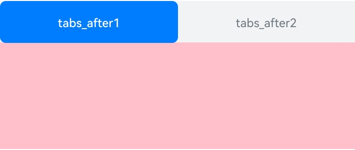

# ArkUI子系统Changelog

## cl.arkui.1 FrameNode的isModifiable值为false时，无法通过addComponentContent挂载节点

**访问级别**

公开接口

**变更原因**

addComponentContent接口用于实现ComponentContent对象的挂载，但是只有isModifiable为true的FrameNode对象允许更改其子节点，当前实现与设计不一致。

**变更影响**

该变更为不兼容变更。

变更前：addComponentContent可以向isModifiable为false的FrameNode对象挂载子节点。

变更后：addComponentContent无法向isModifiable为false的FrameNode对象挂载子节点，调用addComponent接口后会抛出异常导致子节点挂载失败，并出现白屏，可以通过try catch捕获异常解决。

| 变更前 | 变更后 |
|---------|---------|
|||

**起始API Level**

API 12

**变更发生版本**

从OpenHarmony SDK 5.0.0.38开始。

**变更的接口/组件**

FrameNode的addComponentContent接口。

**适配指导**

开发者在使用addComponentContent前需要判断父节点的isModifiable是否为true，不支持isModifiable为false的FrameNode节点使用addComponentContent新增子节点。需要在声明式组件中动态添加内容时，可以通过占位节点[NodeContainer](../../../application-dev/reference/apis-arkui/arkui-ts/ts-basic-components-nodecontainer.md)、[ContentSlot](../../../application-dev/quick-start/arkts-rendering-control-contentslot.md)进行操作。

```ts
import { ComponentContent, NodeContent, typeNode } from "@kit.ArkUI"

interface ParamsInterface {
  text: string;
}

@Builder
function buildText(params: ParamsInterface) {
  Column() {
    Text(params.text)
      .fontSize(20)
      .fontWeight(FontWeight.Bold)
      .margin({ bottom: 36 })
  }
}

@Entry
@Component
struct Index {
  @State message: string = "hello"
  private content: NodeContent = new NodeContent();

  build() {
    Row() {
      Column() {
        Button('addComponentContent')
          .onClick(() => {
            let column = typeNode.createNode(this.getUIContext(), "Column");
            column.initialize();
            if (column.isModifiable()) {
              column.addComponentContent(new ComponentContent<ParamsInterface>(this.getUIContext(),
                wrapBuilder<[ParamsInterface]>(buildText), { text: 'Colum Text isModifiable true' }))
            }
            this.content.addFrameNode(column)
            let column1 = this.getUIContext().getFrameNodeById('column1');
            if (!column1?.isModifiable()) {
              try {
                column1?.addComponentContent(new ComponentContent<ParamsInterface>(this.getUIContext(),
                  wrapBuilder<[ParamsInterface]>(buildText), { text: 'Colum1 Text isModifiable false' }))
              } catch (e) {
                console.error('addComponentContent fail, err: ' + e);
              }
            }
          })
        ContentSlot(this.content)
      }
      .id('column1')
      .width('100%')
      .height('100%')
    }
    .height('100%')
  }
}
```

## cl.arkui.2 Waterflow组件onScroll接口废弃变更

**废弃原因**

onScroll事件在Scroll组件和List、Grid、WaterFlow组件中回调时机不一样，Scroll组件在布局前回调，其他组件在布局后回调，开发者使用时，对回调时机可能会混淆。

在API version 12，ArkUI提供了onWillScroll和onDidScroll两种回调时机更明确的接口。其中，Waterflow组件的onDidScroll接口可以完全替换onScroll接口，所以废弃Waterflow的onScroll接口。


**废弃影响**

该变更为兼容性变更。

从API version 12开始，Waterflow的onScroll接口将废弃，推荐使用OnDidScroll接口替代。

**起始 API Level**

API 11

**废弃发生版本**

从OpenHarmony SDK 5.0.0.38版本开始。

**废弃的接口/组件**

Waterflow组件的OnScroll接口。

**适配指导**

```ts
@Entry
@Component
struct Index {
  @State data: number[] = [1, 2, 3, 4, 5, 6, 7, 8, 9, 10, 11, 12, 13, 14, 15, 16];

  build() {
    Column({ space: 10 }) {
      WaterFlow() {
        ForEach(this.data, (item: number) => {
          FlowItem() {
          }
          .height(100).width('100%')
        })
      }
      .columnsGap(10)
      .rowsGap(10)
      .columnsTemplate("1fr 1fr")
      .width("80%")
      .height("100%")
      // 变更前
      .onScroll((scrollOffset: number, scrollState: ScrollState) => {
        console.log('onScroll scrollOffset: ' + scrollOffset + ', scrollState: ' + scrollState)
      })
      // 变更后
      .onDidScroll((scrollOffset: number, scrollState: ScrollState) => {
        console.log('onDidScroll scrollOffset: ' + scrollOffset + ', scrollState: ' + scrollState)
      })
    }
    .height('100%')
    .width('100%')
  }
}
```
## cl.arkui.3  状态管理V2版本组件内的@Local,@Param,@Event,@Provider,@Consumer,@BuilderParam,必须声明类型 

**访问级别**

公开接口

**变更原因**

 V2组件内的@Local,@Param,@Event,@Provider,@Consumer,@BuilderParam装饰器不需要写类型就可以编译成功，而装饰器是有类型限制的，所以这些装饰器需要加上类型校验。

**变更影响**

该变更为不兼容变更。

变更前：V2组件内的@Local,@Param,@Event,@Provider,@Consumer,@BuilderParam修饰的变量没有写类型不会被校验。

变更后：V2组件内的@Local,@Param,@Event,@Provider,@Consumer,@BuilderParam修饰的变量没有写类型会被校验。


**起始API Level**

API 12

**变更发生版本**

从OpenHarmony 5.0.0.38 版本开始。

**变更的接口/组件**

无。

**适配指导**

在V2组件内，每一个被@Local,@Param,@Event,@Provider,@Consumer,@BuilderParam修饰的变量加上类型声明。

```ts

@Builder
function testBuilder() {
  
}

@Entry
@ComponentV2
struct V2ComponentMember {
  @Local localValue: string = 'localValue';
  @BuilderParam builderParamValue: () => void = testBuilder;
  @Param paramValue: string = 'paramValue';
  @Event eventValue: string = 'eventValue';
  @Provider() providerValue: string = 'providerValue';
  @Consumer() consumerValue: string = 'consumerValue';
  build() {

  }
}
```
## cl.arkui.4 Tabs组件的选中页签为子页签且背板模式时，其默认字体颜色变更

**访问级别**

公开接口

**变更原因**

Tabs组件内TabContent子组件的tabbar属性为SubTabBarStyle对象，SubTabBarStyle对象的selectedMode为SelectedMode.BOARD情况下，选中页签的默认字体颜色与背板颜色一致，此时文本内容无法清晰可见，因此修改其默认字体颜色。

**变更影响**

该变更为兼容性变更。

变更前：选中子页签背板模式下默认字体颜色为'#ff007dff'

变更后：选中子页签背板模式下默认字体颜色为'#ffffff'

| 变更前 | 变更后 |
|---------|---------|
|  |  |

**起始API Level**

API 10

**变更发生版本**

从OpenHarmony SDK 5.0.0.38开始。

**变更的接口/组件**

Tabs组件

**适配指导**

若需要变更前的颜色，可以修改SubTabBarStyle对象的labelStyle属性中selectedColor值为变更前的默认颜色。

```ts
@Entry
@Component
struct TabBarStyleExample {
  build() {
    Column() {
      Tabs({ barPosition: BarPosition.Start }) {
        TabContent() {
          Column().width('100%').height('100%').backgroundColor(Color.Pink)
        }.tabBar(new SubTabBarStyle('Pink')
          .selectedMode(SelectedMode.BOARD)
          .labelStyle({selectedColor:'#ff007dff'}))
      }
      .vertical(false)
      .scrollable(true)
      .barMode(BarMode.Fixed)
      .width('100%')
      .backgroundColor(0xF1F3F5)
    }.width('100%').height(200)
  }
}
```
## cl.arkui.5 Text组件属性字符串支持超链接

**访问级别**

公开接口

**变更原因**

为了提升Text组件的联合布局能力，StyledStringValue需要增加UrlStyle类型。

**变更影响**

该变更为兼容性变更。

新增属性字符串超链接功能，提升组件的联合布局能力。

**起始API Level**

12

**变更发生版本**

从OpenHarmony SDK 5.0.0.38开始

**变更的接口/组件**

StyledStringValue

**适配指导**

Text组件属性字符串支持超链接的示例代码：

```ts
@Entry
@Component
struct styled_string {
  urlString: StyledStringValue = new UrlStyle( "https://www.example.com" );
  mutableStyledString: MutableStyledString = new MutableStyledString("test hello world", [{
    start: 0,
    length: 5,
    styledKey: StyledStringKey.URL,
    styledValue: this.urlString
  }]);
  controller: TextController = new TextController();
  async onPageShow() {
    this.controller.setStyledString(this.mutableStyledString)
  }
  build() {
    Column() {
      Column() {
        Text(undefined, { controller: this.controller }).key('mutableStyledString')
      }
    }
  }
}
```


## cl.arkui.6 属性字符串支持设置背景色能力

**访问级别**

公开接口

**变更原因**

为了提升组件的联合布局能力StyledStringValue需要增加BackgroundColorStyle类型。

**变更影响**

该变更为兼容性变更。

新增属性字符串支持设置背景色能力，提升了组件的联合布局能力。

**起始API Level**

12

**变更发生版本**

从OpenHarmony SDK 5.0.0.38开始

**变更的接口/组件**

StyledStringValue

**适配指导**

属性字符串支持设置背景色能力：

```ts
@Entry
@Component
struct styled_string_demo {
  @State backColor: TextBackgroundStyle = {color: Color.Yellow, radius: "12vp"};
  colorVal: BackgroundColorStyle = new BackgroundColorStyle(this.backColor);

  mutableStyledString: MutableStyledString = new MutableStyledString("test hello world are you ok !", [{
    start: 0,
    length: 4,
    styledKey: StyledStringKey.BACKGROUND_COLOR,
    styledValue: this.colorVal}
  ],)

  controller: TextController = new TextController();

  async onPageShow() {
    this.controller.setStyledString(this.mutableStyledString)
  }

  build() {
    Column() {
        Text(undefined, { controller: this.controller }).key('mutableStyledString')
    }
  }
}