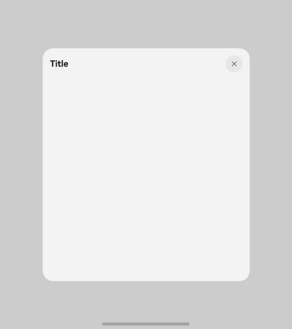
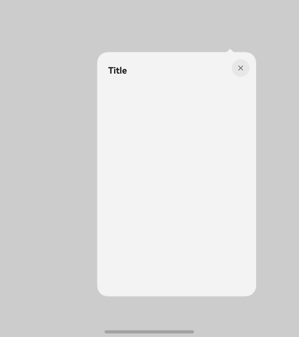
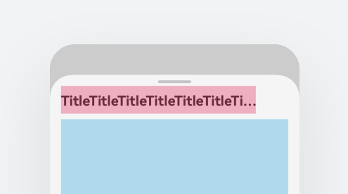
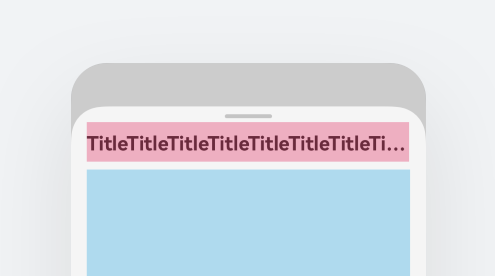

# ArkUI 子系统变更说明

## cl.arkui.1 bindSheet半模态面板视觉样式增加

**访问级别**

公开接口

**变更原因**

增强视觉效果。

**变更影响**

该变更为不兼容变更，设备宽度在600-840vp间时，SheetOptions中的preferType设置为SheetType.POPUP，原先显示居中弹窗样式，现在显示跟手弹窗样式。

API version 13及以后，设备宽度在600-840vp间时，默认显示居中弹窗样式，增加跟手弹窗样式。

变更前：设备宽度在600-840vp间时，默认显示居中弹窗样式，可设置为居中弹窗样式和底部弹窗样式。

| 居中弹窗样式                             | 底部弹窗样式                             |
| ---------------------------------------- | ---------------------------------------- |
|  |  |

变更后：设备宽度在600-840vp间时，增加跟手弹窗样式。

**起始API Level**

11

**变更发生版本**

从OpenHarmony SDK 5.0.0.41 版本开始。

**变更的接口/组件**

bindSheet半模态面板。

**适配指导**

设备宽度在600-840vp间时，如需显示跟手弹窗样式，则SheetOptions中的preferType设置为SheetType.POPUP；如需显示底部弹窗样式，则preferType设置为SheetType.BOTTOM；如需显示居中弹窗样式，则preferType设置为SheetType.CENTER或者不设置。

## cl.arkui.2 bindSheet半模态面板标题与关闭按钮布局变更

**访问级别**

公开接口

**变更原因**

增强视觉效果。

**变更影响**

该变更为不兼容变更。

API version 13及以后，关闭按钮不显示时，关闭按钮区域放开限制给标题栏区域布局。

变更前：关闭按钮不显示时，关闭按钮区域未放开限制给标题栏区域布局。

变更后：关闭按钮不显示时，关闭按钮区域放开限制给标题栏区域布局。

| 变更前                                   | 变更后                                   |
| ---------------------------------------- | ---------------------------------------- |
|  |  |

**起始API Level**

11

**变更发生版本**

从OpenHarmony SDK 5.0.0.41 版本开始。

**变更的接口/组件**

bindSheet半模态面板。

**适配指导**

关闭按钮不显示时，关闭按钮区域放开限制给标题栏区域布局，标题栏宽度增加48vp。

## cl.arkui.3 keyboardShortcut快捷键功能增强

**访问级别**

公开接口

**变更原因**

应用快捷键功能增强。

**变更影响**

该变更为兼容性变更。

API version 13及以后，不再禁止注册以下列表中的快捷键。

- `Ctrl` + `C`
- `Ctrl` + `A`
- `Ctrl` + `V`
- `Ctrl` + `X`
- `Ctrl` + `Shift` + `Z`
- `Ctrl` + `Z`
- `Ctrl` + `Y`

变更前：应用不可以使用keyboardShortcut注册上述列表中的快捷键。

变更后：应用可以使用keyboardShortcut注册上述列表中的快捷键。

**起始API Level**

10

**变更发生版本**

从OpenHarmony SDK 5.0.0.41 版本开始。

**变更的接口/组件**

通用接口。

**适配指导**

不涉及适配，API使用参考[keyboardShortcut](../../../application-dev/reference/apis-arkui/arkui-ts/ts-universal-events-keyboardshortcut.md)。
