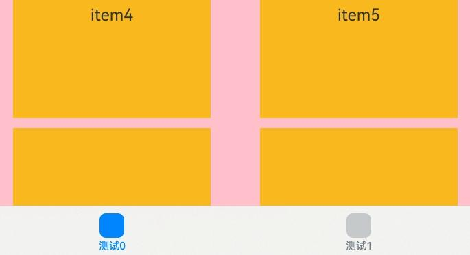

# ArkUI子系统Changelog

## cl.arkui.1 在字节码HAR中通过router.getState()获取的path内容变更

**访问级别**

公开接口

**变更原因**

当开发者使用中间码HAR升级到字节码HAR时，通过router.getState()方法获取的path信息不正确。

**变更影响**

该变更为不兼容变更。

此不兼容变更的前提是：源码HAR或者中间码HAR升级为字节码HAR时产生的不兼容。

不兼容场景示例1：

变更前：

当开发者使用的是源码HAR时使用router.getState()方法获取的是**相对路径**。


通过router.getState()方法获取的path信息为"../../../../library/src/main/ets/components/"。

当开发者把源码HAR升级为字节码HAR时，通过router.getState()方法获取的path信息为"/\_\_harDefaultPagePath\_\_"，不能获取正确的name和path值。


变更后：

当开发者把源码HAR升级为字节码HAR时使用router.getState()方法获取的是**绝对路径**。


通过router.getState()方法获取的path信息为"library/src/main/ets/components/"。

不兼容场景示例2：

变更前：

当开发者使用的是中间码HAR时使用router.getState()方法获取的是**相对路径**。


通过router.getState()方法获取的path信息为"../../../../ + 哈希值 + library/src/main/ets/components/"。

当开发者把中间码HAR升级为字节码HAR时，通过router.getState()方法获取的path信息为"/\_\_harDefaultPagePath\_\_"，不能获取正确的name和path值。


变更后：

当开发者把中间码HAR升级为字节码HAR时使用router.getState()方法获取的是**绝对路径**。


通过router.getState()方法获取的path信息为"library/src/main/ets/components/"。

**起始API Level**

API 10

**变更发生版本**

从OpenHarmony SDK 5.0.0.49开始

**变更的接口/组件**

router.getState()

**适配指导**

当开发者在代码中有通过router.getState()使用path值时，需要根据获取到的内容进行整改。

## cl.arkui.2 禁止在转场动画过程中，更新消失节点的属性。

**访问级别**

公开接口

**变更原因**

在转场动画过程中改变正在消失节点的属性，可能造成数据访问异常，产生crash。例如，动画过程中将data置为undefined，Text组件增加默认转场不会立即被删除，在更新状态时，数据访问异常产生crash。因此，需要变更为在转场动画过程中，禁止更新消失节点的属性。

```
class Mydata {
  str: string;
  constructor(str: string) {
    this.str = str;
  }
}
@State data: Mydata|undefined = new MyData("branch");
if (this.data) {
  // 对于删除时增加的默认转场，会延长组件生命周期。Text没有立即被删除，而是等转场动画结束后才被删除
  Text(this.data.str)
}
Button("play with animation")
  .onClick(()=>{
    animateTo({},()=>{
      if (this.data) {
        // 在动画过程中，会给if下的第一层组件增加默认转场
        this.data = undefined;
      }
    }) 
  })

```

**变更影响**

该变更为不兼容变更。

变更前：转场动画过程中，正在消失的节点可以更新属性。

变更后：转场动画过程中，禁止消失的节点更新属性。

**起始API Level**

API 10

**变更发生版本**

从OpenHarmony 5.0.0.49 版本开始。

**变更的接口/组件**

transition属性

**适配指导**

如果要对转场动画过程中，消失的节点进行属性更新，应当在节点下树之前产生，而不是在消失过程中。

示例：

```
@Entry
@Component
struct Index {
  @State flag: Boolean = true;
  @State color: Color = Color.Red;
  build() {
    Column(){
      if (this.flag) {
        Text('abc')
          .transition(TransitionEffect.OPACITY)
          .backgroundColor(this.color)
      }

      Button("play with animation")
        .onClick(()=>{
          // 变更前，消失过程中的节点可以更新属性，Text组件的颜色在消失过程中变为蓝色
          // animateTo({},()=>{
          //   this.flag ? this.color = Color.Blue : this.color = Color.Red;
          //   this.flag = !this.flag;
          // })

          // 变更后，消失过程中的节点无法更新属性，Text组件的颜色在消失过程中一直为红色
          // 如果需要更新属性，使Text组件的颜色在消失过程中变为蓝色，应当在节点下树之前更新
          animateTo({},()=>{
            this.flag ? this.color = Color.Blue : this.color = Color.Red;
          }) // 节点下树前改变颜色属性
          animateTo({},()=>{
            this.flag = !this.flag;
          })
        })
        .width("100%")
        .padding(10)
    }
  }
}
```

## cl.arkui.3 Tabs组件barOverlap接口默认效果变更

**访问级别**

公开接口

**变更原因**

优化Tabs组件barOverlap属性设置为true时，TabBar的模糊效果和渲染性能。

**变更影响**

该变更为不兼容变更。

变更前：设置barOverlap属性为true时，TabBar默认背景色修改为'#F2F1F3F5'并添加模糊效果。

变更后：设置barOverlap属性为true时，TabBar默认模糊材质的BlurStyle值修改为'BlurStyle.COMPONENT_THICK'。

| 变更前 | 变更后 |
|------ |--------|
|||

**起始API Level**

API 10

**变更发生版本**

从OpenHarmony 5.0.0.49 版本开始。

**变更的接口/组件**

barOverlap接口

**适配指导**

当barOverlap设置为true时，开发者若期望无模糊效果，设置barBackgroundBlurStyle为BlurStyle.NONE。示例如下：

```ts
@Entry
@Component
struct barHeightTest {
  @State arr: number[] = [0, 1, 2, 3, 4, 5, 6, 7, 8, 9]
  build() {
    Column() {
      Tabs({ barPosition: BarPosition.End }) {
        TabContent() {
          Column() {
            List({ space: 10 }) {
              ForEach(this.arr, (item: number) => {
                ListItem() {
                  Text("item" + item).width('80%').height(200).fontSize(16).textAlign(TextAlign.Center).backgroundColor('#fff8b81e')
                }
              }, (item: string) => item)
            }.width('100%').height('100%')
            .lanes(2).alignListItem(ListItemAlign.Center)
          }.width('100%').height('100%')
          .backgroundColor(Color.Pink)
        }
        .tabBar(new BottomTabBarStyle($r('sys.media.ohos_icon_mask_svg'), "测试0"))

        TabContent() {
          Column() {
            List({ space: 10 }) {
              ForEach(this.arr, (item: number) => {
                ListItem() {
                  Text("item" + item).width('80%').height(200).fontSize(16).textAlign(TextAlign.Center).backgroundColor('#fff8b81e')
                }
              }, (item: string) => item)
            }.width('100%').height('100%')
            .lanes(2).alignListItem(ListItemAlign.Center)
          }.width('100%').height('100%')
          .backgroundColor(Color.Blue)
        }
        .tabBar(new BottomTabBarStyle($r('sys.media.ohos_icon_mask_svg'), "测试1"))
      }
      .barOverlap(true)
      .barBackgroundBlurStyle(BlurStyle.NONE) // 关闭TabBar模糊效果
    }
  }
}
```

## cl.arkui.4 setSpecificSystemBarEnabled接口在横屏的行为变更

**访问级别**

公开接口

**变更原因**

修复该接口当前的实现bug。

当前行为：应用窗口处于横屏状态时，应用使用该接口设置状态栏显隐不生效，状态栏始终处于隐藏状态。

变更之后的行为：应用启动之后，若使用该接口设置过状态栏的显隐，状态栏的显隐状态则以应用的设置（多次设置，以最后一次设置状态为准）为准来生效。

**变更影响**

该变更为不兼容变更。

可能产生的影响：应用预期在横屏时隐藏状态栏，该接口行为变更后应用横屏时状态栏可能因为应用自启动之后使用该接口主动设置过状态栏显示而变为显示状态。

**起始API Level**

API 12

**变更发生版本**

从OpenHarmony SDK 5.0.0.49开始

**变更的接口/组件**

Window#setSpecificSystemBarEnabled(name: SpecificSystemBar, enable: boolean, enableAnimation?: boolean): Promise\<void\>

**适配指导**

针对应用预期在横屏时隐藏状态栏的场景，需确认应用自启动之后是否使用该接口主动设置过状态栏显示，若应用设置过状态栏显示，需再次设置状态栏隐藏，才能实现应用横屏时隐藏状态栏。