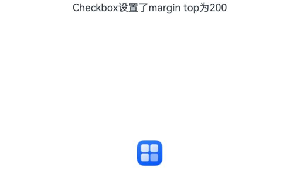

# ArkUI子系统Changelog

## cl.arkui.1 当使用自定义组件名和内置属性重名时编译报错变更

**访问级别**

公开接口

**变更原因**

当使用自定义组件名和内置属性重名时，编译会根据指定的白名单进行拦截报错，如果白名单中不存在，编译就拦截不到，导致编译转换后的产物出现问题。

**变更影响**

该变更涉及应用适配。

举例说明，执行以下用例：

```ts
@Entry
@Component
struct enableAnalyzer {
  build() {
    Canvas()
      .enableAnalyzer((true))
  }
}
```

变更前：
不在白名单的内置组件属性与自定义组件重名时，编译没有拦截报错，导致运行时crash。

变更后：
在白名单的内置组件属性与自定义组件重名时，编译拦截报错。


**起始API Level**

API 10

**变更发生版本**

从OpenHarmony SDK 5.1.0.44开始。

**变更的接口/组件**

ArkUI 内置组件属性API。

**适配指导**

自定义组件名和内置组件属性重名时，编译报错，修改自定义组件名为其他非内置组件属性名即可解决。

修改前：

自定义组件enableAnalyzer和Canvas的enableAnalyzer重名。

```ts
@Entry
@Component
struct enableAnalyzer {
  build() {
    Canvas()
      .enableAnalyzer()
  }
}
```

修改后：

将自定义组件名改为任意不和内置组件重名的名称，如EnableAnalyzerComp。

```ts
@Entry
@Component
struct EnableAnalyzerComp {
  build() {
    Canvas()
      .enableAnalyzer()
  }
}
```

## cl.arkui.2 @ComponentV2自定义组件冻结变更

**访问级别**

公开接口

**变更原因**

当@ComponentV2装饰的子组件设置freezeWhenInactive为true时，父组件没有设置，则子组件的组件冻结功能不生效。

为了确保组件冻结功能生效，需要修改当子组件设置freezeWhenInactive为true，无论父组件是否设置，子组件的组件冻结功能应生效。

**变更影响**

该变更为不兼容变更。

变更前：仅子组件开启了组件冻结，父组件没有开启组件冻结，不会对子组件开启冻结功能。

变更后：仅子组件开启了组件冻结，父组件没有开启组件冻结，子组件会启用组件冻结功能。

**起始API Level**

API 12

**变更发生版本**

从OpenHarmony SDK 5.1.0.44开始。

**变更的接口/组件**

@ComponentV2的freezeWhenInactive接口。

**适配指导**

当子组件使用了组件冻结，父组件没有使用组件冻结的情况下，当组件处于inactive时，子组件组件冻结功能生效。示例如下：

页面1：

```ts
// Page1.ets
import { router } from '@kit.ArkUI';

@ObservedV2
export class Book {
  @Trace name: string = "100";

  constructor(page: string) {
    this.name = page;
  }
}

@Entry
@ComponentV2
export struct Page1 {
  build() {
    Column() {
      Child()
    }
  }
}

@ComponentV2({ freezeWhenInactive: true })
export struct Child {
  @Local bookTest: Book = new Book("A Midsummer Night’s Dream");

  @Monitor("bookTest.name")
  onMessageChange(monitor: IMonitor) {
    console.log(`The book name change from ${monitor.value()?.before} to ${monitor.value()?.now}`);
  }

  textUpdate(): number{
    console.log("The text is update");
    return 25;
  }

  build() {
    Column() {
      Text(`The book name is  ${this.bookTest.name}`).fontSize(this.textUpdate())
      Button('go to next page').fontSize(30)
        .onClick(() => {
          router.pushUrl({ url: 'pages/Page2' });
          setTimeout(() => {
            this.bookTest = new Book("Jane Austen oPride and Prejudice");
          }, 1000);
        })
    }
  }
}
```

页面2：

```ts
// Page2.ets
import { router } from '@kit.ArkUI';

@Entry
@ComponentV2
struct Page2 {
  build() {
    Column() {
      Text(`This is the page`).fontSize(50)
      Button('Back')
        .onClick(() => {
          router.back();
        })
    }
  }
}
```

如果开发者不关注组件冻结的功能是否生效，只是调用了其接口，会发现组件冻结能力在该场景下并没有生效，即在跳转到页面2后，改变状态变量`@Local bookTest`，页面1的Child组件还会刷新，其@Monitor也会调用。

trace如下：


变更后，修复了上面示例中组件冻结接口不生效的行为，变更后的行为是：
- 页面1的子组件Child，设置`freezeWhenInactive: true`, 开启了组件冻结功能。
- 点击Button跳转到页面2，然后延迟1s更新状态变量`bookTest`。在更新`bookTest`的时候，已经跳转到页面2，页面1的组件处于inactive状态，又因为Child组件开启了组件冻结，状态变量`@Local bookTest`将不响应更新，其@Monitor不会调用，状态变量关联的节点不会刷新。

变更后trace如下：


如果开发者希望Page1在不可见的时候依旧刷新，和正常触发@Monitor回调，建议不使用组件冻结功能，即不设置`freezeWhenInactive: true`。示例如下：


页面1：

```ts
// Page1.ets
import { router } from '@kit.ArkUI';

@ObservedV2
export class Book {
  @Trace name: string = "100";

  constructor(page: string) {
    this.name = page;
  }
}

@Entry
@ComponentV2
export struct Page1 {
  build() {
    Column() {
      Child()
    }
  }
}

@ComponentV2
export struct Child {
  @Local bookTest: Book = new Book("A Midsummer Night’s Dream");

  @Monitor("bookTest.name")
  onMessageChange(monitor: IMonitor) {
    console.log(`The book name change from ${monitor.value()?.before} to ${monitor.value()?.now}`);
  }

  textUpdate(): number{
    console.log("The text is update");
    return 25;
  }

  build() {
    Column() {
      Text(`The book name is  ${this.bookTest.name}`).fontSize(this.textUpdate())
      Button('go to next page').fontSize(30)
        .onClick(() => {
          router.pushUrl({ url: 'pages/Page2' });
          setTimeout(() => {
            this.bookTest = new Book("Jane Austen oPride and Prejudice");
          }, 1000);
        })
    }
  }
}
```

页面2：

```ts
// Page2.ets
import { router } from '@kit.ArkUI';

@Entry
@ComponentV2
struct Page2 {
  build() {
    Column() {
      Text(`This is the page`).fontSize(50)
      Button('Back')
        .onClick(() => {
          router.back();
        })
    }
  }
}
```

当子组件Child不使用组件冻结功能时，跳转到页面2，修改状态变量将响应更新，@Monitor被调用，状态变量关联的节点将会刷新。

## cl.arkui.3 contentModifier导致margin属性失效变更

**访问级别**

公开接口

**变更原因**

用户配置了contentModifier时，设置margin无法生效。

**变更影响**

此变更需要应用适配。

| 变更前 | 变更后 |
|---------|---------|
|配置了contentModifier时，设置margin不生效|配置了contentModifier时，设置margin生效|
|||

**起始API Level**

API 12

**变更发生版本**

从OpenHarmony SDK 5.1.0.44开始。

**变更的接口/组件**

Checkbox/Radio/Rating/Slider/Toggle/DataPanel/Gauge/LoadingProgress/Progress

**适配指导**

若应用存在使用contentModifer，并且设置了margin的情况，变更后margin会生效，适配删除margin属性即可。

```ts
@Entry
@Component
struct Index {

  build() {
    Column() {
      Text("Checkbox设置了margin top为200")
      Checkbox({ name: '复选框状态', group: 'checkboxGroup' })
        .contentModifier(new MyCheckboxStyle(Color.Red))
        .onChange((value: boolean) => {
          console.info('Checkbox change is' + value)
        })
        // .margin({ top: 200 }) 若期望原有效果，删除margin调用即可
    }.width('100%')
  }
}
```