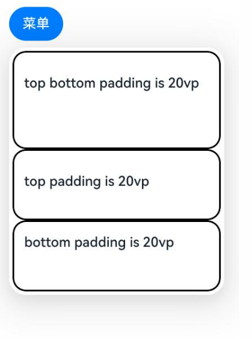

# ArkUI子系统Changelog

## cl.arkui.1 带标题栏窗口应用内菜单弹出位置变更

**访问级别**

公开接口

**变更原因**

对于带标题栏窗口使用非子窗的Menu组件场景，菜单默认弹出位置调整，UX体验更佳。


**变更影响**

该变更为不兼容变更。

变更前：带标题栏窗口应用内弹出菜单位置偏移4vp，菜单没有和按钮对齐。

变更后：带标题栏窗口应用内弹出菜单位置正确，菜单和按钮对齐。

| 变更前 | 变更后 |
|---------|---------|
|         |         |

**起始API Level**

API 11

**变更发生版本**

从OpenHarmony SDK 5.1.0.45开始。

**变更的接口/组件**

Menu组件。

**适配指导**

Menu UX默认效果变更，无需适配，但应注意变更后的默认效果是否符合开发者预期，如不符合则应自定义修改效果控制变量以达到预期。

## cl.arkui.2 MenuItem设置padding属性时默认布局行为变更

**访问级别**

公开接口

**变更原因**

优化MenuItem添加padding时布局效果，变更后效果更佳。

**变更影响**

该变更为不兼容变更。

变更前：MenuItem设置padding属性时，布局和预期不符合。

变更后：MenuItem设置padding属性时，布局符合预期。

```ts
@Entry
@Component
struct Index {
  @Builder
  MenuWithPadding() {
    Menu() {
      MenuItemGroup() {
        MenuItem({content:"top bottom padding is 20vp"})
          .padding({top:20, bottom: 20})
          .borderWidth(2)
          .borderColor(Color.Black)
        MenuItem({content:"top padding is 20vp"})
          .padding({top:20})
          .borderWidth(2)
          .borderColor(Color.Black)
        MenuItem({content:"bottom padding is 20vp"})
          .padding({bottom: 20})
          .borderWidth(2)
          .borderColor(Color.Black)
      }
    }
  }

  build() {
    Column() {
      Button("菜单")
        .bindMenu(this.MenuWithPadding)
    }
    .width('100%')
  }
}
```

| 变更前 | 变更后 |
|---------|---------|
|         |         |

**起始API Level**

API 7

**变更发生版本**

从OpenHarmony SDK 5.1.0.45 版本开始。

**变更的接口/组件**

MenuItem组件。

**适配指导**

MenuItem设置padding属性时默认布局效果变更，开发者无需适配。