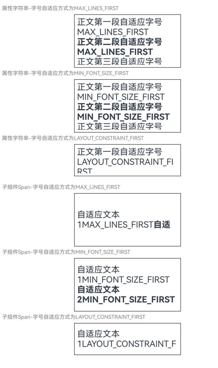

# ArkUI子系统Changelog

## cl.arkui.1 TextInput、TextArea、Search组件onChange事件参数内容变更

**访问级别**

公开接口

**变更原因**

在预上屏输入功能启用时，当先选中一段文本再进行输入，onChange回调中的value字段将仅反映实际显示的上屏文本，不再包含原先选中的文本内容，以此确保value字段与用户界面显示的文本一致。

**变更影响**

此变更不涉及应用适配。

运行如下示例代码：

```ts
// Index.ets
@Entry
@Component
struct TextInputExample {
  @State text: string = ''
  controller: TextInputController = new TextInputController()

  onPageShow(): void {
    setTimeout(() => {
      this.controller.setTextSelection(0,3);
    }, 10);
  }
  build() {
    Column() {
      TextInput({ text:"12345",  controller: this.controller })
        .width(380)
        .height(60)
        .defaultFocus(true)
        .onChange((value: string) => {
          console.log("value is" + value)
        })
    }
  }
}
```
变更前：
开启预上屏输入，输入过程中，onChange回调的值为“12345”

变更后：
开启预上屏输入，输入过程中，onChange回调的值为“45”

**起始API Level**

API 12

**变更发生版本**

从OpenHarmony SDK 5.1.0.46开始。

**变更的接口/组件**

TextInput组件onChange事件的EditableTextOnChangeCallback参数

TextArea组件onChange事件的EditableTextOnChangeCallback参数

Search组件onChange事件的EditableTextOnChangeCallback参数

**适配指导**

变更后value参数的内容将与实际显示内容保持一致，无需进行额外的适配。若开发者希望获取全部文本内容，可利用onEditChange等事件，在输入开始前进行获取并记录。

## cl.arkui.2 Text的minFontSize、maxFontSize在子组件span或属性字符串场景下，文本自适应字号设置生效

**访问级别**

公开接口

**变更原因**

能力增强，方便开发者对不同文字样式的文字做字号的适应。

**变更影响**

此变更涉及应用适配。

变更前，Text的minFontSize、maxFontSize在子组件Span或属性字符串场景下，文本自适应字号设置不生效。

变更后，Text的minFontSize、maxFontSize在子组件Span或属性字符串场景下，文本自适应字号设置生效。

如下是属性字符串和Span子组件场景变更前后效果对比：

|               变更前                |              变更后               |
| :---------------------------------: | :-------------------------------: |
|||

**起始API Level**

API 7

**变更发生版本**

从OpenHarmony SDK 5.1.0.46开始。

**变更的接口/组件**

Text组件的minFontSize、maxFontSize接口。

**适配指导**

如果在Text使用子组件或属性字符串场景下，设置了minFontSize、maxFontSize，变更后自适应字号生效，导致字号变化，如果需要保持之前的字号，可以删除minFontSize、maxFontSize属性设置。