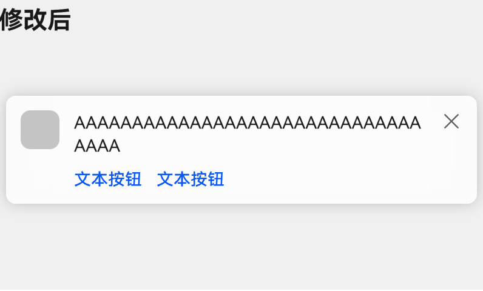

# ArkUI子系统Changelog

## cl.arkui.1 无障碍绿框绘制区域和聚焦区域修改为组件触摸热区

**访问级别**

公开接口

**变更原因**

无论是否开启无障碍，触碰操作控件的范围都应保持一致，无需为无障碍单独定义操控范围。

**变更影响**

此变更不涉及应用适配。

- 变更前：无障碍绿框绘制区域、聚焦区域为组件区域。

- 变更后：无障碍绿框绘制区域、聚焦区域为组件触摸热区。

**起始API Level**

16

**变更发生版本**

从OpenHarmony SDK 5.1.0.53开始。

**变更的接口/组件**

arkui无障碍

**适配指导**

此处无需应用适配，热区显示大小的调整，无论是否配置热区，均为内部逻辑调整绿框显示位置或大小。

## cl.arkui.2 拖拽缩放比例UX规则变更

**访问级别**

公开接口

**变更原因**

UX规范变更。

**变更影响**

此变更不涉及应用适配。

变更前：通过设备栅格数来设置跟手图的大小。

  | 设备大小 | 跟手图大小 |
  | :------- | :--------- |
  | 4栅格    | 2栅格      |
  | 8栅格    | 3栅格      |
  | 12栅格   | 4栅格      |

变更后：根据不同类型设备的最短边来设置缩放规则。

| 拖拽对象         | 判断规则                          | 缩放规则                                                                                                                               |
| :--------------- | :-------------------------------- | :------------------------------------------------------------------------------------------------------------------------------------- |
| 图文选择跟随文本 | 设备最短边小于600vp。             | 跟手图最大高度不超过屏幕短边长度的1/2且最大宽度不超过屏幕短边长度，跟手图在超出限制时需按比例缩小，同时满足高度和宽度的限制条件。      |
| 图文选择跟随文本 | 设备最短边大于600vp，小于840vp。  | 跟手图最大高度不超过屏幕短边长度的1/4且最大宽度不超过屏幕短边长度的1/2，跟手图在超出限制时需按比例缩小，同时满足高度和宽度的限制条件。 |
| 图文选择跟随文本 | 设备最短边大于840vp，小于1440vp。 | 跟手图最大高度不超过屏幕短边长度的1/3且最大宽度不超过屏幕短边长度的2/3，跟手图在超出限制时需按比例缩小，同时满足高度和宽度的限制条件。 |
| 图文选择跟随文本 | 设备最短边大于1440vp。            | 跟手图最大高度不超过屏幕短边长度的1/3且最大宽度不超过屏幕短边长度的2/3，跟手图在超出限制时需按比例缩小，同时满足高度和宽度的限制条件。 |
| 图片拖拽缩放     | 设备最短边小于600vp。             | 跟手图最大高度不超过屏幕短边长度的1/2且最大宽度不超过屏幕短边长度的1/2，跟手图在超出限制时需按比例缩小，同时满足高度和宽度的限制条件。 |
| 图片拖拽缩放     | 设备最短边大于600vp，小于840vp。  | 跟手图最大高度不超过屏幕短边长度的1/4且最大宽度不超过屏幕短边长度的1/4，跟手图在超出限制时需按比例缩小，同时满足高度和宽度的限制条件。 |
| 图片拖拽缩放     | 设备最短边大于840vp，小于1440vp。 | 跟手图最大高度不超过屏幕短边长度的1/3且最大宽度不超过屏幕短边长度的1/3，跟手图在超出限制时需按比例缩小，同时满足高度和宽度的限制条件。 |
| 图片拖拽缩放     | 设备最短边大于1440vp。            | 跟手图最大高度不超过屏幕短边长度的1/3且最大宽度不超过屏幕短边长度的1/3，跟手图在超出限制时需按比例缩小，同时满足高度和宽度的限制条件。 |

**起始API Level**

13

**变更发生版本**

从OpenHarmony SDK 5.1.0.53开始。

**变更的接口/组件**

UX规格变更，不涉及接口和组件。

**适配指导**

默认行为变更，无需适配。

## cl.arkui.3 TEXTURE模式XComponent的本地窗口缓冲区支持设置旋转变换

**访问级别**

公开接口

**变更原因**

TEXTURE模式XComponent的本地窗口缓冲区旋转变换在设置后不生效，导致开发者无法通过设置缓冲区旋转变换来调整显示画面的旋转方向。

**变更影响**

此变更涉及应用适配。

变更前：
设置TEXTURE模式XComponent的本地窗口缓冲区旋转变换后，旋转变换在实际显示的画面中不生效。

变更后：
设置TEXTURE模式XComponent的本地窗口缓冲区旋转变换后，旋转变换在实际显示的画面中生效。

| 写入缓冲区的原始图像 | 变更前设置了缓冲区逆时针旋转90度后的实际显示画面 | 变更后设置了缓冲区逆时针旋转90度后的实际显示画面 |
| --------- | --------- | --------- |
||       |  |

**起始API Level**

API 10

**变更发生版本**

从OpenHarmony SDK 5.1.0.53开始。

**变更的接口/组件**

ArkUI 内置组件XComponent。

**适配指导**

变更后，设置TEXTURE模式XComponent的本地窗口缓冲区旋转变换后，XComponent显示的内容将根据设置进行旋转。
如开发者原先设置过TEXTURE模式XComponent的本地窗口缓冲区旋转变换，为避免显示内容旋转，
应将原先设置本地窗口缓冲区旋转变换的相关调用语句去除。
```
OHNativeWindow* window;
// 利用XComponent的surfaceId获取本地窗口
OH_NativeWindow_CreateNativeWindowFromSurfaceId(surfaceId, &window);

// ......

// 应去除此处设置本地窗口缓冲区逆时针旋转90度的调用
OH_NativeWindow_NativeWindowHandleOpt(nativeWindow, SET_TRANSFORM, NATIVEBUFFER_ROTATE_90);

// ......
```

## cl.arkui.4 按钮默认值变更为新增圆角矩形类型

**访问级别**

公开接口

**变更原因**

原有默认类型按钮是胶囊按钮，在适老化场景下字体过大，在多行等场景下胶囊按钮文字易超出其圆角范围。不符合简单易用及高端精致原则，因此新增圆角矩形类型按钮，默认值变为新增的圆角矩形类型。

**变更影响**

此变更不涉及应用适配。

变更前：ButtonOptions中type的默认值为ButtonType.Capsule。

变更后：ButtonOptions中type的默认值为ButtonType.ROUNDED_RECTANGLE


**起始API Level**

API 9

**变更发生版本**

从OpenHarmony SDK 5.1.0.53开始。

**变更的接口/组件**

Button组件中ButtonOptions对象的type属性默认值。

**适配指导**

开发者在使用Button组件，创建默认类型的Button按钮时，Button按钮为ROUNDED_RECTANGLE类型。

```ts

@Entry
@Component
struct ButtonExample {
  build() {
    Flex({ direction: FlexDirection.Column, alignItems: ItemAlign.Start, justifyContent: FlexAlign.SpaceBetween }) {
      Text('Capsule button with rounded corners by default.').fontSize(9).fontColor(0xCCCCCC)
      Flex({ alignItems: ItemAlign.Center, justifyContent: FlexAlign.SpaceBetween }) {
        Button('Capsule')
          .type(ButtonType.Capsule)
          .backgroundColor(0x317aff)
          .height(60)
          .controlSize(ControlSize.NORMAL)
          .width(180)
      }
      Text('Rounded rectangle button with rounded corners by default.').fontSize(9).fontColor(0xCCCCCC)
      Flex({ alignItems: ItemAlign.Center, justifyContent: FlexAlign.SpaceBetween }) {
        Button('Rounded rectangle')
          .type(ButtonType.ROUNDED_RECTANGLE)
          .backgroundColor(0x317aff)
          .controlSize(ControlSize.NORMAL)
          .height(60)
          .width(180)
      }
    }.height(400).padding({ left: 35, right: 35, top: 35 })
  }
}

```

## cl.arkui.5 修复Popup高级组件宽度限制计算错误的问题

**访问级别**

公开接口

**变更原因**

目前宽度最大限制不符合ux规范，在手机屏幕场景下，会出现Popup高级组件无法撑满屏幕的情况，影响体验。

**变更影响**

此变更不涉及应用适配。

变更前：屏幕宽度小于400vp时，Popup高级组件最大宽度为当前屏幕宽度-80vp。

变更后：屏幕宽度小于400vp时，Popup高级组件最大宽度为当前屏幕宽度。

| 变更前                                   | 变更后                                   |
| ---------------------------------------- | ---------------------------------------- |
|  |  |

**起始API Level**

11

**变更发生版本**

从OpenHarmony 5.1.0.53 版本开始。

**变更的接口/组件**

Popup高级组件。

**适配指导**

如果用户原来没有自定义Popup高级组件的宽度，且内容宽度大于320vp，变更前按320vp显示，变更后，Popup高级组件会变宽；如不符合预期，可以手动修改为想要的宽度。

## cl.arkui.6 getKeyboardAvoidMode接口返回值变更

**访问级别**

公开接口

**变更原因**

getKeyboardAvoidMode接口实际返回值为字符串，与文档描述返回值为KeyboardAvoidMode枚举值类型不符。

**变更影响**

此变更涉及应用适配。

- 变更前：getKeyboardAvoidMode接口返回字符串类型。
  
- 变更后：getKeyboardAvoidMode接口返回KeyboardAvoidMode枚举值，为整数类型。

**起始API Level**

11

**变更发生版本**

从OpenHarmony SDK 5.1.0.53开始。

**适配指导**

如下代码实现：
```ts
//EntryAbility.ets
import { AbilityConstant, ConfigurationConstant, UIAbility, Want } from '@kit.AbilityKit';
import { hilog } from '@kit.PerformanceAnalysisKit';
import { window, KeyboardAvoidMode } from '@kit.ArkUI';

export default class EntryAbility extends UIAbility {
  onCreate(want: Want, launchParam: AbilityConstant.LaunchParam): void {
    this.context.getApplicationContext().setColorMode(ConfigurationConstant.ColorMode.COLOR_MODE_NOT_SET);
    hilog.info(0x0000, 'testTag', '%{public}s', 'Ability onCreate');
  }
  onDestroy(): void {
    hilog.info(0x0000, 'testTag', '%{public}s', 'Ability onDestroy');
  }
  onWindowStageCreate(windowStage: window.WindowStage): void {
    // Main window is created, set main page for this ability
    hilog.info(0x0000, 'testTag', '%{public}s', 'Ability onWindowStageCreate');

    windowStage.loadContent('pages/Index', (err, data) => {
      //获取并打印当前KeyboardAvoidMode
      let keyboardAvoidMode = windowStage.getMainWindowSync().getUIContext().getKeyboardAvoidMode();
      console.log("=====keyboardAvoidMode=====: ", keyboardAvoidMode);

      if (err.code) {
        hilog.error(0x0000, 'testTag', 'Failed to load the content. Cause: %{public}s', JSON.stringify(err) ?? '');
        return;
      }
      hilog.info(0x0000, 'testTag', 'Succeeded in loading the content. Data: %{public}s', JSON.stringify(data) ?? '');
    });
  }

  onWindowStageDestroy(): void {
    // Main window is destroyed, release UI related resources
    hilog.info(0x0000, 'testTag', '%{public}s', 'Ability onWindowStageDestroy');
  }

  onForeground(): void {
    // Ability has brought to foreground
    hilog.info(0x0000, 'testTag', '%{public}s', 'Ability onForeground');
  }

  onBackground(): void {
    // Ability has back to background
    hilog.info(0x0000, 'testTag', '%{public}s', 'Ability onBackground');
  }
}
```
