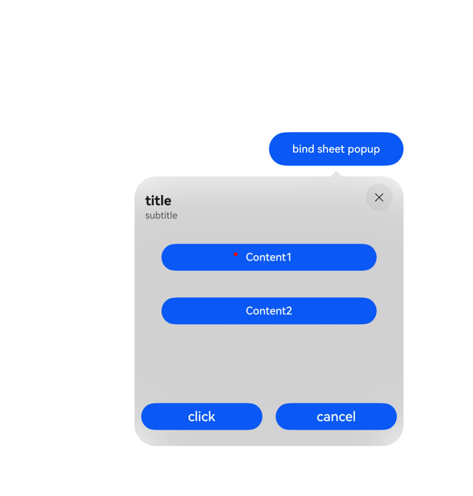
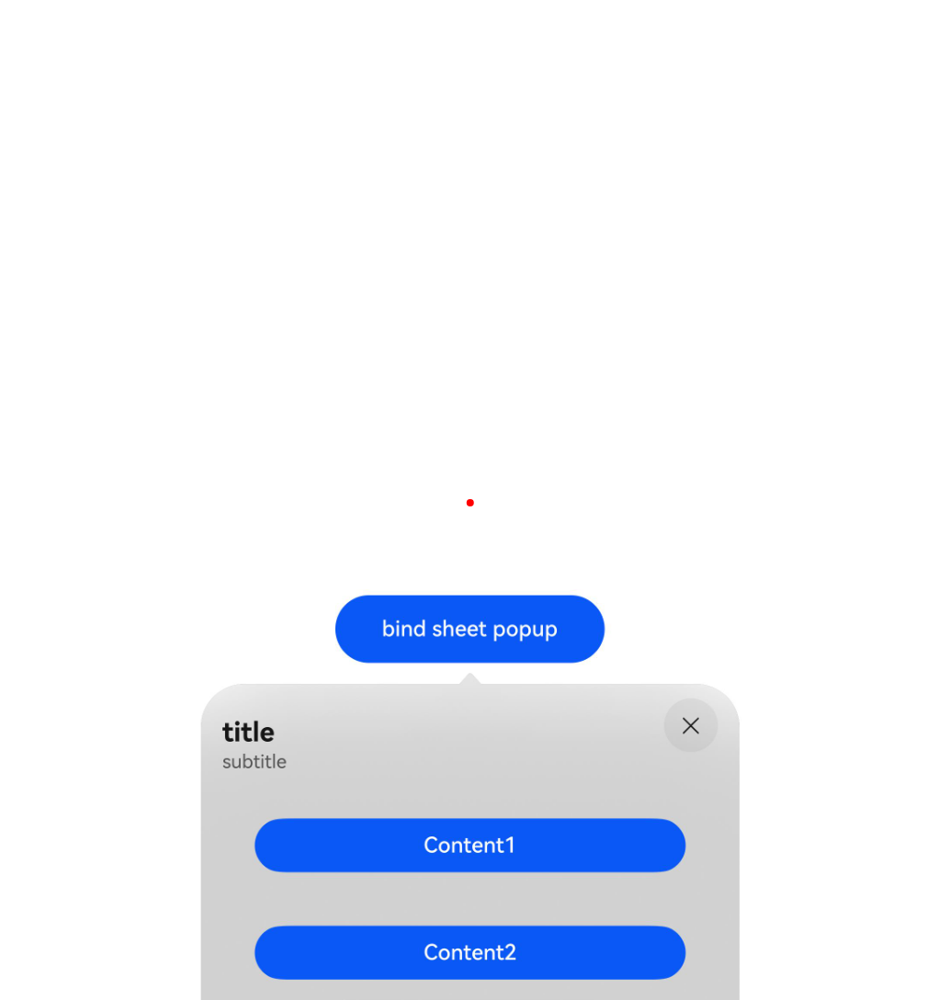
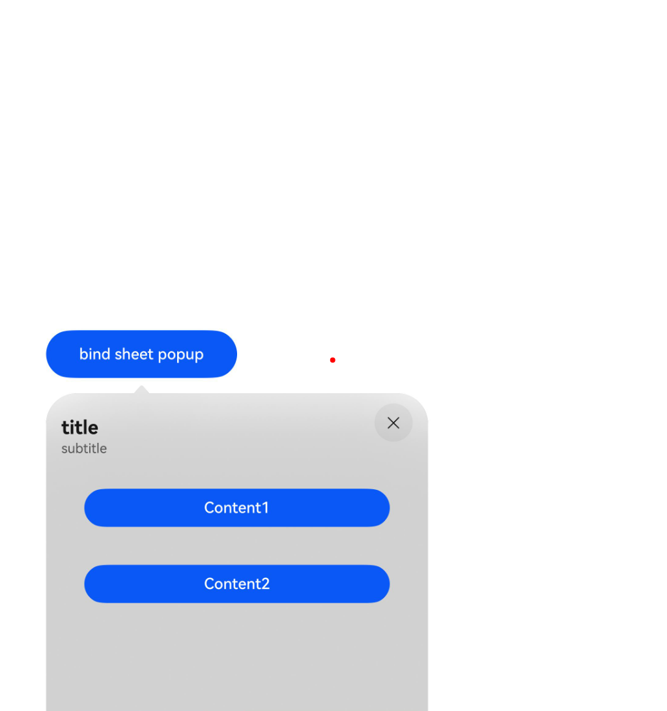
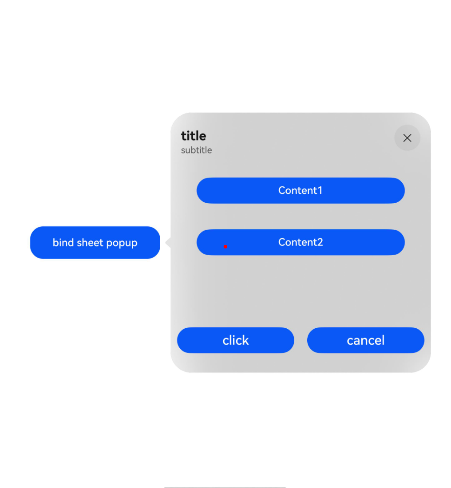
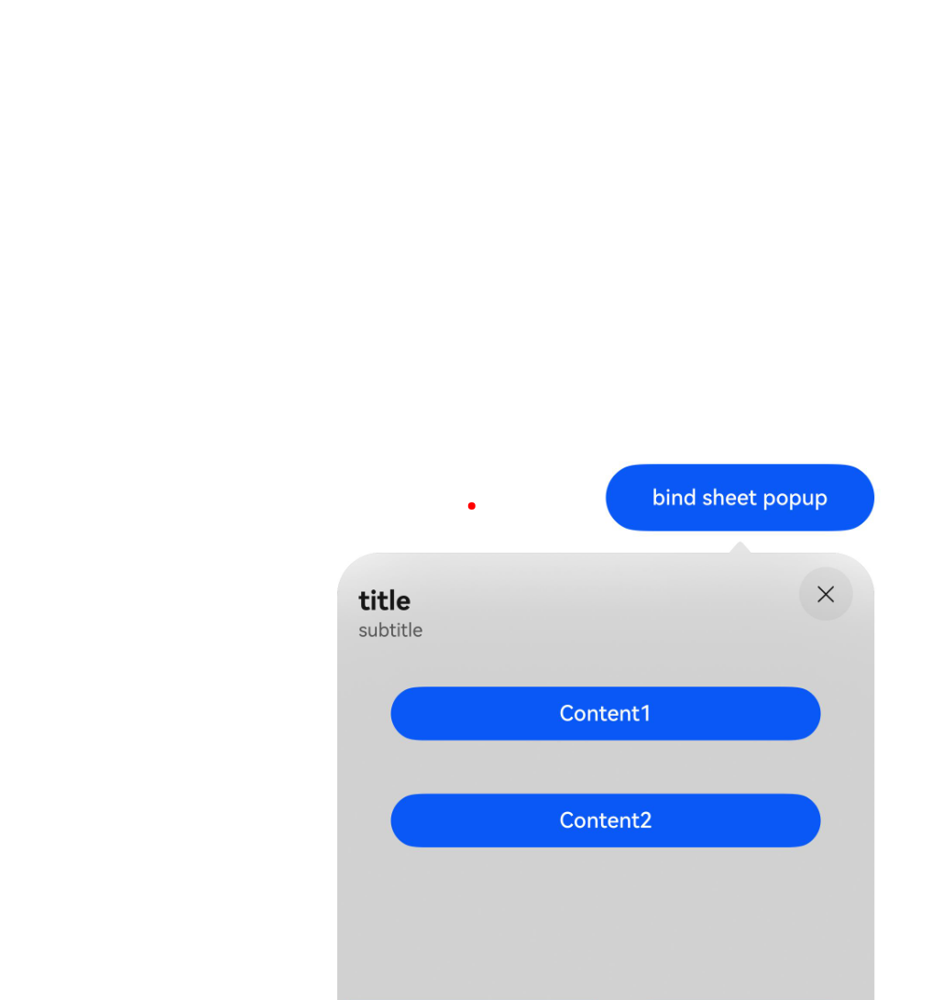

# ArkUI子系统Changelog


## cl.arkui.1 通用属性backgroundEffect在modifier中radius参数单位修改

**访问级别**

公开接口

**变更原因**

 直接使用backgroundEffect时对应的模糊参数radius单位为vp。通过modifier或者CAPI使用时，单位为px。现将单位同一为vp。

**变更影响**

此变更涉及应用适配。

变更前：backgroundEffect通过modifier使用时单位为px。<br/>


变更后：backgroundEffect通过modifier使用时单位为vp。<br/>


**起始API Level**

API 12

**变更发生版本**

从OpenHarmony 5.1.0.45 版本开始。

**变更的接口/组件**

backgroundEffect

**适配指导**

在modifier中使用px2vp方法把radius参数转换为vp。

```ts

import { CommonModifier } from '@kit.ArkUI';

class ColumnModifier extends CommonModifier {
  public radius: number = 0;
  applyNormalAttribute(instance: CommonAttribute): void {
    instance.backgroundEffect({ radius: this.radius })
  }
}

@Entry
@Component
struct Index {
  @State testSize: number = 200;
  @State modifier:ColumnModifier = new ColumnModifier();
  onPageShow(): void {
    // 变更前
    // this.modifier.radius = 10;
    // 变更后适配
    this.modifier.radius = px2vp(10);
  }
  build() {
    Column() {
      Stack() {
        Image($r('app.media.test')).width(this.testSize).height(this.testSize)
        Column().width(this.testSize).height(this.testSize).attributeModifier(this.modifier)
      }.width('100%')
    }
  }
}
```

## cl.arkui.2 DrawModifier的invalidate接口行为变更

**变更原因**

实现bug，之前实现中未在节点标脏后请求下一帧vsync信号，导致部分场景下invalidate无法刷新绘制内容。

**变更影响**

此变更不涉及应用适配。

| 变更前                                        | 变更后                                        |
|-----------------------------------------------|-----------------------------------------------|
|invalidate接口仅对节点标脏，不请求下一帧。导致节点标脏但不会刷新重绘。等到其他操作，例如点击触发下一帧信号的时候才会重绘。 |invalidate接口对节点标脏后主动请求下一帧，使节点及时刷新重绘。|

使用如下示例代码对影响补充说明。

```ts
import { drawing } from '@kit.ArkGraphics2D';

class MyFrontDrawModifier extends DrawModifier {
  public scaleX: number = 1;
  public scaleY: number = 1;

  drawFront(context: DrawContext): void {
    const brush = new drawing.Brush();
    brush.setColor({
      alpha: 255,
      red: 0,
      green: 0,
      blue: 255
    });
    context.canvas.attachBrush(brush);
    const halfWidth = context.size.width / 2;
    const halfHeight = context.size.width / 2;
    const radiusScale = (this.scaleX + this.scaleY) / 2;
    context.canvas.drawCircle(vp2px(halfWidth), vp2px(halfHeight), vp2px(20 * radiusScale));
  }
}

@Entry
@Component
struct DrawModifierExample {
  @State modifier: MyFrontDrawModifier = new MyFrontDrawModifier();
  @State changeScale: boolean = false;

  build() {
    Column() {
      Row() {
        Text()
          .width(100)
          .height(100)
          .margin(10)
          .backgroundColor(Color.Gray)
          .drawModifier(this.modifier)
      }

      Button('invalidate immediately')
        .onClick(() => {
          this.changeScale = !this.changeScale
          // 变更前后不影响，节点在invalidate的下一帧刷新
          this.changeScale ? this.modifier.scaleX = 2 : this.modifier.scaleX = 1
          this.changeScale ? this.modifier.scaleY = 2 : this.modifier.scaleY = 1
          this.modifier.invalidate()
        }
        )
      Button('invalidate in setTimeout ')
        .onClick(() => {
          setTimeout(() => {
            // 变更前：invalidate对节点标脏，但不请求下一帧，等到其他事件触发下一帧，进行刷新绘制
            // 变更后：节点在invalidate的下一帧刷新
            this.changeScale = !this.changeScale
            this.changeScale ? this.modifier.scaleX = 2 : this.modifier.scaleX = 1
            this.changeScale ? this.modifier.scaleY = 2 : this.modifier.scaleY = 1
            this.modifier.invalidate()
          }, 1000)
        }
        )
    }
  }
}
```

**起始API Level**

API 12

**变更发生版本**

从OpenHarmony SDK 5.1.0.54开始。

**变更的接口/组件**

common.d.ts#DrawModifier.invalidate

**适配指导**

默认行为变更，无需适配。但需要注意invalidate调用后没有其他操作产生请求下一帧的场景下的影响。

## cl.arkui.3 节点默认生命周期回调策略变更

**访问级别**

公开接口

**变更原因**

节点复用情况下，造成冗余的性能损耗。

**变更影响**

此变更不涉及应用适配。

| 变更前                           |           变更后 |
|---------------------------------|------------------|
|节点复用情况下,如果存在父布局约束。节点通过addChild重新上树默认触发测量，布局以及绘制。| 节点复用情况下节点通过addChild重新上树，只有布局约束发生变化才会触发测量布局以及绘制。|

变更前后示例代码对比如下，调用rebuildTree变更前会触发customEventReceiver变更后不会。<br/>

示例代码如下，完整实例可参考使用ndk接口构建接入UI中的接入ArkTS页面。

```ts

static std::vector<ArkUI_NodeHandle> childList;

void registerCustomEvent(ArkUI_NodeHandle node) {
    nodeApi->registerNodeCustomEvent(node, ARKUI_NODE_CUSTOM_EVENT_ON_MEASURE, 0, nullptr);
    nodeApi->registerNodeCustomEvent(node, ARKUI_NODE_CUSTOM_EVENT_ON_LAYOUT, 0, nullptr);
    nodeApi->registerNodeCustomEvent(node, ARKUI_NODE_CUSTOM_EVENT_ON_DRAW, 0, nullptr);
}

void customEventReceiver(ArkUI_NodeCustomEvent *event) {
   auto eventType = OH_ArkUI_NodeEvent_GetEventType(event);
  // 变更前会触发自定义测量，布局，绘制事件
  // 变更后不会触发自定义测量，布局，绘制事件
} 

void init() {

auto rootNode = nodeApi->CreateNode(ARKUI_NODE_CUSTOM);
auto child1 = nodeApi->CreateNode(ARKUI_NODE_CUSTOM);
auto child2 = nodeApi->CreateNode(ARKUI_NODE_CUSTOM);
nodeApi->addChild(rootNode, child1);
nodeApi->addChild(rootNode, child2);
childList.push_back(child1);
childList.push_back(child2);
ArkUI_NumberValue value[] = {{.f32 = 100}};
ArkUI_AttributeItem item = {value, 1};
nodeApi->setAttribute(rootNode, NODE_WIDTH, item);
nodeApi->setAttribute(child1, NODE_WIDTH, item);
nodeApi->setAttribute(child2, NODE_WIDTH, item);
nodeApi->setAttribute(rootNode, NODE_HEIGHT, item);
nodeApi->setAttribute(child1, NODE_HEIGHT, item);
nodeApi->setAttribute(child2, NODE_HEIGHT, item);

// 注册订阅自定义事件
registerCustomEvent(rootNode);
registerCustomEvent(child1);
registerCustomEvent(child2);
nodeApi->registerNodeCustomEventReceiver(customEventReceiver);
}

void rebuildTree(ArkUI_NodeHandle root) {
  // 触发组件上下树
  auto front = childList.front();
  nodeApi->removeChild(root, front);
  childList.erase(childList.begin());
  nodeApi->addChild(root, front);
  childList.push_back(front);
} 

```

**起始API Level**

API 12

**变更发生版本**

从OpenHarmony SDK 5.1.0.54开始。

**变更的接口/组件**

frameNode 生命周期。

**适配指导**

默认行为变更无需适配。

## cl.arkui.4 禁用键盘Ctrl按键和触控板轴事件触发缩放手势变更

**访问级别**

公开接口

**变更原因**

UX规格变化。

**变更影响**

此变更不涉及应用适配。

变更前：键盘Ctrl按键和触控板双指水平滑动或者垂直滑动时，可以触发缩放手势。

变更前：键盘Ctrl按键和触控板双指水平滑动或者垂直滑动时，不可以触发缩放手势。

**起始API Level**

接口起始版本为API version 7。

**变更发生版本**

从OpenHarmony SDK 5.1.0.54开始。

**变更的接口/组件**

ArkTS：PinchGestureInterface、PinchGestureHandler

C API：createPinchGesture

**适配指导**

默认UX变更无需适配。

## cl.arkui.5 半模态跟手样式弹窗显示位置避让规则变更
**访问级别**

公开接口

**变更原因**

基础能力增强，半模态跟手样式弹窗支持开发者自定义弹出方向，并根据位置避让流程决定弹窗最终显示位置

**变更影响**

此变更不涉及应用适配，

变更前行为：半模态跟手样式弹窗默认弹出位置为绑定组件底部，会根据剩余空间情况同绑定组件左边和右边作对齐布局，不做任何半模态面板高度的压缩。

变更后行为：开发者可使用bindOptions中的placement(设置弹窗默认弹出位置，默认值Bottom) 和 placementOnTarget(所有位置均放不下时，是否允许弹窗覆盖在绑定节点上)两个字段，自定义半模态跟手样式弹窗相关的弹出位置信息。半模态跟手样式弹窗在确保指定位置能容纳弹窗尺寸的前提下，优先依据设定的placement展示弹窗。若不可行，则遵循先垂直翻转，后尝试90°水平旋转的规则调整显示位置，以预设方向为下方为例，调整顺序依次为：下、上、右、左。如果设置的对齐方式导致组件布局超出窗口范围，将根据该对齐方式在水平或垂直方向上进行位移，直至组件完全显示在窗口内。如果在四个方向上均无法容纳跟手样式弹窗，处理方式遵循开发者设置的placementOnTarget属性。若属性值为True，将依据设定的placement，向其镜像方向平移，直至弹窗能够完全显示，且允许覆盖在绑定的弹出节点上；若属性值为false，则在四个方向中，选择能够完全展示弹窗宽度且剩余高度最大的方向，通过调整半模态高度以适应当前方向，确保弹窗能够放下，同时保持预设placement对应的对齐方式不变。

| 场景 | 变更前 | 变更后placementOnTarget为true | 变更后placementOnTarget为false |
|------ |------ |--------|--------|
|半模态跟手弹窗大小过大导致底部空间不足以容纳弹窗面板||||

| 场景 | 变更前 | 变更后 |
|------ |--------|--------|
|半模态跟手弹窗弹出位置过于靠近左侧边界导致左侧剩余空间不足以保持同绑定节点居中对齐|||
|半模态跟手弹窗弹出位置过于靠近右侧边界导致右侧剩余空间不足以保持同绑定节点居中对齐|||
|半模态绑定的弹出节点在y轴位置上更偏底部，但绑定节点的底部空间不足以容纳半模态弹窗面板，而顶部空间足以容纳|||
|半模态绑定的弹出节点在x轴位置上更偏左边，但绑定节点的底部、顶部空间不足以容纳半模态弹窗面板，而右边空间足以容纳|||
|半模态绑定的弹出节点在x轴位置上更偏右边，但绑定节点的底部、顶部、右边空间不足以容纳半模态弹窗面板，而左边空间足以容纳|||

**起始API Level**

11

**变更发生版本**

从OpenHarmony SDK 5.1.0.54 版本开始。

**变更的接口/组件**

bindSheet
SheetType.POPUP

**适配指导**

默认行为变更，开发者无需适配。若api18前希望实现的效果为位于弹出节点底部并且同弹出节点左对齐或者右对齐，可以通过设置placement值为BottomLeft或BottomRight来实现对应显示效果。