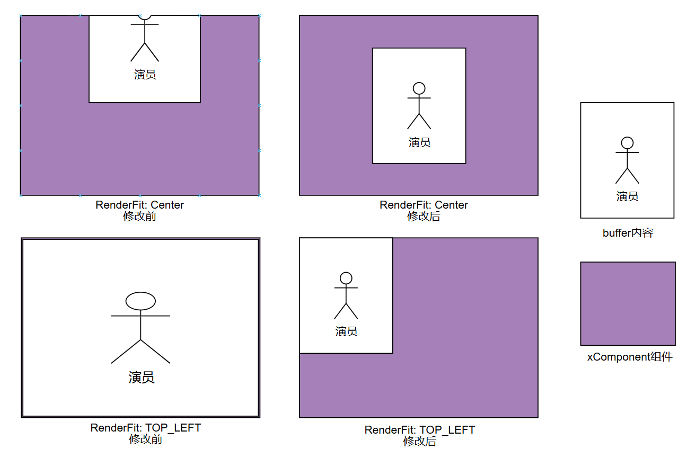

# ArkUI子系统Changelog

## cl.arkui.1 XComponent组件上使用renderFit接口显示效果变更

**访问级别**

公开接口

**变更原因**

优化XComponent组件上使用renderFit接口显示效果的正确性。

**变更影响**

此变更要求涉及XComponent组件上使用renderFit接口的应用进行适配。

- 变更前：在XComponent组件上使用renderFit接口，使用部分fit模式的显示效果不符合预期。
  
- 变更后：XComponent组件上使用renderFit接口后，可以正确显示。

**起始API Level**

API 10

**变更发生版本**

从OpenHarmony SDK 5.1.0.56开始。

**变更的接口/组件**

涉及接口: renderFit。

涉及组件: XComponent组件。

**适配指导**

默认行为变更，涉及XComponent组件上使用renderFit接口的应用进行适配，若出现显示效果变更，则需要按照正确效果进行布局。

## cl.arkui.2 setSpecificSystemBarEnabled接口在横屏的行为变更

**访问级别**

公开接口

**变更原因**

修正接口规格，保证接口调用在不同场景下均可正常控制状态栏显隐。

**变更影响**

此变更不涉及应用适配。

变更前：应用窗口处于横屏状态时，应用使用该接口设置状态栏显隐不生效，状态栏始终处于隐藏状态。

变更后：应用启动之后，若使用该接口设置过状态栏的显隐，状态栏的显隐状态则以应用的设置（多次设置，以最后一次设置状态为准）为准来生效。

**起始API Level**

API 12

**变更发生版本**

从OpenHarmony SDK 5.1.0.56开始

**变更的接口/组件**

Window#setSpecificSystemBarEnabled(name: SpecificSystemBar, enable: boolean, enableAnimation?: boolean): Promise\<void\>

**适配指导**

针对应用预期在横屏时隐藏状态栏的场景，需确认应用自启动之后是否使用该接口主动设置过状态栏显示，若应用设置过状态栏显示，需再次设置状态栏隐藏，才能实现应用横屏时隐藏状态栏。
