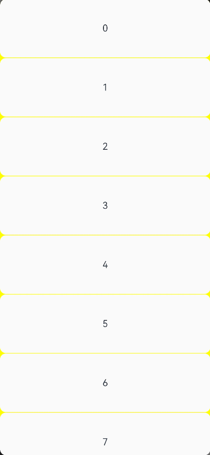

# arkui子系统ChangeLog

## cl.arkui.1 List中的滚动条边距由跟随padding变更为不跟随padding

**变更影响**

API10之前，List的滚动条边距会受到padding的影响，滚动条在List设置了padding时，位置会被向内挤压。

API10之后，List的滚动条边距不会受到padding的影响，距离List的边距为固定的4vp。

## cl.arkui.2 滚动条底部和顶部预留距离由固定值变更为根据滑动组件的圆角值动态计算。

**变更影响**

变更前，滚动条底部和顶部预留距离是固定值（横向滚动条则为左边和右边预留距离），不会随滑动组件的圆角变化而动态变化。

变更后，滚动条底部和顶部预留距离会根据滑动组件的圆角值动态计算，避免被圆角截断。例如，当Scroll组件的圆角值为0时，滚动条的底部预留距离为0，滚动条可以滑动Scroll的底部。

## cl.arkui.3 通用属性position设置在宽高为0的组件上时由不生效变更为生效

**变更影响**

API version 10之前，如果一个组件的宽或高设置为0，则该组件所设置的通用属性position不生效。

API version 10之后，如果一个组件的宽或高设置为0，则该组件所设置的通用属性position生效。

**适配方法**
如果宽或高为0的组件因设置了position而发生了布局上的变化，可以将设置的position属性取消来与变更前保持一致。

## cl.arkui.4 Flex上设置的itemAlign.Auto相当于itemAlign.Start

**变更影响**

4.1.1.1之前，Flex设置itemAlign.Auto时，设置itemAlign.Auto在交叉轴上会跟随其他组件。

4.1.1.1之后，Flex设置itemAlign.Auto时，相当于设置了itemAlign.Start。

## cl.arkui.1 Image组件的draggable接口不支持在ArkTS卡片上使用

**变更级别**

公开接口

**变更原因**

根据ArkTS卡片能力范围跟限制说明，Image组件的draggable接口不支持在ArkTS卡片上使用，应该去掉@form标签。

**变更影响**

该变更为非兼容性变更。删除Image组件的draggable接口标记的@form标签后，开发者不能在ArkTS卡片上使用Image组件的draggable接口。

**API级别**

从API9开始。

**变更的接口/组件**

修改前，Image组件的draggable接口有@form标签。

修改后，Image组件的draggable接口去掉@form标签不支持在ArkTS上使用。

**适配指导**

变更前后，Image组件的draggable接口均不支持在ArkTS卡片上使用，开发者无需适配。

## cl.Arkui.1 QRCode组件的默认颜色、默认背景颜色和默认尺寸变更

**变更影响**

API 11前，二维码默认颜色是Color.Black，默认背景颜色是Color.White，组件默认宽高是父组件大小。


API 11及以后，二维码默认颜色是系统资源中的`ohos_id_color_foreground`，默认背景颜色是系统资源中的`ohos_id_color_background`，组件默认宽度和高度都是240vp。

**适配指导**

请查阅[QRCode组件](../../../application-dev/reference/arkui-ts/ts-basic-components-qrcode.md)文档进行适配。

示例代码:
```ts
// xxx.ets
@Entry
@Component
struct QRCodeExample {
  private value: string = 'hello world'
  build() {
    Column() {
      QRCode(this.value)
    }.width('100%').height('100%')
  }
}
```
## cl.arkui.2 Refresh变更
**变更影响**

1、默认刷新场景

API 11以前，Refresh组件嵌套子组件，默认场景，刷新组件下拉，子组件不跟随下移。滑动组件的边缘回弹效果和loading的移动是相互独立的。


API 11及以后，Refresh组件嵌套子组件，刷新组件下拉，子组件下移。


**适配指导**

请查阅[Refresh组件](../../../application-dev/reference/arkui-ts/ts-container-refresh.md)文档进行适配

示例代码:

```ts
@Entry
@Component
struct RefreshExample {
  @State isRefreshing: boolean = false
  @State arr: String[] = ['0', '1', '2', '3', '4','5','6','7','8','9','10']

  build() {
    Column() {
      Refresh({ refreshing: $$this.isRefreshing}) {
        List() {
          ForEach(this.arr, (item: string) => {
            ListItem() {
              Text('' + item)
                .width('100%').height(100).fontSize(16)
                .textAlign(TextAlign.Center).borderRadius(10).backgroundColor(0xFFFFFF)
            }
          }, (item: string) => item)
        }
        .onScrollIndex((first: number) => {
          console.info(first.toString())
        })
        .width('100%')
        .height('100%')
        .divider({strokeWidth:1,color:Color.Yellow,startMargin:10,endMargin:10})
        .scrollBar(BarState.Off)
        .backgroundColor(Color.Yellow)
      }
      .onStateChange((refreshStatus: RefreshStatus) => {
        console.info('Refresh onStatueChange state is ' + refreshStatus)
      })
      .onRefreshing(() => {
        setTimeout(() => {
          this.isRefreshing = false
        }, 2000)
        console.log('onRefreshing test')
      })
      .backgroundColor(0x89CFF0)
    }
  }
}
```

2、使用builder接口自定义刷新组件

API 11以前，Refresh组件嵌套子组件，自定义刷新组件，刷新组件的高度不大于64vp。滑动组件的边缘回弹效果和builder下拉同时生效。



API 11及以后，Refresh组件嵌套子组件，刷新组件下拉，子组件下移。自定义刷新组件builder的高度没有限制。


**适配指导**

请查阅[Refresh组件](../../../application-dev/reference/arkui-ts/ts-container-refresh.md)文档进行适配

示例代码:

```ts
// xxx.ets
@Entry
@Component
struct RefreshExample {
  @State isRefreshing: boolean = false
  @State arr: String[] = ['0', '1', '2', '3', '4','5','6','7','8','9','10']
  @Builder
  customRefreshComponent()
  {
    Stack()
    {
      Row()
      {
        LoadingProgress().height(32)
        Text("正在刷新...").fontSize(16).margin({left:20})
      }
      .alignItems(VerticalAlign.Center)
    }.width("100%").align(Alignment.Center)
  }

  build() {
    Column() {
      Refresh({ refreshing: $$this.isRefreshing,builder:this.customRefreshComponent()}) {
        List() {
          ForEach(this.arr, (item: string) => {
            ListItem() {
              Text('' + item)
                .width('100%').height(100).fontSize(16)
                .textAlign(TextAlign.Center).borderRadius(10).backgroundColor(0xFFFFFF)
            }
          }, (item: string) => item)
        }
        .onScrollIndex((first: number) => {
          console.info(first.toString())
        })
        .width('100%')
        .height('100%')
        .divider({strokeWidth:1,color:Color.Yellow,startMargin:10,endMargin:10})
        .scrollBar(BarState.Off)
        .backgroundColor(Color.Yellow)
      }
      .onStateChange((refreshStatus: RefreshStatus) => {
        console.info('Refresh onStatueChange state is ' + refreshStatus)
      })
      .onRefreshing(() => {
        setTimeout(() => {
          this.isRefreshing = false
        }, 2000)
        console.log('onRefreshing test')
      })
      .backgroundColor(0x89CFF0)
    }
  }
}
```

## cl.arkui.1 系统组件父子校验

从API version11开始，当`Blank`，`FlowItem`，`GridItem`，`GridCol`，`ListItem`，`ListItemGroup`，`Option`，`Span`，`StepperItem`，`TabContent`组件的父组件不是限定组件时，编译报错。

**示例：**

```
@Entry
@Component
struct Index {
  build() {
    Button(){
      Blank()
    }
  }
}
```

**变更影响**

如果`Blank`，`FlowItem`，`GridItem`，`GridCol`，`ListItem`，`ListItemGroup`，`Span`，`StepperItem`，`TabContent`组件的父组件没有写在限定的组件中，编译报错 。父组件为`if`组件，`ForEach`组件，`LazyForEach`组件， `@Builder`修饰的方法中，编译不会报错。

```
// ArkTS:ERROR The 'Blank' component can only be nested in the 'Row,Column,Flex' parent component.
Button(){
      Blank()
    }
```

**关键的接口/组件变更**

不涉及。

**适配指导**

请查阅[Blank组件](../../../application-dev/reference/arkui-ts/ts-basic-components-blank.md)，[FlowItem组件](../../../application-dev/reference/arkui-ts/ts-container-flowitem.md)，[GridItem组件](../../../application-dev/reference/arkui-ts/ts-container-griditem.md)，[GridCol组件](../../../application-dev/reference/arkui-ts/ts-container-gridcol.md)，[ListItem组件](../../../application-dev/reference/arkui-ts/ts-container-listitem.md)，[ListItemGroup组件](../../../application-dev/reference/arkui-ts/ts-container-listitemgroup.md)，[Span组件](../../../application-dev/reference/arkui-ts/ts-basic-components-span.md)，[StepperItem组件](../../../application-dev/reference/arkui-ts/ts-basic-components-stepperitem.md)，[TabContent组件](../../../application-dev/reference/arkui-ts/ts-container-tabcontent.md)文档进行适配。

## cl.arkui.2 Flex组件wrap模式尺寸约束属性constraintSize生效变更

从API version 11开始，当Flex组件wrap模式下使用属性constraintSize可以正常对交叉轴约束生效。

**示例：**

```
@Entry
@Component
struct ClipExample1 {
  @State message: string = 'Hello World'
  build() {
    Row() {
      Column() {
        Text(this.message)
          .fontSize(50)
          .fontWeight(FontWeight.Bold)
        Flex({wrap:FlexWrap.Wrap}) {
          Text('1').height(50).backgroundColor(Color.Gray)
          Text('天天向上').height(50).backgroundColor(Color.Gray)
          Text('天天向上向上').height(50).backgroundColor(Color.Gray)
          Text('天天向上向上天天向上向上').height(50).backgroundColor(Color.Gray)
          Text('1天天向上向上').height(50).backgroundColor(Color.Gray)
          Text('1天天向上向上').height(50).backgroundColor(Color.Gray)
          Text('天天向上向上天天向上向上').height(50).backgroundColor(Color.Gray)
          Text('天天向上向上天天向上向上').height(50).backgroundColor(Color.Gray)
          Text('1').height(50).backgroundColor(Color.Gray)
          Text('1').height(50).backgroundColor(Color.Gray)
          Text('1').height(50).backgroundColor(Color.Gray)
        }
        .clip(true)
        .backgroundColor(Color.Orange)
        .constraintSize({
          minHeight: 50,
          maxHeight: 150
        })
      }
      .width('100%')
    }.height('100%').width(300)
  }
}
```

**变更影响**

变更前示例中Flex组件实际高度为200，没有受constraintSize中maxHeight约束，变更后constraintSize约束能正常生效，最小高度为50，最大高度为150，最大最小宽度约束同理可正常生效。

**适配指导**

若之前使用了wrap并且设置了constraintSize并未对Flex容器大小约束成功，API version 11及以上版本会正常生效，应用若不想要该约束则将constraintSize移除或调整约束数值。

## cl.arkui.3 Scroll组件中currentOffset接口的返回值由any变更为OffsetResult

**变更影响**

API version 10前 ，currentOffset接口的返回值为any，不利于在IDE中开发代码时自动提示。

API version 11及以后，currentOffset接口的返回值为OffsetResult。

## cl.arkui.1 Flex组件padding接口变更

**访问级别**

公开接口

**变更原因**

在受到父组件布局大小约束增加padding过程中，flex容器组件设置的主轴或者交叉轴padding之和从不超过容器宽度到超过容器宽度，组件大小会有一个跳变。

**变更影响**

该变更为兼容性变更。

API Version 11变更前：在padding逐渐增大过程中，设置的左右内边距之和从不超过容器宽度到超过容器宽度，子组件会有一个突然向右偏移的效果。(交叉轴方向上下边距场景同理)

API Version 11变更后：在padding逐渐增大过程中，设置的左右内边距之和从不超过容器宽度到超过容器宽度，子组件是一点点向右移动后消失。(交叉轴方向同理)

**变更发生版本**

从OpenHarmony SDK 4.1.2.5开始。

**变更的接口/组件**

Flex组件。

**适配指导**

若设置的padding之和没有超过组件的约束宽高，则不受影响无需适配。从API Version 11开始，若设置的padding偏大使子组件不可见则需调大padding值保持相同效果。

## cl.arkui.1 尺寸设置constraintSize minWidth接口变更

**访问级别**

公开接口

**变更原因**

在API version 10上使用constraintSize minWidth存在错误，因此需要限制constraintSize minWidth接口生效的API版本范围，使得minWidth在API version 10及以下的SDK中不生效。

**变更影响**

该变更为非兼容变更。

**变更发生版本**

从OpenHarmony SDK 4.1.3.1开始。

**flex组件**

变更前：API version 10使用constraintSize minWidth接口正常生效。

变更后：API version 11及更高的版本使用constraintSize minWidth接口正常生效。API version 10及更低的版本中constraintSize minWidth接口不再生效。

**适配指导**

若使用API version 10及以下的SDK时，通过constraintSize minWidth接口约束组件的最小宽度，需要修改代码。当宽度变化时，若当前宽度小于minWidth，则直接设置组件宽度的数值。
从API version 11开始，设置minWidth约束组件的最小宽度正常生效。

## 默认焦点行为变更

当开发者未配置通用属性：defaultFocus 时，默认焦点获取策略：

API 11之前：给到当前页面上首个可获焦的非容器组件。

API 11及之后：给到当前页面的根容器上。

**变更影响**

未配置defaultFocus属性的情况下，当页面首次打开时，原先默认第一个可获焦的非容器组件会立即获取焦点。变更后，该组件不会在此刻获取到焦点，此时焦点在当前页面的根容器上。

例如：
1. 页面内首个可获焦的非容器组件为一个输入框组件，且无任何组件绑定defaultFocus属性。

   API 11之前：在页面打开时该输入框组件获焦并拉起输入法。

   API 11及之后：在页面打开时该输入框组件不处于获焦状态，无法自动拉起输入法。需要按一次TAB键才可以使其获焦。

2. 开发者在页面内首个可获焦的非容器组件上绑定了onKeyEvent事件，用以监听按键事件然后做对应的业务处理。
   
   API 11之前：在页面打开时该组件默认获焦，无需其他任何操作，onKeyEvent回调可立即监听键盘的按键事件。

   API 11及之后：在页面打开时该组件不处于获焦状态，此时它的onKeyEvent回调无法响应键盘按键事件，需要按一次TAB键使其获焦后，才可继续使用onKeyEvent功能。


**适配指导**

若希望应用保持变更前的效果，则需要给目标组件绑定defaultFocus(true)属性，使能其成为页面内的默认焦点，这样当页面首次打开时，焦点会自动给到首个绑定了defaultFocus(true)属性的组件上。


## 输入框类组件软键盘交互行为变更

输入框获焦后会拉起输入法，在输入法的软键盘上，有两个位置的点击可使软键盘收起，一个是软键盘右上角的倒三角收起按钮，另一个是软键盘右下角的EnterKey按钮。

API 11之前：按钮点击时可使软键盘收起，但不会使对应拉起方的输入框组件失焦。

API 11及之后：按钮点击时既可以使软键盘收起，也会使对应拉起方的输入框组件失焦。

影响的输入框组件包括：TextInput、TextArea、Search、RichEditor。

**变更影响**

影响焦点的逻辑行为：

API 11之前，点击按钮后输入框仍处于获焦状态，此时输入框组件上的onKeyEvent事件仍可正常响应、应用先后台再前台，会重新拉起输入法、按TAB键走焦可立即走到下一个组件。

API 11及之后，点击按钮后输入框会立即失焦，此时输入框组件上的onKeyEvent事件无法响应、应用先后台再前台，不会重新拉起输入法、按TAB键会使该输入框组件重新获焦，而非走焦到下一个组件。

**适配指导**

默认行为变更，无适配指导。

## Checkbox组件默认形状变更

当开发者未配置Checkbox组件的shape属性，默认形状变更。

**变更影响**

默认形状策略：

API version 11及之后：Checkbox组件的形状默认为圆形。

API version 11之前：Checkbox组件的形状默认为圆角方形。

**适配指导**

若希望API version 11及之后Checkbox组件的形状为变更前的圆角方形，则需要Checkbox组件绑定shape(CheckBoxShape.ROUNDED_SQUARE)属性，这样Checkbox组件的形状就变成圆角方形。


## rawfile文件资源校验等级变更

**访问级别**

所有$rawfile()的使用校验。

**变更影响**

$rawfile()引用不存在的资源，报错等级由WARN变更成ERROR。

**变更发生版本**

从OpenHarmony SDK 4.1.3.2 开始。

**示例：**

```
@Entry
@Component
struct Index {
  build() {
    Button(){
      // ERROR: No such 'app_icon.ong' resource in current module.
      Image($rawfile('app_icon.png'))
    }
  }
}
```

**变更的接口/组件**

不涉及。

**适配指导**

不涉及。

## cl.arkui.1 手势事件出参中的控件坐标系数据规格明确

**访问级别**

公开接口

**变更原因**

以往组件经过平移、旋转、缩放变换后，事件响应的控件坐标是错误的，不能对应到控件坐标系。

**变更影响**

此次变更，会返回开发者准确的控件坐标系下的数据。

**变更发生版本**

从OpenHarmony SDK 4.1.3.3开始。

**变更的接口/组件**

* GestureEvent中的offsetX、offsetY、pinchCenterX、pinchCenterY、speed。

* FingerInfo中的localX、localY。

* ClickEvent中的x、y。

* TouchObject中的x、y。

**适配指导**

此次变更，会返回开发者准确的控件坐标下的数据，无需新增适配。

## cl.ArkUI.2 TextInput组件selectBackgroundColor接口变更

**访问级别**
公开接口

**变更原因**
使用selectedBackgroundColor设置ResourceColor，未设置不透明度时，选中文本会遮罩所选文字。

**变更影响**
该变更为兼容性变更，在开发者设置selectedBackgroundColor的ResourceColor时，如果未指明不透明度，默认设置20%的不透明度。

**变更发生版本**
从OpenHarmony SDK 4.1.3.3开始。

**变更的接口/组件**
TextInput组件的selectedBackgroundColor接口。

**适配指导**
默认行为变更，不涉及适配。

## cl.ArkUI.3 Tabs组件animationDuration属性默认行为变更

**访问级别**

公开接口

**变更原因**

Tabs组件animationDuration属性的默认行为未保持一致。
不设置animationDuration属性值时，点击TabBar页签切换TabContent无动画；设置为小于0的异常值时，点击TabBar页签切换TabContent有动画，按默认值300ms显示。

**变更影响**

该变更为非兼容性变更。
API version 10及以前，Tabs组件不设置animationDuration属性值时，点击TabBar页签切换TabContent无动画。
API version 11及以后，Tabs组件不设置animationDuration属性值时，点击TabBar页签切换TabContent有动画，动画时长为默认值300ms。

**变更发生版本**

从OpenHarmony SDK 4.1.3.3 开始。

**变更的接口/组件**

Tabs组件的animationDuration属性。

**适配指导**

变更前，若希望点击TabBar页签切换TabContent无动画，可以不设置animationDuration属性值或设置animationDuration属性值为0。
变更后，若希望点击TabBar页签切换TabContent无动画，API version 11及以后，需设置animationDuration属性值为0，API version 10及以前维持变更前规则，不会产生影响。

## cl.ArkUI.4 TextInput组件padding接口变更

**访问级别**

公开接口

**变更原因**

使用padding设置{left:10vp}，未设置上下右内边距，上下右内边距实际效果为0，不是TextInput组件padding默认值。

**变更影响**

该变更为非兼容性变更，在开发者设置padding{left:10vp}时，如果未指明上下右内边距，则上下内边距走默认值16vp,右内边距8vp。

**变更发生版本**

缺陷修复, 所有版本生效。

**变更的接口/组件**

TextInput组件的padding接口。

**适配指导**

此次变更,若开发者希望TextInput组件左内边距为10vp,上下右内边距为0vp,需要显示指定{left:10vp, right:0vp, top:0vp, bottom:0vp}, 未指明的各方向内边距均走TextInput组件padding默认值。

## cl.ArkUI.5 Text组件换行高度规格明确

**访问级别**

其他

**变更原因**

Text组件换行高度应该和字号大小保持一致，非固定值14px。

**变更影响**

该变更为非兼容性变更。

API Version 10及以前在开发者设置fontSize('20px')时，Text组件内容换行高度为14px, Text组件子组件Span换行高度也是固定值14px。

API Version 11及以后在开发者设置fontSize('20px')时，Text组件内容换行高度则为20px, Text组件子组件Span换行高度还是固定值14px。

**变更发生版本**

从OpenHarmony SDK 4.1.3.3开始。

**变更的接口/组件**

Text组件。

**适配指导**

默认行为变更，不涉及适配。

## cl.ArkUI.6 Scroller调用scrollTo方法控制Grid组件跳转Bug修复

**访问级别**

公开接口

**变更原因**

 Scroller调用scrollTo方法控制Grid组件跳转超过Grid当前页面主轴方向高度距离时，存在跳转位置会有rowsGap*行数的误差的Bug。现问题已修复。

**变更影响**

该变更为兼容性变更。此次变更，开发者使用Scroller调用scrollTo方法控制Grid组件跳转时，会跳转到更精确的位置。

**API Level**

7

**变更发生版本**

从OpenHarmony 4.1.3.3开始。

**变更的接口/组件**

变更前：Grid组件，调用Scroller的scrollTo接口，跳转超过一屏时，跳转位置会有rowsGap*行数的误差。

变更后：Grid组件，调用Scroller的scrollTo接口，跳转超过一屏时，跳转位置会更精确。

**适配指导**

此次变更，Scroller调用scrollTo方法控制Grid组件跳转位置会更精确，不涉及适配。

## cl.ArkUI.1 多态样式属性中组件按下状态的样式行为变更

**访问级别**
公开接口

**变更原因**
优化多态样式属性中的按压态状态样式能力，方便开发者进行状态样式开发。

**变更影响**
该变更为兼容性变更，会影响组件设置了多态样式属性按压态的生效/取消行为。

**变更发生版本**
从OpenHarmony SDK 4.1.3.3开始。

**变更的接口/组件**

API 11之前组件按压态样式行为：

* 手指按压组件后出现按压态效果，在手指滑动出组件的区域时，按压态仍然保持，在手指抬起后按压态取消。
* 如果多指按下，组件出现按压态效果后，部分手指抬起，按压态会取消。
* 如果设置按压态的组件在List等滚动类容器组件中，在组件上滑动，组件会出现按压态后立即取消。

API 11及之后组件按压态样式行为：

* 手指按压组件后会立即出现按压态效果，在手指滑动出组件的区域时，按压态取消。
* 如果多指按下，组件出现按压态效果后，部分手指抬起，按压态会保持；所有手指抬起时，按压态取消。
* 如果设置按压态的组件在List等滚动类容器中，在组件上滑动，组件不出现按压态效果。

**适配指导**
默认行为变更，不涉及适配。

##  cl.arkui.1 工具链对Scroll的拦截规则变更

**访问级别**

公开接口

**变更原因**

[Scroll](../../../application-dev/reference/arkui-ts/ts-container-scroll.md)组件仅支持设置单个子组件。为了避免开发者为Scroll组件添加多个子组件，编译器添加报错提示。

**变更影响**

该变更为非兼容性变更。编译器对添加了多个子组件的Scroll组件添加报错提示，不会改变其布局和行为。

**变更发生版本**

从OpenHarmony SDK 4.1.3.5 开始。

**变更的接口/组件**

Scroll

**适配指导**

删除Scroll组件下添加的多余子组件。

##  cl.arkui.2 Flex容器子组件交叉轴尺寸设置和交叉轴stretch对齐方式明确优先级

**访问级别**

公开接口

**变更原因**

确定规格：Flex容器中，子组件的尺寸设置优先级高于交叉轴stretch对齐方式，同时设置，仅子组件的交叉轴尺寸设置生效。

**变更影响**

该变更为兼容性变更。

API Version 9以及之前版本：同时设置子组件的尺寸和交叉轴stretch对齐方式，子组件交叉轴尺寸设置不生效。

API Version 10变更后：同时设置子组件的尺寸和交叉轴stretch对齐方式，stretch对齐方式不生效。

**变更发生版本**

从OpenHarmony SDK 4.1.3.5 开始。

**变更的组件**

受影响的组件有：Flex。

**适配指导**

若需要交叉轴stretch对齐方式生效，删去对子组件的交叉轴上的尺寸设置。

## cl.arkui.1 轴事件响应能力变更

**访问级别**

公开接口

**变更原因**

提升用户使用鼠标滚轮和触控板对滑动事件和滑动组件操作的便捷性，使其更贴合用户的行为习惯，并解决了多方向滑动事件行为冲突的问题。

**变更影响**

该变更为兼容性变更，无API变更，但是优化了滑动事件在使用鼠标滚轮和触控板时的响应逻辑，对应用原先的滑动/滚动事件的响应操作可能存在一定影响。

**变更发生版本**

从OpenHarmony SDK 4.1.5.1 开始。

**变更的接口/组件**

受影响的接口有：PanGesture、SwipeGesture。

受影响的组件有：List、Grid、Scroll等所有可使用鼠标滚轮进行滚动操作的组件。

**适配指导**

变更前：

无论鼠标指针所在的区域内有多少个滑动事件，鼠标滚轮和触控板的双指滑动仅能响应首个子节点上绑定的第一个滑动事件。若这个滑动事件的方向是横向的，那么鼠标滚轮可以触发它响应、双指在触控板上横向或纵向滑动也可以触发它响应。若这个滑动事件的方向是纵向的，那么鼠标滚轮可以触发它响应、双指在触控板上纵向滑动也可以触发它响应。

例子1：组件上绑定或内置的是一个横向的滑动事件，当鼠标指针位于该组件区域内，滚动鼠标滚轮可以触发事件响应，双指在触控板纵向或横向滑动也可以触发事件响应。

例子2：组件上绑定或内置的是一个纵向的滑动事件，当鼠标指针位于该组件区域内，滚动鼠标滚轮可以触发事件响应，双指在触控板纵向滑动也可以触发事件响应。

例子3：父组件上绑定或内置的是一个纵向的滑动事件，子组件上绑定或内置的是一个横向的滑动事件，当鼠标指针位于子组件区域内（同时也是在父组件的区域内），此时鼠标滚轮和触控板上的任何操作都无法使父组件响应，鼠标滚轮和触控板双指滑动（无论是横向还是纵向的滑动）均只能触发子组件上的滑动事件响应。

变更后：

当鼠标指针所在的区域内只有横向的滑动事件时，首个子节点上的第一个滑动事件可以被鼠标滚轮、Shift+鼠标滚轮、触控板的双指横向滑动触发响应。

当鼠标指针所在的区域内只有纵向的滑动事件时，首个子节点上的第一个滑动事件可以被鼠标滚轮、触控板的双指纵向滑动触发响应，不会被Shift+鼠标滚轮触发。

当鼠标指针所在的区域内既有横向的滑动事件，也有纵向的滑动事件时，首个子节点上的第一个纵向滑动事件可以被鼠标滚轮、触控板的双指纵向滑动触发响应，首个子节点上的第一个横向滑动事件可以被Shift+鼠标滚轮、触控板的双指横向滑动触发响应。

以上所有场景中，对于触控板的双指滑动操作，均不支持Shift组合操作，按住Shif不会对触发响应的结果造成任何影响。

例子1：滚动鼠标滚轮、Shift+滚动鼠标滚轮、双指在触控板横向滑动可以触发事件响应。

例子2：滚动鼠标滚轮、双指在触控板纵向滑动可以触发事件响应。

例子3：滚动鼠标滚轮、双指在触控板纵向滑动会触发父组件的滑动事件响应，Shift+滚动鼠标滚轮、双指在触控板横向滑动会触发子组件的滑动事件响应。
## cl.arkui.2 UIContext的showActionMenu的接口修改

**访问级别**

公开接口

**变更原因**

UIContext的showActionMenu的接口callback参数类型定义错误，导致接口回调不可用。

**变更影响**

该变更为非兼容性变更，存在API变更，修改原始不可用的接口参数，使得开发者可以如预期调用接口实现对应回调的接收和使用。若存在应用使用该错误接口，传入callback参数，则对应功能不可用。

**变更发生版本**

从OpenHarmony SDK 4.1.5.1 开始。

**变更的接口/组件**

受影响的接口有：@ohos.arkui.UIContext的showActionMenu方法。

**适配指导**

变更前：

callback参数为promptAction.ActionMenuSuccessResponse，为一个数据对象，若按照接口定义传入promptAction.ActionMenuSuccessResponse则该接口无法使用。

```ts
import { PromptAction, UIInspector } from '@ohos.arkui.UIContext';
import promptAction from '@ohos.promptAction';
import { BusinessError } from '@ohos.base';

let promptActionF: PromptAction = uiContext.getPromptAction();
try {
    promptActionF.showActionMenu({
      title: 'Title Info',
      buttons: [
        {
          text: 'item1',
          color: '#666666'
        },
        {
          text: 'item2',
          color: '#000000'
        }
      ]
    },  (data:promptAction.ActionMenuSuccessResponse))
} catch (error) {
  let message = (error as BusinessError).message;
  let code = (error as BusinessError).code;
  console.error(`showActionMenu args error code is ${code}, message is ${message}`);
};
```

变更后：

callback参数数据类型为AsyncCallback&lt;[promptAction.ActionMenuSuccessResponse](https://gitee.com/openharmony/docs/tree/OpenHarmony-4.1-Beta1/zh-cn/application-dev/reference/apis/js-apis-promptAction.md#actionmenusuccessresponse)&gt;，为回调方法。使用AsyncCallback&lt;[promptAction.ActionMenuSuccessResponse](https://gitee.com/openharmony/docs/tree/OpenHarmony-4.1-Beta1/zh-cn/application-dev/reference/apis/js-apis-promptAction.md#actionmenusuccessresponse)&gt;作为callback的入参接口可以正常使用。

```ts
import { PromptAction, UIInspector } from '@ohos.arkui.UIContext';
import promptAction from '@ohos.promptAction';
import { BusinessError } from '@ohos.base';

let promptActionF: PromptAction = uiContext.getPromptAction();
try {
    promptActionF.showActionMenu({
      title: 'Title Info',
      buttons: [
        {
          text: 'item1',
          color: '#666666'
        },
        {
          text: 'item2',
          color: '#000000'
        }
      ]
    }, (err:BusinessError, data:promptAction.ActionMenuSuccessResponse) => {
        if (err) {
        console.info('showDialog err: ' + err);
        return;
        }
        console.info('showDialog success callback, click button: ' + data.index);
    });
} catch (error) {
    let message = (error as BusinessError).message;
    let code = (error as BusinessError).code;
    console.error(`showActionMenu args error code is ${code}, message is ${message}`);
};
```
## cl.arkui.3 RelativeContainer组件尺寸计算优先级变更

**访问级别**

公开接口

**变更原因**

当同时设置了组件尺寸和约束条件时，优先使用开发者设置的尺寸来表示组件大小。同时在API version 11上，增加了bias属性用于设置组件在约束条件下的偏移，上述约定也更便于开发者理解bias的含义。

**变更影响**

变更前，当组件的尺寸和约束条件同时设置时，优先采用约束条件来决定组件大小；变更后优先采用用户设置的尺寸来决定组件大小。

**变更发生版本**

从OpenHarmony SDK 4.1.5.1 开始（API version 11及以上）。

**变更的接口/组件**

受影响的组件有：RelativeContainer。

## cl.arkui.1 菜单背板的默认视觉效果变更为模糊材质

**访问级别**

公开接口

**变更原因**

增强视觉效果。

**变更影响**

该变更为兼容性变更。在**统一渲染模式**下，菜单背板的默认视觉效果变更为模糊材质。

**API Level**

11 

**变更发生版本**

从OpenHarmony SDK 4.1.52 版本开始。

**变更的接口/组件**

涉及到左键菜单（bindMenu）、右键菜单（bindContextMenu）、下拉选项菜单（Select）、导航组件工具栏的更多悬浮菜单（Navigation）等菜单背板的默认视觉效果：

- 变更前：菜单背板显示为白色
- 变更后：菜单背板显示为模糊材质

**适配指导**

无需适配。


## cl.arkui.2 bindSheet半模态面板视觉样式增加

**访问级别**

公开接口

**变更原因**

增强视觉效果。

**变更影响**

该变更为兼容性变更。

a) 设备宽度小于600vp时，默认显示底部弹窗样式。

b) 设备宽度在600-840vp间时，默认显示居中弹窗样式。

c) 设备宽度大于840vp时，默认显示跟手弹窗样式，跟手弹窗显示在bindSheet绑定的节点下方。

**API Level**

11

**变更发生版本**

从OpenHarmony SDK 4.1.5.2 版本开始。

**变更的接口/组件**

bindSheet半模态面板。

**适配指导**

对于宽度大于840vp设备，如需要显示居中弹窗样式，可以设置SheetOptions中的preferType为SheetType.CENTER。


## cl.arkui.3 bindSheet半模态面板底部弹窗样式修改

**访问级别**

公开接口

**变更原因**

增强视觉效果。

**变更影响**

该变更为兼容性变更。

a) 底部弹窗SheetOptions中的SheetSize的Medium档位，设置后面板高度为屏幕高度*0.6。

b) 底部弹窗SheetOptions中的SheetSize增加FIT_CONTENT档位，设置后面板高度根据内容自适应调整。

c) 底部弹窗可通过SheetOptions中的detents设置1-3个自定义高度档位，面板可在不同档位间滑动切换，detents仅在底部弹窗并且设备为竖屏时生效。

d) 底部弹窗在设备横屏时，仅有一个档位高度，距离屏幕顶部8vp。

e) 对内容区Builder设置高度为百分比时，百分比参考的依据是设置的height或detents的高度值，非屏幕高度。

**API Level**

11

**变更发生版本**

从OpenHarmony SDK 4.1.5.2 版本开始。

**变更的接口/组件**

bindSheet半模态面板。

**适配指导**

a) 设置SheetOptions中的detents时，默认高度为detents元组中的第一个元素。

b) 当在SheetOptions中设置detents后，height属性设置无效。

c) 当在height属性中设置自定义高度或FIT_CONTENT自适应的高度，大于最大高度或小于0，则显示最大高度。


## cl.arkui.4 bindSheet半模态面板增加居中弹窗与跟手弹窗样式

**访问级别**

公开接口

**变更原因**

增强视觉效果。

**变更影响**

该变更为兼容性变更。

a) 居中弹窗样式默认宽度480vp，默认高度560vp。

b) 居中弹窗内容固定时可自定义半模态面板高度，自定义高度最小为320vp，最大为设备短边长度*0.9。

c) 居中弹窗在横竖屏切换时，面板大小不会改变。

d) 跟手弹窗样式默认宽度360vp，默认高度560vp。

e) 跟手弹窗内容固定时可自定义半模态面板高度，自定义高度最小为320vp，最大为设备短边长度*0.9。

**API Level**

11

**变更发生版本**

从OpenHarmony SDK 4.1.5.2 版本开始。

**变更的接口/组件**

bindSheet半模态面板。

**适配指导**

当在height属性中设置自定义高度或FIT_CONTENT自适应的高度大于最大高度，则显示最大高度，小于最小高度，则显示最小高度，若自定义高度为负数，则显示默认高度。


## cl.arkui.5 bindSheet半模态面板操作区修改

**访问级别**

公开接口

**变更原因**

增强视觉效果。

**变更影响**

该变更为兼容性变更。

a) 增加标题区，通过SheetOptions中的title设置。设置单行标题或自定义标题时，标题区高为56vp，设置双行标题时，标题区高为72vp。

b) 增加关闭图标，通过SheetOptions中的showClose设置，关闭图标默认为显示。

c) 控制条的大小改变为48*4vp，控制条当面板高度为单档位时不显示，面板高度为多档位时默认显示。

d) 拖拽控制条时，条在一定范围内无xy方向的小幅位移动效。

**API Level**

11

**变更发生版本**

从OpenHarmony SDK 4.1.5.2 版本开始。

**变更的接口/组件**

bindSheet半模态面板。

**适配指导**

无。


## cl.arkui.6 bindSheet半模态面板内容区交互修改

**访问级别**

公开接口

**变更原因**

增强交互效果。

**变更影响**

该变更为兼容性变更。

a) 底部弹窗内容处于顶部时上滑，如有更高的档位，则优先扩展档位，如无档位，则滚动内容；底部弹窗内容处于顶部时下滑，优先向下收缩面板档位，如无档位可收缩，则关闭面板。

b) 底部弹窗内容处于底部时上滑，呈现内容区域回弹效果，不切换档位；底部弹窗内容处于底部时下滑，滚动内容直到到达顶部。

c) 底部弹窗、居中弹窗和跟手弹窗内容处于中间位置时，上/下滑时，优先滚动内容，直至页面内容到达底部/顶部，无档位变化等其他交互内容。

d) 居中弹窗如果内容处于顶部，下滑关闭面板，上滑滚动内容；如果内容处于底部，则上滑呈现内容区域回弹效果，下滑滚动内容。

e) 跟手弹窗如果内容处于顶部，下滑不关闭面板，上滑滚动内容；如果内容处于底部，则上滑呈现内容区域回弹效果，下滑滚动内容。

**API Level**

11

**变更发生版本**

从OpenHarmony SDK 4.1.5.2 版本开始。

**变更的接口/组件**

bindSheet半模态面板。

**适配指导**

无。


## cl.arkui.7 bindSheet半模态面板标题区交互修改

**访问级别**

公开接口

**变更原因**

增强交互效果。

**变更影响**

该变更为兼容性变更。

a) 底部弹窗标题区上滑，短滑向上切换至相邻较大档位，长滑可跨档位直接切换至最大档位，若已到最大档位呈现面板回弹效果。

b) 底部弹窗标题区下滑，短滑向下切换至相邻较小档位，长滑可跨档位直接关闭面板。

c) 居中弹窗标题区上滑，呈现面板回弹效果；下滑时，短滑且速度未到阈值呈现面板回弹效果，长滑或速度到达阈值直接关闭面板。

**API Level**

11

**变更发生版本**

从OpenHarmony SDK 4.1.5.2 版本开始。

**变更的接口/组件**

bindSheet半模态面板。

**适配指导**

无。


## cl.arkui.8 bindSheet半模态面板关闭交互修改

**访问级别**

公开接口

**变更原因**

增强交互效果。

**变更影响**

该变更为兼容性变更。

a) 可通过点击蒙层关闭半模态面板，底部弹窗和居中弹窗样式默认有蒙层，跟手弹窗样式默认无蒙层。

b) 可通过点击关闭图标关闭半模态面板。

c) 底部弹窗、居中弹窗可通过下滑手势关闭半模态面板。

d) SheetOptions中增加shouldDismiss接口，当用户执行下拉关闭/back事件/点击蒙层关闭/关闭按钮关闭交互操作时，如果注册该回调函数，则不会立刻关闭。

**API Level**

11

**变更发生版本**

从OpenHarmony SDK 4.1.5.2 版本开始。

**变更的接口/组件**

bindSheet半模态面板。

**适配指导**

无。

## cl.arkui.1 DatePickerDialog、TimePickerDialog、TextPickerDialog设置alignment参数显示效果变更

**访问级别**

公开接口

**变更原因**

规格优化。

**变更影响**

该变更为兼容性变更。

DatePickerDialog、TimePickerDialog、TextPickerDialog支持通过设置alignment参数调整滑动选择器弹窗相对于窗口的弹出位置。具体受影响的场景见下文：

a) 设置alignment为Top、TopStart、TopEnd

变更前：与窗口顶部默认有40vp的间距

变更后：与窗口顶部的间距为0

b) 设置alignment为Bottom

变更前：与窗口底部默认有16vp的间距

变更后：与窗口底部的间距为0

c) 设置alignment为Center

变更前：相对于窗口正中位置默认有16vp的向上偏移

变更后：处于窗口正中位置

**API Level** 

11

**变更发生版本**

从OpenHarmony SDK 4.1.5.3开始。

**变更的接口/组件**

日期滑动选择器弹窗（DatePickerDialog）、时间滑动选择器弹窗（TimePickerDialog）、文本滑动选择器弹窗（TextPickerDialog）

**适配指导**

DatePickerDialog、TimePickerDialog、TextPickerDialog设置alignment时与窗口边缘的间距通过offset设置来调整。

## cl.arkui.2 SegmentButton组件buttonMargin、textMargin接口命名变更

**访问级别**

公开接口

**变更原因**

原接口命名与接口实际功能不符。

**变更影响**

该变更为非兼容性变更。修改SegmentButton用于设置按钮内边距、文本内边距的接口命名：

a) 按钮内边距接口命名变更

变更前：buttonMargin

变更后：buttonPadding

b) 文本内边距接口命名变更

变更前：textMargin

变更后：textPadding

**变更发生版本**

从OpenHarmony SDK 4.1.5.3开始。

**变更的接口/组件**

分段按钮（SegmentButton）。

**适配指导**

变更前：

分段按钮通过buttonMargin、textMargin进行按钮内边距、文本内边距的设置。

变更后：

分段按钮通过buttonPadding、textPadding进行按钮内边距、文本内边距的设置。

## cl.arkui.3 TextInput组件cancelButton接口IconOptions.size参数默认值变更

**访问级别**

公开接口

**变更原因**

cancelButton接口不设置IconOptions.size参数，图片的实际尺寸与开发者获取的尺寸不符。

**变更影响**

该变更为非兼容性变更。cancelButton接口不设置IconOptions.size参数，开发者获取的图片尺寸发生变更，变更如下：

变更前：0.00px

变更后：24.00vp

**变更发生版本**

从OpenHarmony SDK 4.1.5.3开始。

**变更的接口/组件**

单行文本输入框（TextInput）

**适配指导**

TextInput设置cancelButton时不设置IconOptions.size参数可以获取正确的图片尺寸24.00vp。

## cl.arkui.4 变更@Prop和@BuilderParam初始化校验规格

**访问级别**

公开接口。

**变更原因**

@Require和@Prop或者@BuilderParam结合使用能够决定是否需要从父组件构造传参，现@Prop和@BuilderParam的初始化校验变更。

**变更影响**

该变更为兼容性变更。变更@Prop和@BuilderParam初始化校验规格。增加当@Require装饰器和@Prop装饰器或者@BuilderParam装饰器结合使用时，@Prop装饰器或者 @BuilderParam装饰器修饰的变量值必须由父组件构造传参，如父组件未构造传参，编译报错。如果@Prop、@BuilderParam没有和@Require结合使用，不会进行构造传参初始化校验。 

**变更发生版本**

从OpenHarmony SDK 4.1.5.3 开始。

**示例：**

```
@Entry
@Component
struct Index {
  build() {
    Row() {
      Child()
    }
  }
}

@Component
struct Child {
  // ERROR: Property buildText must be initialized through the component constructor.
  @Require @BuilderParam buildText: () => void;
  // ERROR: Property initBuildText must be initialized through the component constructor.
  @Require @BuilderParam initBuildText: () => void = buildFuction;
  // ERROR: Property message must be initialized through the component constructor.
  @Require @Prop message: string = 'Hello';
  // ERROR: Property initMessage must be initialized through the component constructor.
  @Require @Prop initMessage: string;
  // 删除ERROR: Property 'chindProp' in the custom component 'Child' is missing assignment or initialization.
  @Prop chindProp: string;
  // 删除ERROR: Property 'chindBuildParam' in the custom component 'Child' is missing assignment or initialization.
  @BuilderParam chindBuildParam: () => void;

  build() {
  }
}

@Builder
function buildFuction() {
}
```

**变更的接口/组件**

不涉及。

**适配指导**

当\@Require装饰器和\@Prop装饰器或者\@BuilderParam装饰器结合使用时，\@Prop和\@BuilderParam必须在构造时传参。


## cl.arkui.5 变更popup样式与避让逻辑规格

**访问级别**

公开接口。

**变更原因**

UX能力增强。

**变更影响**

该变更为兼容性变更。

1.未设置气泡背景色默认使用模糊填充效果。

2.增加12种对齐方式：

上方:TopLeft/Top/TopRight

下方:BottomLeft/Bottom/BottomRight

左方:LeftTop/Left/LeftBottom

右方:RightTop/Right/RightBottom

3.避让规则（相对父组件区域弹出）

1）按预设方向弹出

根据位置属性（如未设置则使用默认值），查找指定方向的空间是否满足气泡显示要求，如空间足够，则直接弹出气泡。

2）自动调整弹出方向（会根据对齐方式进行避让）

如不满足，依次使用如下规则调整显示位置： 1.尝试对向翻转： - 激活组件垂直方向空间不足时，尝试垂直翻转至相对方向显示 - 激活组件水平方向空间不足时，尝试水平翻转至相对方向显示 2. 尝试更多方向变化： - 垂直方向空间均不足时，尝试水平方向（右→左）显示 - 水平方向空间均不足时，尝试垂直方向（下→上）显示 3. 相邻⽅向空间均不足： - 以激活组件为参考，垂直/水平居中覆盖显示在其上方 - 此情况应避免出现（将导致可用性问题）

气泡避让，不用考虑安全边距问题，随着父组件的弹出方向进行避让。

**API Level**

11

**变更发生版本**

从OpenHarmony SDK 5.2 开始。

**变更的接口/组件**

不涉及。

**适配指导**

1.根据用户需求自定义背景色。

2.根据避让规则进行适配。

## cl.arkui.1 Slider设置showTips方法显示效果变更

**访问级别**

公开接口

**变更原因**

该变更为兼容性变更，约束了Silder气泡的使用，优化了slider气泡的样式。

**变更影响**

Slider通过设置showTips方法，显示气泡。该方法有两个参数，参数1:boolean类型，表示是否显示气泡；参数2:ResourceStr类型，表示气泡中的文本内容。
具体受影响的场景见下文：

a) showTips 第一个参数设置为true显示气泡，气泡样式变化

变更前气泡样式：


变更后气泡样式：


b) showTips 第二个参数设置文本内容时，文本内容可能产生变化

变更前：根据栅格化宽度，可多行显示文本，全量显示文本。

变更后：单行显示文本，文本最大宽度36vp，即最大显示2个中文字符或4个数字。

**API Level**

7

**变更发生版本**

从OpenHarmony SDK 4.1.5.5开始。

**变更的接口/组件**

滑动条（Slider）

**适配指导**

默认行为变更，不涉及适配。

## cl.Arkui.2 Progress组件的默认颜色变更

**访问级别**

公开接口

**变更原因**

当前Progress组件的默认进度条前景色、默认进度条底色和默认内描边颜色不符合UX规范，因此依照UX规范对相关默认颜色做出变更。

**变更影响**

该变更为兼容性变更，改变了组件默认情况下的显示颜色，提升了组件的默认显示效果。

**API Level**

8

**变更发生版本**

从OpenHarmony SDK 4.1.5.5开始。

**变更的接口/组件**

API 11前，胶囊样式进度条默认前景色是系统资源中的`ohos_id_color_emphasize_contrary`，默认内描边颜色是系统资源中的`ohos_id_color_emphasize_contrary`，环形样式进度条默认进度条底色是系统资源中的`ohos_id_color_component_normal`。

API 11及以后，胶囊样式进度条默认前景色是系统资源中的`ohos_id_color_emphasize`，前景色不透明度为系统资源中的`ohos_id_alpha_highlight_bg`，默认内描边颜色是系统资源中的`ohos_id_color_emphasize`，内描边颜色不透明度为系统资源中的`ohos_id_alpha_highlight_bg`，环形样式进度条默认进度条底是系统资源中的`ohos_id_color_button_normal`。

**适配指导**

默认颜色变更，不涉及适配。

## cl.Arkui.3 LoadingProgress组件的默认颜色变更

**访问级别**

公开接口

**变更原因**

当前LoadingProgress组件的默认前景色不符合UX规范，因此依照UX规范对相关默认前景色做出变更。

**变更影响**

该变更为兼容性变更，改变了组件默认情况下的显示颜色，提升了组件的默认显示效果。

**API Level**

8

**变更发生版本**

从OpenHarmony SDK 4.1.5.5开始。

**变更的接口/组件**

API 11前，默认前景色不透明度为0.6，默认前景色是“#99666666”。

API 11及以后，默认前景色不透明度为1.0，默认前景色是“#ff666666”。

**适配指导**

默认颜色变更，不涉及适配。

## cl.arkui.4 Image组件colorFilter属性默认行为变更

**访问级别**

公开接口

**变更原因**

用户对于Image组件colorFilter属性设置异常值时，使用默认值

**变更影响**

该变更为非兼容性变更。

变更前，当开发者对Image组件的colorFilter属性设置为异常值时，采用不操作处理。

变更后，当开发者对Image组件的colorFilter属性设置为异常值时，采用对角线为 $1$ 其余值为 $0$ 的 $4 \times 5$ 的矩阵来处理。

**API Level**

11

**变更发生版本**

从OpenHarmony SDK 4.1.5.5 开始。

**变更的接口/组件**

受影响的组件有：Image。

**适配指导**

默认行为变更，不涉及适配。

## cl.arkui.5 Image组件fillColor属性默认行为变更

**访问级别**

公开接口

**变更原因**

用户对于Image组件fillColor属性设置异常值时，使用默认值

**变更影响**

该变更为非兼容性变更。

变更前，当开发者对Image组件的fillColor属性设置为异常值时，采用不操作处理。

变更后，当开发者对Image组件的fillColor属性设置为异常值时，采用系统默认颜色来处理。

**API Level**

11

**变更发生版本**

从OpenHarmony SDK 4.1.5.5 开始。

**变更的接口/组件**

受影响的组件有：Image。

**适配指导**

默认行为变更，不涉及适配。


## cl.Arkui.6 Datapanel组件的默认阴影模糊半径变更

**访问级别**

公开接口

**变更原因**

当前Datapanel组件的默认阴影模糊半径为5vp、UX检视时发现模糊半径过小，因此依照UX规范增加阴影模糊半径到20vp。

**变更影响**

该变更为兼容性变更，改变了组件默认情况下的阴影模糊半径，提升了组件的默认显示效果。

**API Level**

10

**变更发生版本**

从OpenHarmony SDK 4.1.5.5开始。

**变更的接口/组件**

API 11前，Datapanel组件的默认阴影模糊半径为5vp。

API 11及以后，Datapanel组件的默认阴影模糊半径为20vp。

**适配指导**

默认阴影效果变更，不涉及适配。