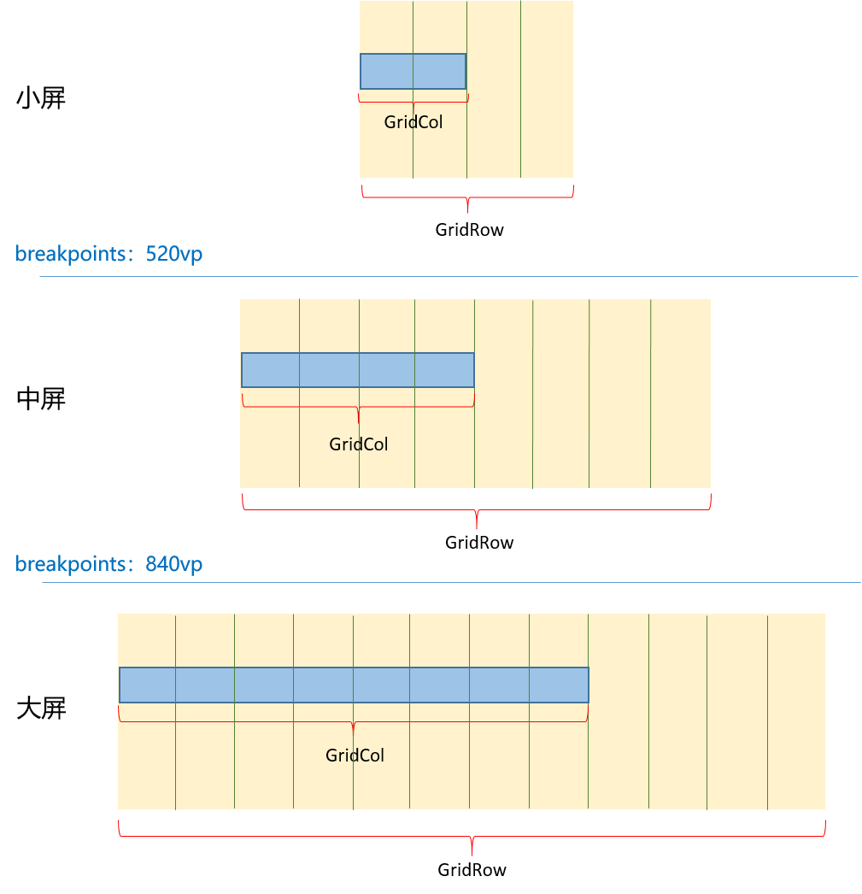

# 如何开发自适应布局

## 场景说明
开发者经常需要将一个应用适配到不同的设备上运行。为了保证用户的浏览体验，就需要根据不同设备的屏幕尺寸设计相应的UI布局变化。常见的如阅读软件，在小屏上显示一页内容，在大屏设备上就可以显示两页内容，这样才能给用户更好的阅读体验。
针对上述场景，OpenHarmony为开发者提供了较为灵活的自适应布局能力，本文将为大家做一个简单的介绍。

## 两个重要的自适应布局组件
使用OpenHarmony进行自适应布局的开发离不开以下两个组件：GridRow、GridCol。
- GridRow用来将屏幕等分为特定列数，并设置区分屏幕大小的临界点（breakpoints），比如可以将屏幕列数根据屏幕大小划分为：小屏设备4列，中屏8列，大屏12列（假设屏幕宽度<=520vp为小屏，520vp<屏幕宽度<=840vp为中屏，屏幕宽度>840vp为大屏）。那么就可以将520vp和840vp设置为临界点，当屏幕尺寸由[0，520vp]区间跨越到[520vp，840vp]区间时，屏幕划分的列数也会由4列变为8列。临界点的详细介绍可参考[GridRow指南](../application-dev/reference/arkui-ts/ts-container-gridrow.md#breakpoints)。

- GridCol是GridRow的子组件，可以根据屏幕大小设置其所覆盖的列数，那么GridCol中的子组件就可以相应的随屏幕的大小变化而变化。比如界面中有一个搜索框，我们希望其长度在小屏设备上占2列，中屏设备占4列，大屏设备占8列，那么就可以将搜索框放在一个GridCol组件中，并设置GridCol组件在小、中、大设备上所占的列数分别为2、4、8。

  可参考如下GridRow和GridCol的示意图理解两者之间的关系：
 
  


## 开发示例
接下来用一个示例来展示GridRow和GridCol是怎么协同实现自适应布局的。

### 页面元素
页面中包含一个文本框，一个搜索框，一个滑动条。

### 实现效果
- 小屏页面时，文本框、搜索框和滚动条纵向排列，搜索框和滚动条跟屏幕等宽，滚动条一次显示一个页面。
- 当拖动页面至中屏大小时，文本框和搜索框在一行显示，滚动条一次显示两个页面。

效果图如下：


### 开发步骤
开发步骤中仅展示相关步骤代码，全量代码请参考完整代码章节的内容。
1. 使用GridRow对屏幕进行划分，本例按照不同屏幕大小进行如下划分：最小屏4列、小屏4列、中屏8列。设置最小屏到小屏，小屏到中屏两个断点（最小屏到小屏的断点本例效果没有演示）
    ```ts
    GridRow({
      // 划分屏幕：最小屏4列、小屏4列、中屏8列
      columns:{xs: 4, sm: 4, md: 8},
      gutter:{x:$r('app.float.gutter_home')},
      // 设置最小屏到小屏，小屏到中屏两个断点
      breakpoints: { value: ["320vp", "520vp"] }
    }){
    //...
    }
    .height("100%")
    .width("100%")
    .padding({top:10,bottom:10,left:10,right:10})
    ```

2. 补充UI元素，将文本框、搜索框、滑动条放在GridCol中，GridCol为GridRow的子组件。
    ```ts
    GridRow({
      // 划分屏幕：最小屏4列、小屏4列、中屏8列
      columns:{xs: 4, sm: 4, md: 8},
      gutter:{x:$r('app.float.gutter_home')},
      // 设置最小屏到小屏，小屏到中屏两个断点
      breakpoints: { value: ["320vp", "520vp"] }
    }){

      // 文本框：首页
      GridCol(){
        Row() {
          Text("首页")
           //...
        }
      }
      .height(56)
      .margin({ bottom: 8})

      // 搜索框
      GridCol(){
        Search({placeholder:'搜索...'})
          //...
      }
      .height(48)

      // 滚动条
      GridCol(){
        Swiper(){
          //...
        }
        .height(144)
        .itemSpace(12)
        .autoPlay(true)
        .displayCount(this.currentbp == 'md' ? 2 : 1)
      }
      .height(144)
    }
    .height('100%')
    .width('100%')
    .padding({top:10,bottom:10,left:10,right:10})
    ```

3. 分别设置文本框、搜索框、滚动条所在GridCol在不同屏幕尺寸下所占的列数。
    - 由于小屏时文本框、搜索框和滚动条纵向排列，且搜索框和滚动条跟屏幕等宽，所以可以让三个元素占满屏幕划分的列数，即4列。
    - 中屏大小时，文本框和搜索框在一行显示，此时屏幕总共划分为8列，所以可以让文本框占2列，搜索框占6列（只要两个元素占用的列数之和小于8都可以在一行显示）。
    - 中屏大小时，滚动条一次显示两个页面。滚动条占满8列，然后通过displayCount属性控制显示的页数。
    
	代码如下：

    ```ts
    GridRow({
      // 划分屏幕：最小屏4列、小屏4列、中屏8列
      columns:{xs: 4, sm: 4, md: 8},
      gutter:{x:$r('app.float.gutter_home')},
      // 设置最小屏到小屏，小屏到中屏两个断点
      breakpoints: { value: ["320vp", "520vp"] }
    }){
    
      // 文本框：首页
      // 小屏sm：4列，中屏md：2列
      GridCol({span:{ xs: 2, sm: 4, md: 2}}){
        Row() {
          Text("首页")
           //...
        }
      }
      .height(56)
      .margin({ bottom: 8})
    
      // 搜索框
      // 小屏sm：4列，中屏md：6列
      GridCol({span:{xs: 2, sm: 4, md: 6}}){
        Search({placeholder:'搜索...'})
          //...
      }
      .height(48)
    
      // 滚动条
      // 小屏sm：4列，中屏md：8列
      GridCol({span:{ xs: 4, sm: 4, md:8 }}){
        Swiper(){
          //...
        }
        .height(144)
        .itemSpace(12)
        .autoPlay(true)
        // 小屏时显示一个页面，中屏时显示两个页面
        .displayCount(this.currentbp == 'md' ? 2 : 1)
      }
      .height(144)
    }
    .height('100%')
    .width('100%')
    .padding({top:10,bottom:10,left:10,right:10})
    // 获取断点
    .onBreakpointChange((breakpoint)=>{
      this.currentbp = breakpoint
    })
    ```

### 完整代码
本例完整代码如下：
示例中用到的资源请替换为开发者本地资源。
```ts
//AdaptiveUI.ets
@Entry
@Component
export struct HomePage{
  @State currentbp: string = ''

  build(){
    GridRow({
      // 划分屏幕：最小屏4列、小屏4列、中屏8列
      columns:{xs: 4, sm: 4, md: 8},
      gutter:{x:24},
      // 设置最小屏到小屏，小屏到中屏两个断点
      breakpoints: { value: ["320vp", "520vp"] }
    }){
    
      // 文本框：首页
      // 小屏sm：4列，中屏md：2列
      GridCol({span:{ xs: 2, sm: 4, md: 2}}){
        Row() {
          Text("首页")
            .fontSize(24)
            .fontWeight(500)
            .width('100%')
            .margin({
              top: 12,
              bottom: 12,
              left: 12
            })
        }
      }
      .height(56)
      .margin({ bottom: 8})
    
      // 搜索框
      // 小屏sm：4列，中屏md：6列
      GridCol({span:{xs: 2, sm: 4, md: 6}}){
        Search({placeholder:'搜索...'})
          .width('100%')
          .height(40)
          .margin({ bottom: 8})
          .placeholderFont({ size: 16 })
      }
      .height(48)
    
      // 滚动条
      // 小屏sm：4列，中屏md：8列
      GridCol({span:{ xs: 4, sm: 4, md:8 }}){
        Swiper(){
          ForEach(SwiperList, (item: CardItem) => {
            Stack({ alignContent: Alignment.TopStart }) {
              Image(item.img)
                .width('100%')
                .height('100%')
                .borderRadius(16)
                .objectFit(ImageFit.Cover)
    
              Column() {
                Text(item.title)
                  .fontSize(16)
                  .fontColor(Color.White)
                  .margin({ bottom: 4 })
                Text(item.info)
                  .fontSize(12)
                  .fontColor(Color.White)
                  .opacity(0.6)
              }
              .alignItems(HorizontalAlign.Start)
              .margin({ top: 20, left: 14 })
            }
          }, item => JSON.stringify(item))
        }
        .height(144)
        .itemSpace(12)
        .autoPlay(true)
        // 小屏时显示一个页面，中屏时显示两个页面
        .displayCount(this.currentbp == 'md' ? 2 : 1)
      }
      .height(144)
    
    }
    .height('100%')
    .width('100%')
    .padding({top:10,bottom:10,left:10,right:10})
    // 获取断点
    .onBreakpointChange((breakpoint)=>{
      this.currentbp = breakpoint
    })
  }
}
```

## 参考
- [GridRow组件的使用](../application-dev/reference/arkui-ts/ts-container-gridrow.md)
- [GridCol组件的使用](../application-dev/reference/arkui-ts/ts-container-gridcol.md)