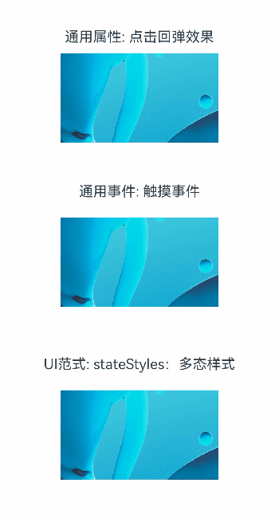

# 实现组件被点击后样式的动态变化

## 场景说明
用户在使用应用时，可通过点击、滑动、按压等方式与应用进行交互，例如通过点击选中文件、跳转页面、开关其他组件。而用户在完成点击操作时，组件样式不改变，用户可能无法确定是否点击，或无法确定实际点击的是哪个组件。因此需要在用户进行点击操作时对组件被点击组件的样式进行变化，提升用户的交互感知。

本案例将通过，点击回弹效果、触摸事件、多态样式的方式实现对图片进行点击后改变图片大小，实现用户交互感知的提升。

## 效果呈现
本例最终效果图如下：




## 环境要求
本例基于以下环境开发，开发者也可以基于其他适配的版本进行开发：

- IDE: DevEco Studio 4.0 Release
- SDK: Ohos_sdk_public 4.0.10.13 (API Version 10 Release)

## 实现思路
本例的包含的关键操作及其实现方案如下：
- 通过组件通用属性中的点击回弹效果属性实现。
- 通过通用事件中的触摸事件实现。在用户手指按下时，将Image组件的宽度值变小，用户手指抬起时，将Image组件的宽度恢复到初始值。此外通过对组件添加属性动画，可实现渐变过渡效果，提升用户体验。
- 通过UI范式中的多态样式来实现。在多态样式中，可根据组件的状态来设置不同样式。在按压态下，设置Image组件的width属性值为180，在正常态下设置组件的width属性值为200。此外通过对组件添加属性动画，可实现渐变过渡效果，提升用户体验。


## 开发步骤
本例详细开发步骤如下，开发步骤中仅展示相关步骤代码，全量代码请参考完整代码章节的内容：
- 通过组件通用属性中的点击回弹效果属性实现：

    该方法是组件的通用属性，组件设置该属性后，点击组件会有先缩小再恢复到初始大小的效果，可通过属性中参数设置缩放比例。

    示例代码如下：

    ```ts
    Image($r('app.media.ic_preview'))
      .width(200)
      .margin({ top: 5, bottom: 5 })
      .clickEffect({ level: ClickEffectLevel.LIGHT, scale: 0.8 })
    ```

- 通用事件中的触摸事件实现：

    当用户手指在组件上按下、滑动、抬起时，会触发触发触摸事件onTouch。根据事件返回的TouchEvent对象，可以确定返回触摸事件的类型，触摸手指位置相关信息等（详情查询参考中官方文档），开发者可通过不同的触摸类型，对组件属性中的参数值进行修改，以达到组件UI样式发生变化的效果。此外还可以在不同触摸类型中，调用不同的能力接口，如在抬起时，发起路由跳转。

    本文中主要介绍如何在通过触摸事件改变图片大小，实现类似点击回弹的效果。因此最终实现是通过在用户在组件上按下时，改小组件的尺寸；抬起时，使得尺寸恢复到初始大小。但是如果直接改变组件尺寸大小后，组件尺寸会直接变化，用户体验不好。可通过设置组件的属性动画animation，使得组件的尺寸变化时有过渡动画效果。

    示例代码如下：
    
    ```ts
    Image($r('app.media.ic_preview'))
      .width(this.widthNumber)
      .animation({ duration: 300, curve: Curve.Ease })
      .renderFit(RenderFit.TOP_LEFT)
      .margin({ top: 5, bottom: 5 })
      .onTouch((event?: TouchEvent) => {
        if (event) {
          if (event.type === TouchType.Down) {
            this.widthNumber = 180
          }
          if (event.type === TouchType.Up) {
            this.widthNumber = 200
          }
        }
      })
    ```
    
- 通过UI范式中的多态样式来实现：

    组件的UI范式中的stateStyles多态样式，定义了组件的六种状态：focused（获焦态），normal（正常态），pressed（按压态），disable（不可用态），clicked（点击状态），selected（选中态）。开发者可以根据组件的内部状态不同 ，快速设置不同样式。需要注意的是，该方式仅可以改变组件样式，无法在该属性中调用其他能力接口。

    本文中主要介绍如何在通过stateStyles多态样式改变图片大小，实现类似点击回弹的效果。设置按压态时，组件宽度为180，正常态时，组件宽度为200。此外为了提升用户体验，通过设置组件的属性动画，使得组件的尺寸变化时有过度效果。
    
    示例代码如下：
    
    ```ts
    Image($r('app.media.ic_preview'))
      .stateStyles({
        pressed: {
          .width(180)
        },
        normal: {
          .width(200)
        }
      })
      .animation({ duration: 300, curve: Curve.Ease })
      .renderFit(RenderFit.TOP_LEFT)
      .margin({ top: 5, bottom: 5 })
    ```
    
    >  **注意：** 开发者在实际使用时需要注意将animation属性放置在stateStyles后边，不然属性动画会失效。因为本质上讲stateStyles是直接给组件设置样式，而animation只会对在其之上的属性变化产生动画效果。
    
    

## 完整代码
完整代码如下：
```ts
@Entry
@Component
struct Index {
  @State widthNumber: number = 200

  build() {
    Column() {
      Column() {
        Text("通用属性: 点击回弹效果").margin({ top: 5, bottom: 5 }).fontSize(18)
        Image($r('app.media.ic_preview'))
          .width(200)
          .margin({ top: 5, bottom: 5 })
          .clickEffect({ level: ClickEffectLevel.LIGHT, scale: 0.8 })
      }.margin({ top: 20, bottom: 20 }).height("20%").width("100%")

      Column() {
        Text("通用事件: 触摸事件").margin({ top: 5, bottom: 5 }).fontSize(18)
        Column() {
          Image($r('app.media.ic_preview'))
            .width(this.widthNumber)
            .renderFit(RenderFit.TOP_LEFT)
            .animation({ duration: 300, curve: Curve.Ease })
            .margin({ top: 5, bottom: 5 })
            .onTouch((event?: TouchEvent) => {
              if (event) {
                if (event.type === TouchType.Down) {
                  this.widthNumber = 180
                }
                if (event.type === TouchType.Up) {
                  this.widthNumber = 200
                }
                event.stopPropagation
              }
            })
        }.height("20%").width("100%").justifyContent(FlexAlign.Center)
      }.margin({ top: 20, bottom: 20 })

      Column() {
        Text("UI范式: stateStyles：多态样式").margin({ top: 5, bottom: 5 }).fontSize(18)
        Column() {
          Image($r('app.media.ic_preview'))
            .stateStyles({
              pressed: {
                .width(180)
              },
              normal: {
                .width(200)
              }
            })
            .animation({ duration: 300, curve: Curve.Ease })
            .renderFit(RenderFit.TOP_LEFT)
            .margin({ top: 5, bottom: 5 })
        }.height("20%").width("100%").justifyContent(FlexAlign.Center)
      }.margin({ top: 20, bottom: 20 })
    }.height("100%").width("100%").justifyContent(FlexAlign.Center)
  }
}
```

## 参考
- [点击回弹效果](../application-dev/reference/apis-arkui/arkui-ts/ts-universal-attributes-click-effect.md)
- [触摸事件)](../application-dev/reference/apis-arkui/arkui-ts/ts-universal-events-touch.md)
- [属性动画概述](../application-dev/ui/arkts-attribute-animation-overview.md)
- [stateStyles：多态样式](../application-dev/quick-start/arkts-statestyles.md)