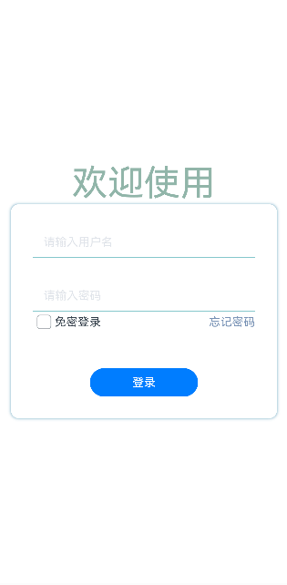

# 自定义输入框
## 场景介绍
输入框是一种常见的场景，开发者为了丰富其多样性，在输入框中的占位符、下划线做了相关处理。本文即为大家介绍如何开发自定义输入框。
## 效果呈现
效果图如下：



## 运行环境
本例基于以下环境开发，开发者也可以基于其他适配的版本进行开发：
- IDE: DevEco Studio 3.2 Release
- SDK: Ohos_sdk_public 3.2.12.5 (API Version 9 Release)
## 实现思路
- 点击输入框，提示文字向上浮动并同时改变文字颜色，输入框底线进行匀速放缩：通过监听输入框状态(onEditChange)发生变化时，提示文字向上浮动以及底部线进行放缩，同时改变文字和底部线的颜色。
- 在输入文本时，输入框右侧显示“清除”图标。点击“清空”图标，清空输入文本：通过监听输入框中有文本输入(onChange)时，右侧显示“清除”图标。
## 开发步骤
1. 封装TextInput组件去监听onEditChange事件（输入状态的变化）和onchange事件（输入内容的变化）。具体代码块如下：
    ```ts
    TextInput({text:this.textValue})
      .width('100%')
      .height('100%')
      .borderRadius(0)
      .borderColor('#86C7CC')
      .borderWidth({bottom: 1})
      .backgroundColor(Color.Transparent)
      .type(this.typeInput)
      .showPasswordIcon(false)
      // 输入内容发生变化
      .onEditChange((isEditing)=>{
        this.isEditing = isEditing
        this.isFloatHint = this.isEditing || this.textValue !==''
      })
      // 输入状态变化时
      .onChange((value)=>{
        this.textValue = value
        this.isFloatHint = this.isEditing || this.textValue !== ''
    })
    ```
2. 输入状态发生变化(onEditChange)时,提示文字向上浮动并同时改变颜色；输入框底线匀速放缩并改变颜色。具体代码如下：
    ```ts
    // 提示文本（占位符）
    Text(this.placeholder)
      .enabled(false)
      .fontColor(this.isFloatHint ?  '#5D7DB3' : '#E1E4EA')
      .position({x: 0, y: this.isFloatHint ? 0 : '50%'})
      .translate({x: 15, y: '-50%'})
       .animation({duration:100, curve: Curve.Linear})

    // 底部线
    Line()
      .width('100%')
      .height(1)
      .backgroundColor('#5D7DB3')
      .position({x: 0, y: 44})
      .scale({x: this.isFloatHint ? 1 : 0, centerX: 0})
      .animation({duration: 300, curve: Curve.Linear})
    ```
3. 输入内容发生变化(onChange)时，输入框右侧显示“清除”图标，点击该图标清空输入框内容。具体代码块如下：
    ```ts
    if (this.textValue){
      Image($r("app.media.canel"))
        .width(15)
        .height(15)
        .border({width: 1, radius: 15, color: '#fffffff'})
        .position({x: '90%', y: '50%'})
        .translate({y: '-50%'})
        .onClick(()=>{
            this.textValue = ''
        })
    }
    ```
4. 构建界面UI。具体代码块如下：
    ```ts
    @Entry
    @Component
    struct InputFloatHintPage{
      build(){
        Column(){
          Text('欢迎使用')
            .fontSize(50)
            .fontColor('#91B5A9')
          Column(){
            InputFloatHint({placeholder: '请输入用户名'})
            Blank().height(30)
            InputFloatHint({placeholder: '请输入密码'})
          Column() {
            Row() {
              Checkbox()
                .select(false)
                .selectedColor(0x39a2db)
                .padding({left:1})
              Text('免密登录')
              Blank().width(150)
              Text('忘记密码')
                .fontColor('#5C9DBA')
            }
          }.justifyContent(FlexAlign.SpaceBetween)
            Blank().height(50)
            Button('登录').width(150)
          }
          .width('90%')
          .padding(30)
          .backgroundColor(Color.White)
          .border({radius: 10})
          .shadow({radius: 10, color: '#5C9DBA' })
        }.width('100%')
        .height('100%')
        .justifyContent(FlexAlign.Center)
      }
    }
    ```
## 完整代码
完整示例代码如下：
```ts
@Component
struct InputFloatHint{
  @State isFloatHint: boolean = false
  @State textValue: string = ''
  isEditing = false
  placeholder: string
  typeInput:InputType = InputType.Normal

  build(){
    Stack(){
      TextInput({text:this.textValue})
        .width('100%')
        .height('100%')
        .borderRadius(0)
        .borderColor('#86C7CC')
        .borderWidth({bottom: 1})
        .backgroundColor(Color.Transparent)
        .type(this.typeInput)
        .showPasswordIcon(false)
        .onEditChange((isEditing)=>{
          this.isEditing = isEditing
          this.isFloatHint = this.isEditing || this.textValue !==''
        })
        .onChange((value)=>{
          this.textValue = value
          this.isFloatHint = this.isEditing || this.textValue !== ''
        })
      Text(this.placeholder)
        .enabled(false)
        .fontColor(this.isFloatHint ?  '#5D7DB3' : '#E1E4EA')
        .position({x: 0, y: this.isFloatHint ? 0 : '50%'})
        .translate({x: 15, y: '-50%'})
        .animation({duration:100, curve: Curve.Linear})

      Line()
        .width('100%')
        .height(1)
        .backgroundColor('#5D7DB3')
        .position({x: 0, y: 44})
        .scale({x: this.isFloatHint ? 1 : 0, centerX: 0})
        .animation({duration: 300, curve: Curve.Linear})

      if (this.textValue){
        Image($r("app.media.canel"))
          .width(15)
          .height(15)
          .border({width: 1, radius: 15, color: '#fffffff'})
          .position({x: '90%', y: '50%'})
          .translate({y: '-50%'})
          .onClick(()=>{
            this.textValue = ''
          })
      }
    }.width('100%').height(45)
  }
}

@Entry
@Component
struct InputFloatHintPage{
  build(){
    Column(){
      Text('欢迎使用')
        .fontSize(50)
        .fontColor('#91B5A9')
      Column(){
        InputFloatHint({placeholder: '账号'})
        Blank().height(30)
        InputFloatHint({placeholder: '密码'})
        Blank().height(50)
        Button('登录').width(150)
      }
      .width('90%')
      .padding(30)
      .backgroundColor(Color.White)
      .border({radius: 10})
      .shadow({radius: 10, color: '#5C9DBA' })
    }.width('100%')
    .height('100%')
    .justifyContent(FlexAlign.Center)
  }
}
```

## 参考
[图形变化](../application-dev/reference/arkui-ts/ts-universal-attributes-transformation.md)

[TextInput](../application-dev/reference/arkui-ts/ts-basic-components-textinput.md)
