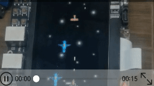
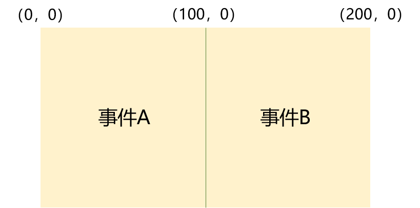

# 如何为组件的不同触摸区域添加不同交互动作

## 场景说明
应用开发中经常需要给同一个组件划分不同的触摸热区，并且不同热区触发的操作也不同，比如阅读应用通常包含左右两个触摸热区，用户触摸左侧触发向后翻页，触摸右侧触发向前翻页；同样的，视频应用中，长按视频播放器的左侧触发快退播放，长按右侧触发快进播放等等。
当前OpenHarmony提供的热区设置属性（responseRegion）只能在不同的触摸热区中触发相同的事件，那么如何实现不同热区不同事件呢，本例即以上述视频播放场景为例进行说明。

## 效果呈现
效果说明：开始时视频以正常速度播放，播放到5秒时，长按播放器右侧触发快进播放，播放到14秒时长按播放器左侧触发快退播放。



## 环境要求
本例基于以下环境开发，开发者也可以基于其他适配的版本进行开发：

- IDE: DevEco Studio 4.0 Release
- SDK: Ohos_sdk_public 4.0.10.13 (API Version 10 Release)

## 实现思路
几乎组件的所有触摸事件都会返回event，通过返回的event可以获取到触摸点的坐标位置，那么就可以根据坐标位置为不同的组件区域添加不同的交互动作。如图：假设有一个长度为200vp的组件，我们希望点击组件的左侧时触发事件A，点击组件的右侧时触发事件B，那么就可以通过触摸点的坐标来判断，当触摸点的x坐标<=100时，触发事件A，反之触发事件B。



本例即采用上述思路为Video组件的左右两侧添加不同的交互动作。从而实现长按视频播放器的左侧触发后退播放，长按右侧触发快进播放。

## 开发步骤
本例详细开发步骤如下，开发步骤中仅展示相关步骤代码，全量代码请参考完整代码章节的内容。
1. 通过Video组件创建视频播放器，并添加触摸手势，通过触摸控制视频的播放、暂停。
    ```ts
    @Component
    export struct VideoPlayer{
      //...
      private isPlaying:boolean = true
      private updateTime: number
      private videoController:VideoController = new VideoController()

      build(){
        // 添加视频组件
        Video({src:this.videoSrc, controller:this.videoController, previewUri:this.videoPreviewer,currentProgressRate:this.playRate})
          //...
          // 获取当前进度条的时间点
          .onUpdate((e)=>{
            this.updateTime = e.time
          })
          .gesture(
            // 添加触摸手势
            TapGesture({count:1})
              .onAction((event:GestureEvent)=>{
                if (this.isPlaying){
                  // 触摸触发播放
                  this.videoController.start()
                  this.isPlaying = !this.isPlaying
                } else {
                  // 再次触摸触发暂停
                  this.videoController.pause()
                  this.isPlaying =!this.isPlaying
                }
              })
          )
      }
    }
    ```
2. 为Video组件添加长按手势，通过长按手势触发播放的快退和快进动作。由于触摸手势和长按手势需要互斥，即一次只能触发一种手势，所以通过GestureGroup来实现手势的互斥。
    ```ts
    .gesture(
      // 通过GestureGroup的GestureMode.Exclusive参数控制手势互斥
      GestureGroup(GestureMode.Exclusive,
        // 添加触摸手势
        TapGesture({count:1})
          .onAction((event:GestureEvent)=>{
            if (this.isPlaying){
              // 触摸触发播放
              this.videoController.start()
              this.isPlaying = !this.isPlaying
            } else {
              // 再次触摸触发暂停
              this.videoController.pause()
              this.isPlaying =!this.isPlaying
            }
          }),
        // 添加长按手势
        LongPressGesture({repeat:true})
          // 长按时触发快进或快退
          .onAction((event)=>{
            //添加快进和快退的逻辑，通过event获取手势坐标进行判断。
          })
          // 长按结束后播放速度回归正常
          .onActionEnd(()=>{
           // 添加回归正常播放的逻辑
          })
      )
    )
    ```
3. 补充长按手势中的业务逻辑：通过event获取到触摸点的x坐标：localX，当localX>=200时，说明触摸点在组件的右侧，触发快进播放；当localX<200时，说明触摸点在左侧，触发快退播放。当触摸停止时，回归正常播放速度。
    ```ts
    // 添加长按手势
    LongPressGesture({repeat:true})
    // 长按时触发快进或快退
    .onAction((event)=>{
      // 获取到触摸点x坐标localX，当localX>=200时，说明触摸点在组件的右侧，触发快进播放
      if (event.fingerList[0].localX>=200){
        // 播放速度变为2倍速
        this.playRate = PlaybackSpeed.Speed_Forward_2_00_X
      }
      // 当localX<200时，说明触摸点在左侧，触发快退播放
      if (event.fingerList[0].localX<200){
        if (this.intervalCount===0){
          // 通过进度时间减小来达到快退的目的，通过setInterval来控制后退的速度，否则会连续触发后退，瞬间后退到播放起点
          this.seekBack = setInterval(()=>{
            this.updateTime -= 1
            this.videoController.setCurrentTime(this.updateTime)
          },500)
        }
        this.intervalCount = 1
      }
    })
    // 长按结束后播放速度回归正常
    .onActionEnd(()=>{
      // 播放回归到1倍速
      this.playRate = PlaybackSpeed.Speed_Forward_1_00_X
      // 清空计时器
      clearInterval(this.seekBack)
      this.intervalCount = 0
    })
    ```


## 完整代码
本例完整代码如下：
>  **说明：**
> 本例中使用的视频等资源需要替换为开发者自己的资源

```ts
@Entry
@Component
export struct VideoPlayer{
  private videoSrc:Resource = $rawfile('video_1.mp4')
  private isPlaying:boolean = true
  private updateTime: number = 0
  private videoPreviewer:Resource = $r('app.media.wandering_previewer')
  private videoController:VideoController = new VideoController()
  @State playRate:number = 1
  private seekBack:number = 0
  private intervalCount:number = 0

  build(){
    Column(){
      // 添加视频组件
      Video({src:this.videoSrc, controller:this.videoController, previewUri:this.videoPreviewer,currentProgressRate:this.playRate})
        .width('100%')
        .height('30%')
        .backgroundColor('#fffff0')
        .controls(true)
        .objectFit(ImageFit.Contain)
        // 获取当前进度条的时间点
        .onUpdate((e)=>{
          this.updateTime = e.time
        })
        .gesture(
          // 通过GestureGroup的GestureMode.Exclusive参数控制手势互斥
          GestureGroup(GestureMode.Exclusive,
            // 添加触摸手势
            TapGesture({count:1})
              .onAction((event:GestureEvent)=>{
                if (this.isPlaying){
                  // 触摸触发播放
                  this.videoController.start()
                  this.isPlaying = !this.isPlaying
                } else {
                  // 再次触摸触发暂停
                  this.videoController.pause()
                  this.isPlaying =!this.isPlaying
                }
              }),
            // 添加长按手势
            LongPressGesture({repeat:true})
              // 长按时触发快进或快退
              .onAction((event)=>{
                // 获取到触摸点x坐标localX，当localX>=200时，说明触摸点在组件的右侧，触发快进播放
                if (event.fingerList[0].localX>=200){
                  // 播放速度变为2倍速
                  this.playRate = PlaybackSpeed.Speed_Forward_2_00_X
                }
                // 当localX<200时，说明触摸点在左侧，触发快退播放
                if (event.fingerList[0].localX<200){
                  if (this.intervalCount===0){
                    // 通过进度时间减小来达到快退的目的，通过setInterval来控制后退的速度，否则会连续触发后退，瞬间后退到播放起点
                    this.seekBack = setInterval(()=>{
                      this.updateTime -= 1
                      this.videoController.setCurrentTime(this.updateTime)
                    },500)
                  }
                  this.intervalCount = 1
                }
              })
                // 长按结束后播放速度回归正常
              .onActionEnd(()=>{
                // 播放回归到1倍速
                this.playRate = PlaybackSpeed.Speed_Forward_1_00_X
                // 清空计时器
                clearInterval(this.seekBack)
                this.intervalCount = 0
              })
          )
        )
    }
    .height('100%')
    .width('100%')
  }
}
```

## 参考
- [Video组件指导](../application-dev/reference/arkui-ts/ts-media-components-video.md)
- [绑定手势指导](../application-dev/reference/arkui-ts/ts-gesture-settings.md)
- [组合手势的使用指导](../application-dev/reference/arkui-ts/ts-combined-gestures.md)